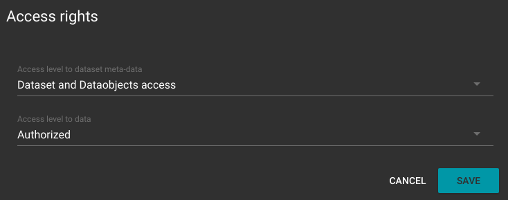
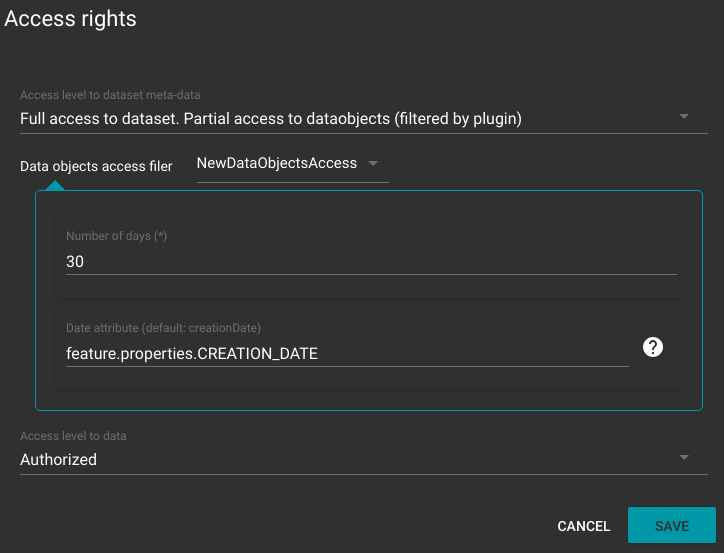



# Customize data access rights

## Overview

    This customziation is a plugin of DataManagement microservice.

REGARDS allows administrators to configure access rights of every data through **user groups** configuration. Each user group can be configured to allow or deny access to each dataset by defining :
 - Access to metadatas (information about datas)
 - Access to data files (download or order)

 To customize access to datas inside a dataset administrator can use **Data access right Plugins**. Those plugins dynamicly define access to each data of a dataset. 

 

 **NOTE :** As some plugins define access rights dynamicly, the calculation is made **every day**.

 ## Examples

 ### New/Old data objects access

  - **NewDataObjectsAccess**
  - **OldDataObjectsAccess**

 Those two plugins allows to configure data access right inside a dataset based on a date (for example creation date). With those plugins you can allow access to datas which have been created at least a year ago or allows acces to datas that are updated at most one week ago.

 ### Filter data objects access with opensearch request

 - **CustomDataObjectsAccess**

 These plugin allows to configure data access tight inside a dataet base on a opensearch query (lucene format). For example you can configure access right to allow access for datas with a specified value like VERSION > 2 with the lucen opensearch query : `VERSION:[2 TO \*]`
