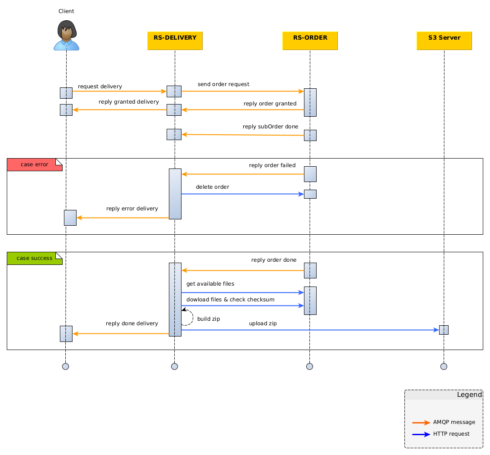

Basically, rs-delivery is a microservice that interact with REGARDS core functionnalities to make files available for
download in a configured S3 server.
The following sequence diagram presents the main interactions when a delivery request is sent.

## Create a delivery request

First, a delivery event is published by an external client and is then received by REGARDS to be proceeded.

*see [create a delivery request](./api-guides/amqp/amqp-publish-request.md)*

REGARDS checks the conformity of the message received,

- if it is the valid, the request is saved and a delivery response with `GRANTED` status is sent,
- otherwise, the response with the`DENIED` status is sent with the error origin.

*see [subscribe to delivery responses](./api-guides/amqp/amqp-subscribe-response.md)*

## Monitor the request progress

Internally, the request is then forwarded to [rs-order microservice](../order/order.md) to be processed.

Files requested are retrieved and made available locally by rs-order. An event is then sent from rs-order to rs-delivery
to
indicate that the suborder has been processed. For now, only one suborder is allowed per delivery request. If there are
more than one,
the delivery request is set to `ERROR` status.

After the final order event, rs-delivery handles the response in two different ways.

- **In case of error**, an event is sent from rs-delivery to delete the order and the request status is set to `ERROR`.
- **In case of success**, files are retrieved by rs-delivery and copied to its local workspace. They are then zipped and
  uploaded to the configured S3 server. The checksums are systematically verified to ensure data integrity. A `DONE`
  response is then published to notify the end of the delivery.

*see [subscribe to delivery responses](./api-guides/amqp/amqp-subscribe-response.md)*
