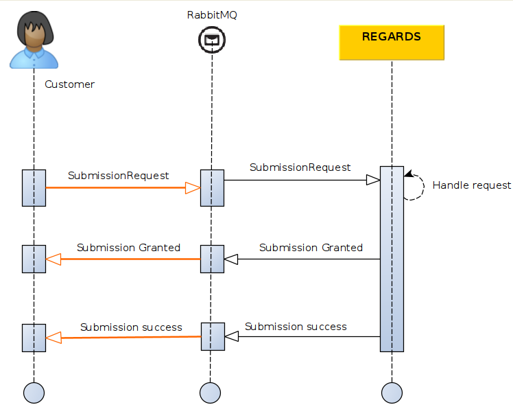

This section describes how to submit a new product to the LTA service of REGARDS thanks to AMQPS interfaces.

## Introduction

The diagram below explains the global processing of a new product submission request by REGARDS system.  
For a REGARDS client using message queuing, the main steps are:

1. Publish your product archive request containing product information to REGARDS Rabbitmq server.
1. Wait for notifications from REGARDS on its Rabbitmq server. Those notifications will inform you about your request
   progression. Request status lifecycles can be :

- `DENIED` : Your request has been denied (possibly malformed request).
- `GRANTED` -> `ERROR` : Your request has been granted, but an internal error happened.
- `GRANTED` -> `SUCCESS` : Your request has been granted and processed with success.



## Submit Product creation request

### Exchange

Submission requests have to be published to REGARDS Rabbitmq exchange:

| Exchange                                                                                    | Virtual host                   |
|---------------------------------------------------------------------------------------------|--------------------------------|
| `regards.broadcast.fr.cnes.regards.modules.ltamanager.amqp.input.SubmissionRequestDtoEvent` | `regards.multitenant.manager`	 |

### Request format

`Message headers`

```json
"regards.tenant": "tenant"
"regards.request.owner": "owner"
```

| Parameter             | Type   | Optional | Description                                                   |
|-----------------------|--------|:--------:|---------------------------------------------------------------|
| regards.tenant        | String |    No    | Tenant name depends on REGARDS instance project configuration |
| regards.request.owner | String |    No    | Name of the request provider.                                 |

`Message body content`

```json
{
  "correlationId": "xxx",
  "productId": "xxx",
  "datatype": "xxx",
  "geometry": {
    "coordinates": [
      [
        [
          0.07604560969926086,
          43.98314313658291
        ],
        [
          0.14096031674824933,
          43.99467654310261
        ],
        [
          0.05530723606827761,
          43.957963973072
        ],
        [
          0.07604560969926086,
          43.98314313658291
        ]
      ]
    ],
    "type": "Polygon"
  },
  "files": [
    {
      "type": "THUMBNAIL",
      "url": "file:/input/LTA/2519/thumbnail-4.png",
      "filename": "thumbnail-4.png",
      "checksumMd5": "fb8613574312c47f215343ebebaf8ebf",
      "mimeType": "image/png"
    },
    {
      "type": "RAWDATA",
      "url": "file:/input/LTA/2519/product-4.zip",
      "filename": "product-4.zip",
      "checksumMd5": "ff3d0a4640b403a02007b0039640607b",
      "mimeType": "application/zip"
    },
    {
      "type": "RAWDATA",
      "url": "file:/input/LTA/2519/product-4-meta.xml",
      "filename": "product-4-meta.xml.",
      "checksumMd5": "fcd0e49a6f85e67ae6d2149a1f67d567",
      "mimeType": "application/xml"
    }
  ],
  "storePath": "",
  "session": "",
  "replaceMode": false,
  "tags": [
    "tag1",
    "tag2"
  ],
  "properties": {}
}
```

| Parameter         | Type             | Optional | Description                                                                                                                                             |
|-------------------|------------------|:--------:|---------------------------------------------------------------------------------------------------------------------------------------------------------|
| correlationId     | String           |    No    | Identifier to track this request during the entire workflow. It must be unique.                                                                         |
| productId         | String           |    No    | Product identifier. If two products are submitted with the same id, a new version is created or the previous one is replaced.                           |
| datatype          | String           |    No    | Product datatype. Must be present in the lta-manager configuration.                                                                                     |
| geometry          | GeoJSON RFC 7946 |   Yes    | Product geometry in GeoJSON RFC 7946 Format.                                                                                                            |
| files             | Object           |    No    | Files linked to the product. At least one is required.                                                                                                  |
| files.type        | String           |    No    | Type of the file can be `RAWDATA`, `THUMBNAIL`, `QUICKLOOK_SD`, `QUICKLOOK_MD` or `QUICKLOOK_HD`                                                        |
| files.url         | String           |    No    | Location of the file. Only http(s) or file protocols are accepted.                                                                                      |
| files.filename    | String           |    No    | File name                                                                                                                                               |
| files.checksumMd5 | String           |    No    | File MD5 checksum                                                                                                                                       |
| files.mimeType    | String           |    No    | File mime type                                                                                                                                          |
| storePath         | Path             |   Yes    | Path to manually define the destination location for files on archival system. If null, the storePath will be built from the lta-manager configuration. |
| session           | String           |   Yes    | Session to monitor the generation of the product. If not provided, a default session will be used.                                                      |
| replaceMode       | Boolean          |   Yes    | default false - Defines whether a product with the same id should be replaced or duplicated with a new version.                                         |
| tags              | Strings          |   Yes    | Optional labels to add in product metadata tags                                                                                                         |
| properties        | json object      |    No    | Product metadata, Map of key/value properties. Mandatory properties depends on product datatype.                                                        |

If two products are submitted with the same provider id :

* if you `replaceMode=false`, a new version is created (V2, V3...)
* if you `replaceMode=true`, the previous version is replaced

:::note First creation
If that's the first time you submit a product (no product with same providerId is present on OAIS catalog), both
endpoint create a first version of the product.
:::

:::info Integrity
REGARDS system will ensure integrity verification of each file of your product by checking provided md5 checksum after
each file copy.
:::

**Click on the link Get product progress AMQP** just below, you will discover responses RS-LTA-MANAGER will send you for
your submission request.
