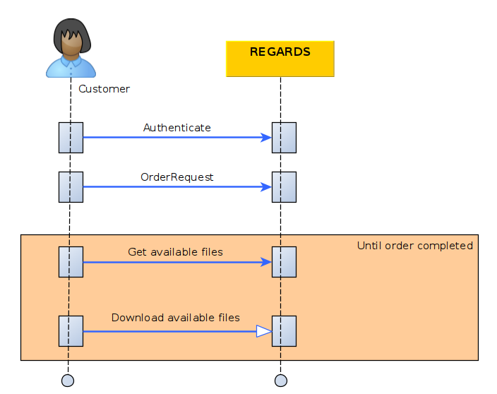

*This page assumes you know how to [authenticate](../../../../services/authentication/api-guides/rest/authent-oauth2.mdx) your REST API requests *

This section describes how to order one or many products from the order service through REST interfaces.

## Introduction

The diagram below explains the global processing of an Order request by REGARDS system.  
For a REGARDS client using REST interface, the main steps are:
1. Authenticate to REGARDS in order to retrieve a valid token. See the 
   [authenticate guide](../../../../services/authentication/api-guides/rest/authent-oauth2.mdx).
1. Send an order request to REGARDS.
1. Retrieve order status and available files.
1. When one or many files are available(s), you can download them. 
1. Repeat again until end of order : retrieve order status, download available files...




## Submit Order request

### Request

| description | url | verb |
| ----------- | --- | ---- |
| Product order request | `<HOST>`/api/v1/rs-order/user/orders/apply | POST |

`Request headers`
```json
{
  "Content-Type": "application/json",
  "Authorization": "Bearer <token>"
}
```

`Request body`

```json
{
  "queries": [],
  "filters": {
    "dataTypes": [],
    "filenameRegExp" : "",
  }
}
```
 | Parameter | Type | Optional | Description |
| --------- | ---- | :------: | ----------- |
| queries | Lucene strings | No | List of lucene formatted queries to find products to order. |
| filters.datatypes | String | Yes | List of REGARDS datatypes to filter files from ordered products. Datatypes can be `RAWDATA` or `QUICKLOOK` |
| filters.filenameRegExp | String | Yes | Regular expression to filter files by their names from ordered products. |

`NOTE`: Here is the link to the [REGARDS Lucene format](https://regardsoss.github.io/docs/development/appendices/lucene-query/)

### Response

| Http status | description |
| ----------- | ------------ |
| 201         | Your order request is successfully created |
| 403         | Access denied |
| 422         | Invalid request body |

```json
{
    "orderId" : 54,
    "status": "GRANTED"
}
```

### Examples

If you want to retrieve a product by its identifier, the order request is :
```json
{
    "queries": [
        "productId:my_product_identifier"
    ]
}
```

If you want to retrieve many products by their identifiers, the order request is :
```json
{
    "queries": [
        "productId:(my_product_id_1 OR my_product_id_2 OR my_product_id_3 OR my_product_id_4)"
    ]
}
```

If you want to retrieve all products from a specific metadata like datatype (depends on configured REGARDS data models), the order request is:
```json
{
    "queries": [
        "datatype:type1"
    ]
}
```

If you want to retrieve all products from a specific metadata like datatype (depends on configured REGARDS data models) and retrieve only image files, the order request is:
```json
{
    "queries": [
        "datatype:type1"
    ],
    "filters": {
        "dataTypes": [
            "QUICKLOOK"
        ],
    }
}
```

**Click on the link Get Order status REST** just below, you will discover how to retrieve Order and availables ordered files.
