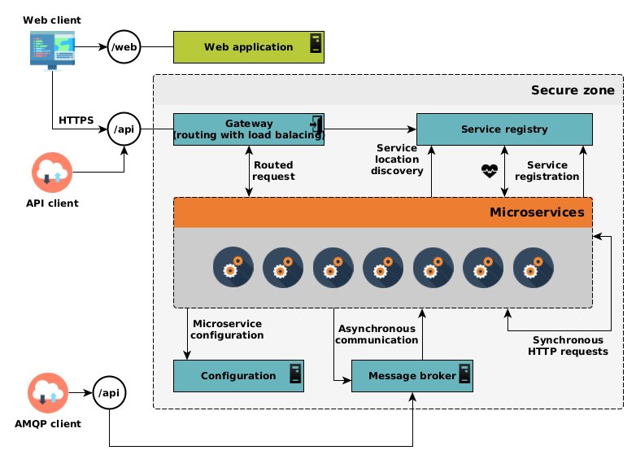

## Microservice architecture

To meet CNES requirements, REGARDS deploys a set of business services within a distributed and modular microservices
architecture.

These microservices are highly cohesive and loosely coupled Restful web services, interacting inside the cluster using
synchronous (REST through HTTP protocol) and asynchronous (event bus through AMQP protocol) communications.

Each microservice is structured in modules, being themselves structured in layer architecture. Each service matches an
elementary REGARDS function (single accountability), and has its own execution context and its own configuration (
modularity). It is built, tested and deployed separately from other services (modularity, maintainability, scalability)
and exposes a REST API (HATEOAS) which relies on a service contract.

Such granular architecture ensures we can provide a strong **horizontal scalability**. Several instances of the same
service can be simultaneously deployed on the system, allowing it to bear load spin-up thanks to the *“load balancing”*
mechanism. Such functionality allows the system to be highly fault-tolerant and resiliant to load fluctuation. On top of
that, GUIs are built using responsive web architecture.

The here-above diagram describes principles of such architecture.  
REGARDS microservices are surrounded by several components : a gateway providing a single point to allow external world
to interact with our system, a discovery and registration service to let service know each other and load balancing; and
finally a centralized configuration holding each kind of microservice configuration.

The key points are that all microservices are **stateless** and expose a **REST API** over **HTTP** and an **AMP API**.
See [REST API Concept](./05-rest-api.md) and [AMQP API Concept](./06-amqp-api.md) to learn more about the way Regards manage 
both API.

## Non fonctionnal microservices architecture

Non fonctionnal microservices are listed here under. Those mandatory microservices are deployed to manage microservices
stack architecture.

- [rs-registry](../backend/regards/registry/overview.md) : Microservices registry.
- [rs-config](../services/config/overview.md)   : Microservices centralized configuration provider.
- [rs-gateway](../backend/regards/gateway/overview.md)  : Microservices main access point

1. At startup each REGARDS microservices retrieve their configuration from **rs-config** microservice.
2. Once they have successfully booted, REGARDS microservices register to **rs-registry** microservice.
3. Client access REGARDS microservice through rs-gateway microservice. **rs-gateway** microservice, ask for target
   microservice address to **rs-registry** and redirect request to it.

Regards Microservice core architecture provides two types of API :

- `REST API` : You can submit REST HTTP Requests to Regards microservices through **rs-gateway** microservice.
- `AMQP API` : You can submit and subscribe to the Regards Message Broker : **RabbitMQ**.

Both API types will be described for each microservice with API Guides under [Services](../backend/regards/overview.md)
section of this documentation.
