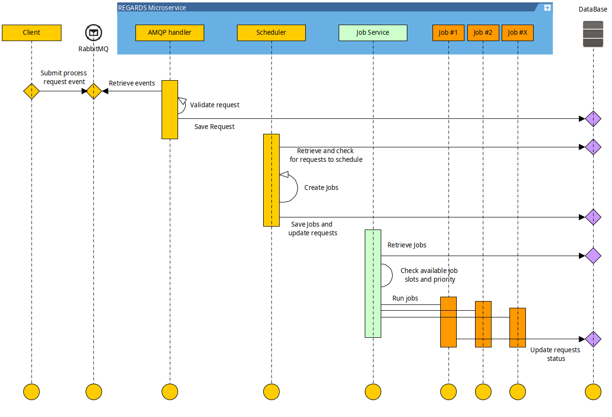

Parallelization of every process in a key architectural concept for REGARDS.

To do so, REGARDS use **Requests** and **Jobs** notions :

- **Request** : Is the process request information received by a service.
- **Job** : Is the work done by the service in a separate Thread for a batch of requests.

Regards Jobs system is configurable on each REGARDS microservice by setting :

- **Jobs pool size**. If you want each instance of one microservice type to be able to process more Jobs in parallel.
- **Requests batch size**. If you want to configure the number of requests handled by a single job.

:::info
You can raise these parameters in relation with server resources and database pool connection size.
:::
To make the fullest use of the **Jobs system**, each process request received by a Regards microservice is handled with
the same algorithm:

1. Process request is received by a microservice ([AMQP API](./06-amqp-api.md) or [REST API](./05-rest-api.md)).
2. Request format and consistency is validated.
3. Valid requests are saved in microservice database with a **Granted state**.
4. A planned task or **Scheduler** check for requests in **Granted state**.
5. The scheduler create one or many **Jobs** with associated requests, save **Jobs** in database and update requests
   with **Scheduled** state. The **number of requests per jobs** is a configurable parameter in most of the
   microservices.
6. Job is executed by the **Job Service**.
7. Requests are updated to **Success** or **Error** status.

To learn more about **Job system** and its usage in Regards Microservice,
see [Module Jobs](../backend/framework/modules/jobs.md)