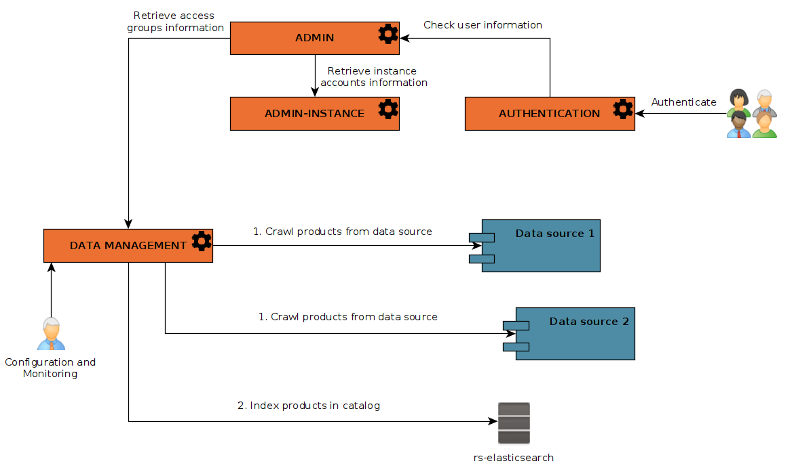
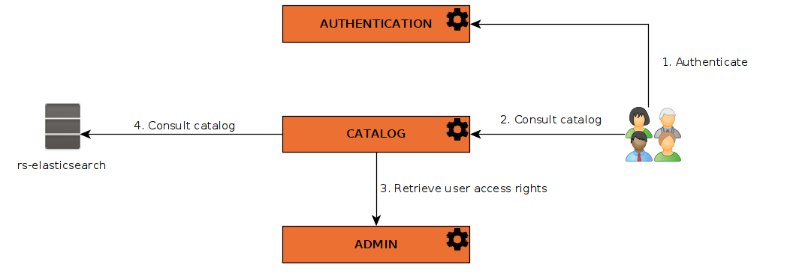

Meta-Catalog services are a set of **mandatory REGARDS services** that allows to :

- populate a [Meta-Catalog](../concepts/09-meta-catalog.md) using data source(s)
- allows users to consult indexed [Products](../concepts/04-products.md)

To do so, REGARDS provides following services :

- [rs-admin-instance](../backend/regards/admin-instance/overview.md) :
  this [instance service](../concepts/03-multitenant.md) manages projects and shared user accounts.
- [rs-admin](../backend/regards/admin/admin.md)          : Manage project users and roles
- [rs-authentication](../backend/regards/authentication/authentication.md) : Manage REGARDS authentication system(s)
- [rs-dam](../backend/regards/dam/dam.md)            : Populate the REGARDS [meta-catalog](../concepts/09-meta-catalog.md) from existing data 
  source(s), manage **Data models** and compute access rights.
- [rs-catalog](../backend/regards/catalog/catalog.md)        : Consult, search and access REGARDS [meta-catalog](../concepts/09-meta-catalog.md)

## Populate meta-catalog

The main concept behind REGARDS [meta-catalog](../concepts/09-meta-catalog.md) population is the service 
[**Data Management** or **rs-dam**](../backend/regards/dam/dam.md), that consults one or many 
**data source(s)** to retrieve [products](../concepts/04-products.md) to index. These products are pushed and centralized inside an 
ElasticSearch index, a powerful and fast search engine.
These [products](../concepts/04-products.md), that can be retrieved from various **data source(s)**, are homogenize
thanks to **data model(s)** and **datasets** and protected using **users access rights**.

:::info Data sources
**Data sources** is a key concept to understand in Regards [Meta Catalog](../concepts/09-meta-catalog.md).
You can connect any compatible data source but Regards provides two data source(s) of his
own : [OAIS Data source](03-oais-catalog-services.md) and [GeoJson Data source](04-geojson-catalog-services.md).
:::info

:::info Data models
**Data models** are the definition of the metadata of your products.  
Each Regards project can define as many data model(s) as needed.
:::info

The [**Data Management** or **rs-dam**](../backend/regards/dam/dam.md) microservice crawl products from data source(s),
map the results with the associated data model(s) and then insert them into **Elasticsearch Index**. 
Data sources and data models need some configuration from an administrator.  
To learn more about **rs-dam** and crawling system,
see [rs-dam microservice documentation](../backend/regards/dam/dam.md).

## Consult meta-catalog

Once the **Elasticsearch index** is populated, [**Catalog**](../backend/regards/catalog/catalog.md) 
microservice can be used to consult products metadata and to download [products](../concepts/04-products.md) files.  
To learn more about catalog service and its multiple search engines like **STAC** or **OpenSearch**,
see [**Catalog**](../backend/regards/catalog/catalog.md).

The diagram below explains the interactions between microservices for this purpose:

