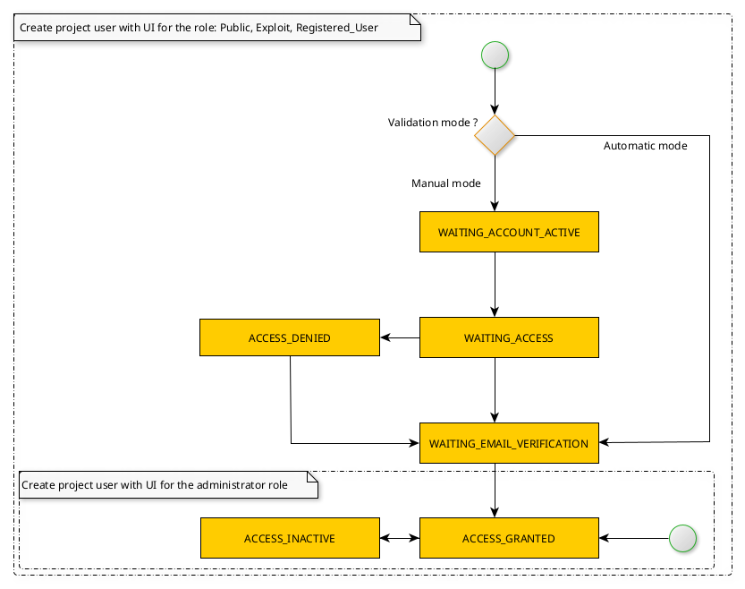

The `rs-admin` is designed to manage specific responsibilities for each project within the Regards architecture.
This microservice consolidates a range of functionalities, organized into different modules.

## Module : accessrights

This module is designed to manage access rights for Regards users. It handles the distribution of licenses across
projects and project users, controlling the ability to download order files.

A project user is a user that must be associated with only one project in Regards. Each project user is linked to a
unique account. The same account can have different project users for each project, allowing one account to be connected
to multiple projects. The relationship between a project user and an account is established via the user’s unique email
address, which also serves as the login for the Regards UI.

The account is stored in the database within the `rs-admin-instance` as a single instance. The project user, however, is
stored separately in the database for each project or tenant in Regards.

The following state diagram outlines the various states a project user goes through during the registration process in
Regards:

A project user has a single role in a project. When the microservice is started, the following list of roles is loaded
from the database and made available for the creation of new project users :

* **PUBLIC** role : not connected user for a project. Users of this role have read-only access.
* **INSTANCE_ADMIN** role : administrator for [multitenant](../../concepts/03-multitenant.md) or several projects. Users
  of this special role can override any restrictions on access to features and data for all projects.
* **PROJECT_ADMIN** role : main administrator for a project. Users of this special role can override any restrictions on
  access to features and data.
* **ADMIN** role : administrator for a project. Users of this role have access to all project administration functions.
* **EXPLOIT** role : exploit (connected user) for a project. Users of this role are granted access to a limited number
  of administrative functions related to project operation.
* **REGISTERED_USER** role : connected user for a project. Users of this role can consult, download and order data.

A role is always inherited from a parent role. Each role contains a list of access rights associated with specific http
endpoints (see the menu item in each microservice: API Guides->Rest->All endpoints (OpenAPI)), a role inherits all
access rights from a parent role.
Regards allows you to create new roles that are inherited from a parent role.

A project user has one or more access groups. An access group is used to determine a user's rights to view datasets, so
that they can subsequently carry out commands.

:::info
This is the Regards administrator responsibility to determines the access rights of each user.
:::

## Module : notification

The purpose of this module is to send notifications to inform users connected to Regards about the progress of tasks
performed by microservices. Notifications can be sent to a specific user or to all users assigned to a particular role.

A user interface allows notifications to be viewed using various criteria. A notification consists of the following
parameters:

- created date,
- message,
- sender : name of microservice (rs-dam, rs-fem, rs-lta-manager ...)
- status (read/unread),
- title,
- type (Error, Warning, Info, Fatal)

The notification can be created by [AMQP message](./api-guides/amqp/amqp-publish-notification.md) or
by [REST API](./api-guides/rest/api-swagger.mdx#tag/notification-controller).

When a notification has been created and stored in the database, the microservice sends emails to the following
recipients. Each user can configure the frequency at which emails are sent. This setting is located in each user's
profile. The list of available frequencies is as follows : custom(day, hour), daily, weekly, monthly.

In the above diagram, each frequency has its own scheduler.

## Module : session

The purpose of this module is to centralize information on the monitoring of data additions in Regards, making it easier
for users to supervise various processes:

* Data acquisition (available actions: view acquisition chains, view requests in error, restart errors)
  errors)
* Data referencing (possible action: view referenced products, view errors, restart errors)
* Data archiving and storage (possible action: relaunch errors)
* Data notification

Sessions enable monitoring of the various steps in data processing within Regards, from the data provider acquisition to
the indexation in catalog.
A session is defined by a session name and a session source. This information is provided by each microservice that
notifies the "Session" module to update the session's state. A source can contain one or more sessions, but each session
belongs to only one source. For each session, the user can track the number of products referenced and the number of
products distributed
Sources and their respective sessions are displayed in the Regards administrator UI dashboard.

Each microservice (`rs-dam`, `rs-dataprovider`, `rs-fem`, `rs-storage`, `rs-worker-manager`, `rs-ingest`) sends an
AMQP message to update session information asynchronously.

Each AMQP message is typed according to the process:

* ACQUISITION : for steps originating from `rs-dataprovider` and `rs-worker-manager`
* REFERENCING : for steps originating from `rs-ingest` and `rs-fem`
* STORAGE : for steps originating from `rs-storage`
* DISSEMINATION : for steps originating from `rs-dam`

