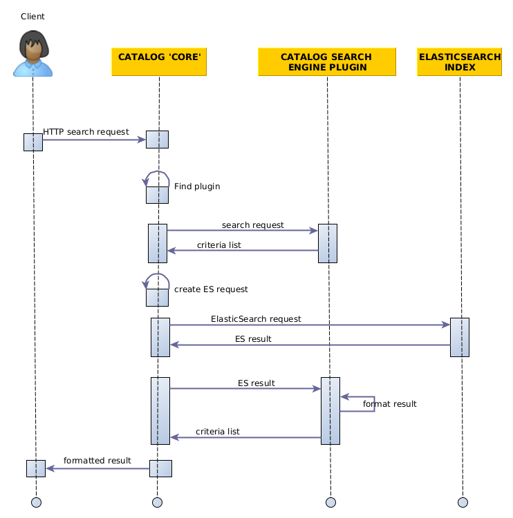
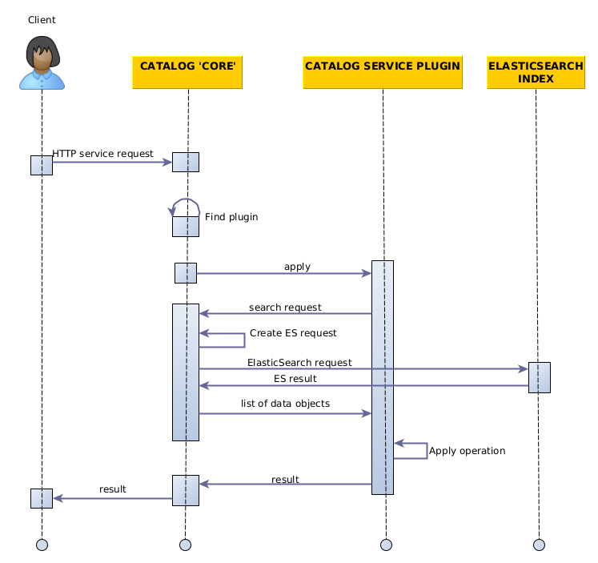

## Conception

There are two main features provided by `Catalog` service :

* Providing a search engine in one of the different search standards supported by REGARDS 
* Performing operations on the products through different services

In both cases, the `Catalog` microservice must send a request to ElasticSearch in order to retrieve the corresponding 
product.

### Search Engines

It is possible to use several search standards with REGARDS to perform researches with the `Catalog` microservice.
To make it possible, the `Catalog` microservice contains different search engines, one for each type of search standard.
These search engines are implemented as plugins.

* The `Catalog` microservice receives a search request through its REST interface. The identifier of the search 
  engine is provided as a path variable.
* The plugin corresponding to the asked service is found thanks to the identifier provided in the request.
* The request is sent to the relevant plugin.
* The search parameters of the request are written in the search standard understood by the plugin. The plugin 
  convert these parameters into a list of criteria, in a common format which can be interpreted by the `Catalog` 
  service.
* This list of criteria is used to create an ElasticSearch request in proper form.
* The result of the ElasticSearch is formatted by the plugin to match the standard required
* The formatted result is sent to the user

:::warning Stac exception
The STAC plugins expose their own REST endpoints.
It means that the call from the user directly requests the plugin, the step where the `Catalog` must find the plugin 
is not operated in this case.
:::

### Service

Several operations can be applied to the products of the Catalog, such as downloading or exporting on specific formats.
These operation are performed by `Catalog` plugins.

* The `Catalog` service receives a service request through its REST interface. The `PluginBusinessId` is provided as a 
  path variable. the payload contains a search request.
* The plugin corresponding to the asked service is found thanks to the `PluginBusinessId` provided in the request. 
  The right plugin is then requested.
*  From the search request of the payload, an ElasticSearch request is elaborated in order to find the good data 
   objects.
* The operation of the plugin can be applied to the result of the search request.
* The final result is sent to the user

## STAC Search description

STAC is one of the search standards you can use with the `rs-catalog` service.
Here is some explanations of how it works.

### STAC Collection management

STAC collections are created from two different sources:
- Static collections from REGARDS collections and datasets,
- Dynamic collections from the configured list of STAC properties.

(If no dynamic collections are configured, the user see directly the
available static collections. Otherwise, the user is given the choice
between static and dynamic collections as two separate collections.)

#### Static collections

In the STAC standard, STAC collections are meant to hold a rather small number
of items, in the hundreds at most. This is why, if the catalog contains a lot
of items, it is a good idea to split them in many different collections.

However, REGARDS already has the notion of collection/datasets, so we recreate
a tree of STAC collections from them.

REGARDS Collections can reference other collections, allowing to build a tree
of collections. Similarly, datasets can reference collections. This is used
by the STAC static collection mechanism to build a tree of STAC collections.

At the root level, static collections display links to the collections or datasets
with no parent collection (referencing no other REGARDS collection).

A user navigating to a STAC collection made from a REGARDS collection will see:
- if this collection is referenced by other collections/datasets: links to these collections/datasets,
- if this collection has only items, the link to the list of items.

A user navigating to a STAC collection made from a REGARDS dataset will see:
- the link to the list of items in this dataset.

#### Dynamic collections

The user may choose to select some of the configured STAC properties
(even the mandatory datetime property) as levels in a dynamic tree.

Each level has at least one sublevel, but may have more.
For instance, datetime properties may have several sublevel consisting of
selecting the year, then the month, then the day.

The dynamic collection is entirely configured in the plugin configuration,
thanks to the "dynamic collection level" and "dynamic collection format"
parameters of the STAC properties. The documentation for these parameters
explains in details how to set their values correctly.

Dynamic collections domain classes are separated in two aspects:
definitions and values.

- Definitions are parsed from the `StacPropertyConfiguration`s.
  They define the structure of the dynamic collections.

- Values are what is provided by the user navigating in collections.
  Values are represented as base64 encoding of the JSON representation
  of key/values. The keys are the names of STAC properties. The values
  are partial or complete values for the properties.

A dynamic collection value allows to provide all possible sub-values,
corresponding to child collections. For instance, a dynamic collection
value finishing with a datetime property for which the year is given,
can lead to all sub-collections for the months of the chosen year.

Once a dynamic collection value is fully completed for the corresponding
dynamic collection definition, when all the level definitions are
fully valued. At that point, the STAC plugin can transform the dynamic
collection value to an `ItemSearchBody`. Then we reuse the search
mechanism with this `ItemSearchBody`.

### Link management

STAC is based extensively on links between entities. Items link
to collections, collections link to their inner items, to parent
or child collections.

However, links provided by our plugin must authenticate the current user.
In STAC, links are only defined by their URL, and it is not pssible
to provide authentication headers to be used by the STAC client.
Fortunately, REGARDS allows to pass the authentication token as
a query parameter named `token`. The plugin leverages this mechanism
and generates links with this parameter.

The class `LinkCreatorServiceImpl` in the `stac-service` module
is responsible for taking a `JWTAuthentication` as input, and
provide links with links with a valid token.

However, these links will be valid only as long as the token is,
and tokens have by default a 2 hour expiration. This means that
the user can not bookmark links provided by our plugin, as they
will expire in a short time.

### STAC browser modifications

Since the official STAC browser implementation ([here](https://github.com/radiantearth/stac-browser) on github)
does not work with links having the `token` query parameter,
a modified version of the STAC browser can be found [here](https://github.com/glmxndr/stac-browser).
This patched version allows to work with the REGARDS `token` query parameters,
at least until the pull request is merged.

