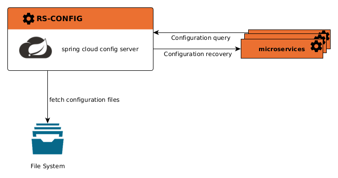

The config microservice is based on [Spring Cloud Config](https://docs.spring.io/spring-cloud-config/docs/current/reference/html/).

**Spring Cloud Config** provides a centralized server for managing the configuration of an application.  
It allows you to centralize configuration files in a repository (typically Git) and distribute them to multiple 
microservices in a distributed architecture.

The main concepts behind **Spring Cloud Config** are :

* **Centralized configuration storage**: The Regards services configuration files are stored in a centralized 
  repository. These configurations can specific to an environment or to a particular microservice.
* **Config server**: The **Spring Cloud Config Server** is a Spring Boot application that exposes a REST API, 
  enabling microservices te retrieve their configurations. This is the role of the **Config** microservice.
* **Config clients**: the multiple **Regards microservices** use the **Spring Cloud Config Client** to retrieve 
  their configuration. On startup, each microservice connects to the **Config server** and recover its configuration.

