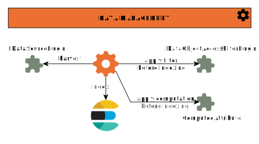

## Introduction

The main purpose of **Data manager** or **rs-dam** microservice is to populate
the Regards [meta-catalog](../../../overview/concepts/02-meta-catalog.md). The microservice is composed of several
modules : `crawler` module, `dam` module(_main core_), `indexer` module, `model` module and `opensearch` module.

To do so, this microservice uses :

- Data sources to retrieve products from several catalogs. Data sources are configured through an UI or XML file (AIP,
  GeoJSON, external database: [REGARDS UI](../../../user-documentation/5-crawler/introduction-crawler.md)).
- Data models to transform and standardize crawled products before adding them into the meta catalog, represented by the
  Elasticsearch index.
- Data access rights to calculate access rights of each product in the meta catalog. Access rights concern the
  permissions granted to a group of users for accessing a set of products that constitute a dataset (
  see [REGARDS UI](../../../user-documentation/3-data-organization/data-access-rights.md)).

This microservice is required to expose products managed by the OAIS Products Manager (`rs-ingest` microservice), the
GeoJson Products Manager (`rs-fem` microservice), or products accessible from an external database or a web service.

Each Elasticsearch index stores products for each project or tenant created in the REGARDS application.

## Meta catalog population

A scheduler is launched to iterate through each configured datasource, and `Data Management` performs the following
tasks:

1. **Retrieve new products from the catalog**: Using an implementation of the `IDataSourcePlugin` interface, the system
   retrieves new products and transforms the datasource-specific product format into the REGARDS standard format.

2. **Insert or update products in the Elasticsearch index**: New or updated products are inserted into or modified
   within the appropriate Elasticsearch index.

3. **Update access groups for products**: If needed, access groups are updated for products using an implementation of
   the `IDataObjectAccessFilterPlugin` interface to apply any necessary product filtering.

4. **Compute calculated attributes**: If the data model contains calculated attributes, these are computed using an
   implementation of the `IComputedAttribute` interface.

:::info
Products aspiration is sequential, one data source after another.
:::
Crawling is performed sequentially. The execution frequency is configurable by the user (
see [Monitoring UI](../../../user-documentation/5-crawler/monitor-crawling.md)). The system determines the next
datasource to be ingested by REGARDS.

### Retrieve new products from data sources

To manage different data sources, an extension point (see the implementation of the **IDataSourcePlugin** interface) is
used to handle the specific requirements for loading products in the REGARDS format :

- Products: A **DATA** Entity, as defined by a model in REGARDS
- A set of products: A **DATASET** Entity, as defined by a model in REGARDS

The following types of crawlers are available:

- **AIP Crawlers**: These crawlers allow crawling of SIPs from the `rs-ingest` microservice. Incremental ingestion uses
  the last data update.
- **Feature Crawlers**: These crawlers allow crawling of features from the `rs-frm` microservice. Incremental ingestion
  uses the last data update.
- **Database Crawlers**: These crawlers allow crawling of data from an external database, with the following modes:
    - Non-incremental ingestion (not recommended)
    - Incremental ingestion based on the last data update
    - Incremental ingestion based on the data identifier

The user selects the incremental ingestion mode during datasource creation.

- **Web Source crawlers** allows to crawl data from an OpenSearch Web Source: incremental aspiration bas on the data
  last update date.

The configuration of the extension point plugin can be used to define, as needed, the type of ingestion, the data source
refresh rate (in seconds), and the overlap duration (in seconds) to prevent data loss.

Next, a mapping must be created between the datasource products and the REGARDS model data before indexing the products.

:::info
Configuration options are available for various connectors used with the crawler's external database (
see [UI](../../../user-documentation/5-crawler/configure-database.md)). The PostgreSQL connector is available as:
`postgresql-db-connection (1.0-SNAPSHOT)`.

:::

### Insert or Update new products in meta catalog

**Dataset** and **Data** entities are stored in a different Elasticsearch index for each project/tenant in
REGARDS application. There is only one index for each tenant.

The **Data** entities are never stored in the REGARDS database.
The **Dataset** entities are stored in the REGARDS database with the following information :

- creation date and update date,
- Identifier of the Uniform Resource Name (example: URN:AIP:**DATASET**:validation:
  39c574a0-2ad6-4f47-9f4a-251d494892b1:V1)
- model of the products in this dataset
- Identifier of the dataset model
- Identifier of the plugin used to load products from a data source
- sub-setting criterion setting on a Dataset for Elasticsearch

### Access rights calculation for dataset

:::note
Acces rights are defined for each dataset and group of users as follows :

- Dataset and Data access
- Dataset access
- Full access to dataset, but partial access to Data (filtered by dynamic plugins)
- No access

:::

Any change in access rights between a group of users and a dataset has an impact on the meta
catalog stored in Elasticsearch. Access rights are indicated in each dataset and products.

Access rights calculation are made when :

- There is a data modification (dataset update, add or remove data object, ...)
- There is a user group modification

Dynamic plugins (see extension point with `IDataObjectAccessFilterPlugins` interface) are made to re-calculate access
rights every day. Access rights will be applied to data filtered by the OpenSearch query.
The periodicity of re-calculation of dynamic plugins is set to once a day by default, but it is configurable in the
microservice properties with the properties `regards.access.rights.update.cron`. The value is in standard cron format.

## Elasticsearch index representation

The following tables show the structure of stocked entities in Elasticsearch index of REGARDS.

#### Entity(product) for DATA type

| Nom                        | Type                              | Description                                                                                                             |
|----------------------------|-----------------------------------|-------------------------------------------------------------------------------------------------------------------------|
| type                       | text                              | Entity type: DATA                                                                                                       |                                                                                                                 |
| creationDate               | Date (format: date_optional_time) | Creation date of entity                                                                                                 |
| lastUpdate                 | Date (format: date_optional_time) | Update date of entity                                                                                                   |
| dataSourceId               | long                              | Data source identifier                                                                                                  |
| datasetModelNames          | text                              | List of dataset model names                                                                                             |
| groups                     | text                              | List of group names for access right                                                                                    |
| id                         | long                              | Entity technical identifier for database                                                                                |
| internal                   | boolean                           | true if a entity of DATA type is internal(created from AIP) or false, external (created from external database)         |
| ipId                       | text                              | Identifier of Uniform Resource Name type (format: `URN:StringId:DATA:tenant:UUID(entityId):version[,order][:revision]`) |
| metadata                   | Object(see details below)         | Information about a group access to a specific dataset for data objects                                                 |
| model                      | Object                            | Entity model                                                                                                            |
| model.description          | text                              | Model description                                                                                                       |
| _model.id_                 | long                              | Model technical identifier for database                                                                                 |
| _model.name_               | text                              | Model name (identical with model property of feature)                                                                   |
| _model.type_               | text                              | Model type : DATA                                                                                                       |
| newPoint                   | geo_point                         | Bounding box north west point                                                                                           |
| setPoint                   | geo_point                         | Bounding box south east point                                                                                           |
| openSearchSubsettingClause | text                              | Representation of the above subsetting clause as an OpenSearch string request                                           | 
| tags                       | text                              | List of tags (included related dataset)                                                                                 |
| wgs84                      | geo_shape                         | Geometry projection on WGS84 crs                                                                                        |
| feature                    | Object(see details below)         | Raw entity feature                                                                                                      |

Metadata for **DATA** type of entity

| Name                              | Type    | Description                                           |
|-----------------------------------|---------|-------------------------------------------------------|
| groups                            | Map     | Map of group names with access right for dataset      |
| groups.\<name\>.dataset           | text    | Identifier of Uniform Resource Name type for dataset  |
| _groups.\<name\>.dataAccessRight_ | boolean | true if access right for the dataset; otherwise false |
| modelNames                        | Map     | Map of model names with dataset URN                   |
| _modelNames.\<name\>.\<URN\>_     | text    | Identifier of Uniform Resource Name type for dataset  |

Feature for **DATA** type of entity

| Name                             | Type                    | Description                                                                                                                              |
|----------------------------------|-------------------------|------------------------------------------------------------------------------------------------------------------------------------------|
| sessionOwner                     | text                    | Session owner                                                                                                                            |
| Session                          | text                    | Session name                                                                                                                             |
| virtualId                        | text                    | Virtual identifier of URN type in order to indicate if this is the last version (format: `URN:StringId:DATA:tenant:UUID(entityId):LAST`) |
| providerId                       | text                    | Provider identifier                                                                                                                      |
| entityType                       | text                    | Entity type : DATA                                                                                                                       |
| label                            | text                    | Entity label (sometimes identical provider identifier property)                                                                          |
| model                            | text                    | Model name of entity (identical with name property of model)                                                                             |
| files                            | Map<DataType, DataFile> | Product-related entity files (example: thumbnail, quicklook, rawdata...)                                                                 |
| _DataType_                       | text                    | Enum of data type (RAWDATA, QUICKLOOK_SD, QUICKLOOK_MD, QUICKLOOK_HD, DOCUMENT, THUMBNAIL...)                                            |
| _DataFile_                       | Object                  | Data for file                                                                                                                            |
| _DataFile.dataType_              | text                    | Enum of data type (RAWDATA, QUICKLOOK_SD, QUICKLOOK_MD, QUICKLOOK_HD, DOCUMENT, THUMBNAIL...)                                            |
| _DataFile.reference_             | boolean                 | False indicates if the file is stored physical in REGARDS, otherwise true REGARDS doesn't store in REGARDS, only reference.              |
| _DataFile.uri_                   | text                    | Uniform Resource identifier of file in order to download. This URI is created by REGARDS.                                                |
| _DataFile.mimeType_              | text                    | Mime type of file                                                                                                                        |
| _DataFile.online_                | boolean                 | True indicates file is on line, otherwise near line for storage service                                                                  |
| _DataFile.checksum_              | text                    | Checksum of file                                                                                                                         |
| _DataFile.digestAlgorithm_       | text                    | Algorithm for checksum of file                                                                                                           |
| _DataFile.filesize_              | double                  | Size of file                                                                                                                             |
| _DataFile.filename_              | text                    | File name                                                                                                                                |
| _DataFile.types_                 | array                   | Custom data file types                                                                                                                   |
| tags                             | text                    | List of tags (included dataset identifier)                                                                                               |
| last                             | boolean                 | true if this the last version; otherwise false                                                                                           |
| version                          | text                    | Entity version                                                                                                                           |
| id                               | text                    | Identifier of Uniform Resource Name type (identical with IpId property)                                                                  |
| geometry                         | Object                  | Information package geometry in GeoJSON RFC 7946 Format                                                                                  |
| _geometry.coordinates_           | double                  | Geometry coordinates                                                                                                                     |
| _geometry.type_                  | text                    | Geometry type (Point, MultiPoint, LineString, Polygon, MultiPolygon...)                                                                  |
| _geometry.bbox_                  | array                   | Geometry bounding box. List of points coordinates [xmin, ymin, xmax, ymax] in Double type.                                               |
| _geometry.crs_                   | text                    | Coordinate reference system. If not specified, WGS84 is considered as the default CRS                                                    |
| normalizedGeometry               | Object                  | Geometry but normalized to be used on a cylindrical project                                                                              |
| _normalizedGeometry.coordinates_ | doi                     | Normalized geometry coordinates                                                                                                          |
| _normalizedGeometry.type_        | text                    | Normalized geometry type (Point, MultiPoint, LineString, Polygon, MultiPolygon...)                                                       |
| _normalizedGeometry.bbox_        | array                   | Geometry bounding box. List of points coordinates [xmin, ymin, xmax, ymax] in Double type.                                               |
| _normalizedGeometry.crs_         | text                    | Coordinate reference system. If not specified, WGS84 is considered as the default CRS                                                    |
| type                             | text                    | Feature                                                                                                                                  |
| crs                              | text                    | Coordinate Reference System (default value: WGS84)                                                                                       |
| properties                       | Object                  | DATA model attributes                                                                                                                    |

#### Entity for DATASET type

| Nom                               | Type                              | Description                                                                                                             |
|-----------------------------------|-----------------------------------|-------------------------------------------------------------------------------------------------------------------------|
| type                              | text                              | Entity type: DATASET                                                                                                    |                                                                                                                 |
| creationDate                      | Date (format: date_optional_time) | Creation date of entity                                                                                                 |
| lastUpdate                        | Date (format: date_optional_time) | Update date of entity                                                                                                   |
| dataModel                         | text                              | Model of Data type for entities included in this dataset                                                                |
| dataSourceId                      | long                              | Data source identifier                                                                                                  |
| groups                            | text                              | List of group names for access right                                                                                    |
| id                                | long                              | Entity technical identifier for database                                                                                |
| internal                          | boolean                           | true if a entity of DATA type is internal(created from AIP) or false, external (created from external database)         |
| ipId                              | text                              | Identifier of Uniform Resource Name type (format: `URN:StringId:DATA:tenant:UUID(entityId):version[,order][:revision]`) |
| metadata                          | Object(see details below)         | Information about a group access to a specific dataset for data objects                                                 |
| model                             | Object                            | Entity model                                                                                                            |
| _model.description_               | text                              | Model description                                                                                                       |
| _model.id_                        | long                              | Model technical identifier for database                                                                                 |
| _model.name_                      | text                              | Model name (identical with model property of feature)                                                                   |
| _model.type_                      | text                              | Model type : DATASET                                                                                                    |
| newPoint                          | geo_point                         | Bounding box north west point                                                                                           |
| setPoint                          | geo_point                         | Bounding box south east point                                                                                           |
| openSearchSubsettingClause        | text                              | Representation of the above subsetting clause as an OpenSearch string request                                           |
| plgConfDataSource                 | Object                            | Plugin configuration for the extension point (IDataSourcePlugin interface)                                              |
| _plgConfDataSource.active_        | boolean                           | Active or not the plugin                                                                                                |
| _plgConfDataSource.businessId_    | text                              | Plugin business identifier                                                                                              |
| _plgConfDataSource.label_         | text                              | Plugin label                                                                                                            |
| _plgConfDataSource.parameters_    | nested                            | Configuration parameters of the plugin                                                                                  |
| _plgConfDataSource.pluginId_      | text                              | Plugin identifier                                                                                                       |
| _plgConfDataSource.priorityOrder_ | long                              | Priority order of the plugin.                                                                                           |
| _plgConfDataSource.version_       | text                              | Plugin version                                                                                                          |
| tags                              | text                              | List of tags                                                                                                            |
| wgs84                             | geo_shape                         | Geometry projection on WGS84 crs                                                                                        |
| feature                           | Object(see details below)         | Raw entity feature                                                                                                      |  

Metadata for **DATASET** type of entity

| Name                                                                    | Type    | Description                                                                 |
|-------------------------------------------------------------------------|---------|-----------------------------------------------------------------------------|
| dataObjectsGroups                                                       | Map     | Map of group names with access right for dataset                            |
| _dataObjectsGroups.\<name\>.groupName_                                  | text    | Group name                                                                  |
| _dataObjectsGroups.\<name\>.dataFileAccess_                             | boolean | true if access right for files of product; otherwise false                  |
| _dataObjectsGroups.\<name\>.dataObjectAccess_                           | boolean | true if access right for objects of products; otherwise false               |
| _dataObjectsGroups.\<name\>.dataAccess_                                 | boolean | true if access right for data of products; otherwise false                  |
| _dataObjectsGroups.\<name\>.metaDataObjectAccessFilterPluginBusinessId_ | String  | Plugin identifier for the extension point :  IDataObjectAccessFilterPlugins |

Feature for **DATASET** type of entities

| Name                          | Type                    | Description                                                                                                                                 |
|-------------------------------|-------------------------|---------------------------------------------------------------------------------------------------------------------------------------------|
| dataObjectsFilesAccessGranted | boolean                 | true if granted Access for data object files; otherwise denied access                                                                       |
| dataObjectsAccessGranted      | boolean                 | true if granted Access for data objects; otherwise denied access                                                                            |
| licence                       | text                    | Licence for dataset                                                                                                                         |
| virtualId                     | text                    | Virtual identifier of URN type in order to indicate if this is the last version (format: `URN:StringId:DATASET:tenant:UUID(entityId):LAST`) |
| providerId                    | text                    | Provider identifier                                                                                                                         |
| entityType                    | text                    | Entity type : DATASET                                                                                                                       |
| id                            | text                    | Identifier of Uniform Resource Name type (format: `URN:StringId:DATA:tenant:UUID(entityId):version[,order][:revision]`)                     |
| label                         | text                    | Label of dataset                                                                                                                            |
| model                         | text                    | Model name of entity (identical with name property of model)                                                                                |
| files                         | Map<DataType, DataFile> | Dataset-related entity files (example: thumbnail, quicklook, rawdata...)                                                                    |
| _DataType_                    | text                    | Enum of data type (RAWDATA, QUICKLOOK_SD, QUICKLOOK_MD, QUICKLOOK_HD, DOCUMENT, THUMBNAIL...)                                               |
| _DataFile_                    | Object                  | Data for file                                                                                                                               |
| _DataFile.dataType_           | text                    | Enum of data type (RAWDATA, QUICKLOOK_SD, QUICKLOOK_MD, QUICKLOOK_HD, DOCUMENT, THUMBNAIL...)                                               |
| _DataFile.reference_          | boolean                 | False indicates if the file is stored physical in REGARDS, otherwise true REGARDS doesn't store in REGARDS, only reference.                 |
| _DataFile.uri_                | text                    | Uniform Resource identifier of file in order to download. This URI is created by REGARDS.                                                   |
| _DataFile.mimeType_           | text                    | Mime type of file                                                                                                                           |
| _DataFile.online_             | boolean                 | True indicates file is on line, otherwise near line for storage service                                                                     |
| _DataFile.checksum_           | text                    | Checksum of file                                                                                                                            |
| _DataFile.digestAlgorithm_    | text                    | Algorithm for checksum of file                                                                                                              |
| _DataFile.filesize_           | double                  | Size of file                                                                                                                                |
| _DataFile.filename_           | text                    | File name                                                                                                                                   |
| _DataFile.types_              | array                   | Custom data file types                                                                                                                      |
| tags                          | text                    | List of tags                                                                                                                                |
| version                       | integer                 | Entity version                                                                                                                              |
| type                          | text                    | Feature                                                                                                                                     |
| properties                    | Object                  | DATA model attributes                                                                                                                       |

