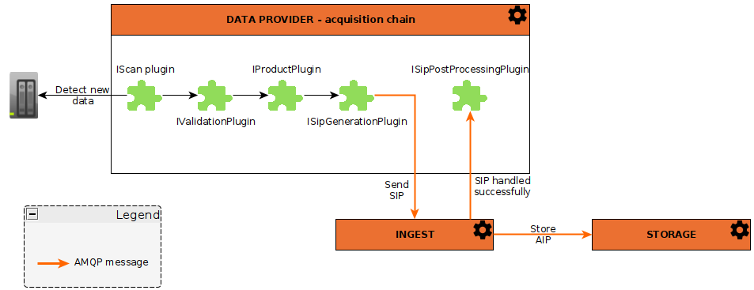

:::note
This guide talks about Product in the Dataprovider point of
view. [Ingest product](/docs/development/concepts/04-products.md) is the real product at Regards point of view.
:::

Dataprovider is used to acquire some [products](/docs/development/concepts/04-products.md) from scanning folders,
through acquisition chains.
Chains are configured to generate products with one or multiple scanned files.

An acquisition chain has several steps :

## Start an acquisition chain

Acquisition chains can be triggered

* periodically, with totally configurable intervals
* manually, from admin UI or directly
  with [Rest API](api-guides/dataprovider-api-swagger.mdx#tag/acquisition-processing-chain-controller/operation/startManualChain).
* restarted (restart only errors detected from a previous acquisition), from admin UI or directly
  with [Rest API](api-guides/dataprovider-api-swagger.mdx#tag/acquisition-processing-chain-controller/operation/relaunchErrors)

## Scan step

Scan is the action to explore a folder (and a complete tree if needed, depending on which plugin you use), and analyse
each file.

Multiple scan path can be indicated. These scan paths are associated to a "since date". Files with an earlier date will
not be processed.

To scan a folder, a [scan plugin](plugins/overview.md#scan-plugins) job is used. There are several ways to scan a folder.

:::info
After a scan, the since date associated with the scan path is updated to the last file scanned date.
Meaning that these files will not be scanned again if the chain is relaunched.
Only modified files will be scanned in the future.
:::

Scanned files will be used in the next steps.

## Validation step

The validation step only validate each file according to a plugin algorithm. Check [here](plugins/overview.md#validation-plugins)
for more details about validation plugin.
All valid files go to the next step.

## Product creation step

Files are wrapped inside [product](../../concepts/04-products.md).
Depending on the configuration, multiple files can be linked to a single product. In configuration, you can indicate
that some files are optionals.

The product plugin generates a unique product name. See [here](plugins/overview.md#product-generator-plugins) for more information about
this plugin.

Products with the same id can exist in case of an exisiting file modification. In this case, a new version of this product
will be created.

These product are stored in dataprovider database with a particular state (see productState attribute of Product objects
in Java) :

* **ACQUIRING** : If the product is not complete (missing files)
* **COMPLETED** : If the product is complete (without optional files - some files can still be added )
* **FINISHED**  : If the product is complete (with optional files included - no more file can be added to the product)
* **UPDATED**   : If the product was complete before the new file acquired. (means a file has been modified)

:::info
In acquisition chains configuration, you can configure the product to create. You can specify how many files are
contained in products and some others informations :

* file type
* file is mandatory or not
* file mime type
:::

## SIP generation step

SIP generation is done by plugin. Check [here](plugins/overview.md#sip-generation-plugins) for more details.

The purpose of this step si to create a SIP product with metadata associated to the files of the product.

Once the product has been generated in SIP format, it is sent to the OAIS catalog (the rs-ingest microservice) by 
[AMQP](../ingest/api-guides/amqp/ingest-amqp-publish-product.mdx).  

The ingest chain to use can be selected in the data provider acquisition chain configuration.  

The versioning method described in [rs-ingest documentation](../ingest/conception.md#versioning) is also configured
in the acquisition chain on the `Data provider` microservice.

## Ingest step

The [Ingest microservice](/docs/development/services/ingest/overview.md) treats each product and sends an acknowledgement by AMQP
message, which indicates if a [Regards product](/docs/development/concepts/04-products.md) is correctly ingested or not.

You can find [here the Sip ingestion AMQP API](/docs/development/services/ingest/api-guides/amqp/ingest-amqp-publish-product.mdx)

Dataprovider catches these amqp message and updates the Dataprovider product state.

## Following Dataprovider Product workflow

A product (in dataprovider) has a ProductSipState attribute. Values for this state are the following :

* **NOT_SCHEDULED** : SIP is not yet scheduled because the related product is not Finished or
  Completed [See product creation step](#product-creation)
* **NOT_SCHEDULED_INVALID** : SIP is not scheduled because the related product is
  Invalid [See product creation step](#product-creation). Data provider has to resubmits its files to fix the problem.
* **SCHEDULED** : SIP generation has been scheduled as a job.
* **SCHEDULED_INTERRUPTED** : SIP generation interrupted by user
* **GENERATION_ERROR** : SIP has not been generated because an error occured.
* **SUBMITTED** : SIP has been generated and submitted to INGEST
* **INGESTION_FAILED** : SIP has been generated but INGEST refuses to treat it
