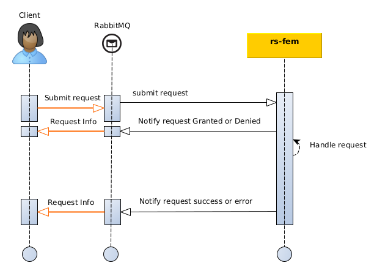

This section describes how to **submit a new product** to the `Feature manager` or `rs-fem` service of REGARDS with 
**AMQP interfaces**.

## Introduction

To create a product through AMQP API, you have to submit a product in GeoJson format with some additional information.
This additional information allows you to:

- Choose product **versioning method**.
- Choose method to handle **product associated files**.
- Add **meta information** about the creation process.

The diagram below explains the global processing of a new **Feature submission request** by REGARDS system.  
For a REGARDS client using message queuing, responses are sent for each change of your request status:

- `DENIED` : Your request has been denied (possibly malformed request).
- `GRANTED` : Your request has been granted and will be processed soon.
- `ERROR` : Processing of your granted request finished in error status.
- `SUCCESS` : Processing of your granted request finished with success. Your feature is successfully created
  and associated files are stored.



Requests and responses are linked with a correlation identifier **requestId** provided into submission requests and
added in service responses.

:::caution
When you submit a Feature submission request you have to ensure that the provided **requestId** is unique. Service will
respond to your request with this identifier.
:::

## AMQP API

### How to

The [Regards AMQP API concept](../../../../../development/concepts/06-amqp-api.md) describes how AMQP interfaces must be
handled to submit events or to subscribe to events.

### Exchange

Submission requests have to be published to this REGARDS RabbitMQ exchange:

| Exchange                                                                                     | Virtual host                   |
|----------------------------------------------------------------------------------------------|--------------------------------|
| `regards.broadcast.fr.cnes.regards.modules.feature.dto.event.in.FeatureCreationRequestEvent` | `regards.multitenant.manager`	 |

### Request content

#### Properties

| Parameter        | Type    | Description                                                          |
|------------------|---------|----------------------------------------------------------------------|
| priority         | Integer | Standard RabbitMQ property to sort messages by priority order.       |
| content_encoding | String  | Standard RabbitMQ property for the encoding type of the message      |
| content_type     | String  | Standard RabbitMQ property for the MIME Type of the message sent     |
| delivery_mode    | Integer | Standard RabbitMQ property for the delivery mode (persistent or not) |

#### Headers

| Header                | Value                                                                                                                         |
|-----------------------|-------------------------------------------------------------------------------------------------------------------------------|
| regards.tenant        | The [tenant or project](../../../../concepts/03-multitenant.md) to request. It **must** be an existing Regards tenant.        |
| regards.request.id    | String of max 36 characters long. **You must ensure that this id is unique**.                                                 |
| regards.request.date  | ISO 8601 date. <br/>See [How it works section](../../conception.md#delaying-the-processing-of-requests) for more information. |
| regards.request.owner | String of max 128 characters long                                                                                             |

:::info
Use the request date parameter to delay the request processing. The given date will be the execution date of your
request. If a past date is provided, request will be processed as soon as possible.
:::

#### Body

| Property | Type                                                               |
|----------|--------------------------------------------------------------------|
| metadata | See below                                                          |
| feature  | (look at [description here](../geojson-feature-format.md#feature)) |

With metadata being described as this:

|            Path             |   Type    |                                                                                                              Description                                                                                                              | Optional |
|:---------------------------:|:---------:|:-------------------------------------------------------------------------------------------------------------------------------------------------------------------------------------------------------------------------------------:|:--------:|
|          priority           | `String`  |                                                         `HIGH`, `NORMAL`, `LOW`.<br/> See [How it works section](../../conception.md#request-priority) for more information.                                                          |          |
|          override           | `Boolean` |                 Indicates whether the previous version should be overridden or not (**only for request without provided URN**).<br/> See [How it works section](../../conception.md#versioning) for more information.                 |   true   |
|       updateIfExists        | `Boolean` | If **URN is provided** and an associated feature already exists, indicates whether the feature should be updated with the new parameters or not.<br/>See [How it works section](../../conception.md#versioning) for more information. |   true   |
|           session           | `String`  |                                                                                     Arbitrary session name to classify data for human operators.                                                                                      |          |
|        sessionOwner         | `String`  |                                                                                     Arbitrary session owner to classify data for human operators.                                                                                     |          |
|          storages           |  `Array`  |                              Target storages if there are files to store (**may be an empty list!**).<br/>See [How it works section](../../conception.md#product-associated-files) for more information.                              |  false   |
| storages[].pluginBusinessId | `String`  |                                                                               Storage plugin identifier (previously configured in `Storage Management`.                                                                               |  false   |
|   storages[].targetTypes    |  `Array`  |                                                                                     List of data object types accepted by this storage location.                                                                                      |   true   |
|    storages[].storePath     | `String`  |                                                                                                 Directory in which to store the file.                                                                                                 |   true   |

### Exemple with files storage

A request with **file storage** means that you want REGARDS to **move the products** files to one or many configured
storage locations. See [How it works section](../../conception.md) for more information.

This feature creation request contains **one product** with only **one file** that will be stored on a **Local**
Regards data storage. That means that the Regards system and more
precisely the [rs-storage microservice](../../../storage/overview)
**must be able to access this file** in order to copy it to the destination storage. Storage locations are configured in
the **storage microservice**.

:::info
This exemple is the way to ask **rs-fem** microservice to move files to the selected storage location(s) of your choice.
:::

```properties
# Headers
regards.tenant=project1
regards.request.id=12345463-0f6b-4488-b58c-52af3f7e9563
regards.request.owner=owner
regards.request.date=2019-07-04T01:03:00
```

```json title='Example of feature creation request body'
{
  "metadata": {
    "sessionOwner": "owner",
    "session": "session",
    "storages": [
      {
        "pluginBusinessId": "Local"
      }
    ],
    "priority": "NORMAL"
  },
  "feature": {
    "entityType": "DATA",
    "model": "FEATURE01",
    "files": [
      {
        "locations": [
          {
            "storage": null,
            "url": "http://www.test.com/filename.xml"
          }
        ],
        "attributes": {
          "dataType": "RAWDATA",
          "mimeType": "application/xml",
          "filename": "filename",
          "filesize": 100,
          "algorithm": "MD5",
          "checksum": "checksum"
        }
      }
    ],
    "id": "MyId",
    "geometry": {
      "coordinates": [
        10.0,
        20.0
      ],
      "type": "Point",
      "bbox": null,
      "crs": null
    },
    "normalizedGeometry": null,
    "properties": {
      "data_type": "TYPE01",
      "file_characterization": {
        "valid": true
      }
    },
    "type": "Feature"
  }
}
```

### Exemple with file reference

A request with **file reference** means that you want REGARDS to reference files **without moving** them from the given
location. See [How it works section](../../conception.md) for more information.

This product contains only one file located on an S3 server.
As the storage location of the file is provided, **S3Server** Regards system will not try to store the file but only
references its given location. Nevertheless, **with this system you must provide** :

- **Storage** location name : Should be an existing storage location defined
  on [rs-storage microservice](../../../storage/overview). If not, the file will be considered as
  **Offline** and will not be accessible for download.
- **File size in bytes** : Regards will not access the file by itself so the information must be provided.
- **metadata.storages** should be an empty array, as you want to reference these files and not copy them

:::info
This exemple is the way to ask **rs-fem** microservice to only reference the files in your product without moving any
file.
:::

```properties
# Headers
regards.tenant=project1
regards.request.id=12345463-0f6b-4488-b58c-52af3f7e9563
regards.request.owner=owner
regards.request.date=2019-07-04T01:03:00
```

```json title='Example of feature creation request body'
{
  "metadata": {
    "sessionOwner": "owner",
    "session": "session",
    "storages": [],
    "priority": "NORMAL"
  },
  "feature": {
    "entityType": "DATA",
    "model": "FEATURE01",
    "files": [
      {
        "locations": [
          {
            "storage": "S3Server",
            "url": "http://www.test.com/bucket1/filename.xml"
          }
        ],
        "attributes": {
          "dataType": "RAWDATA",
          "mimeType": "application/xml",
          "filename": "filename",
          "filesize": 100,
          "algorithm": "MD5",
          "checksum": "checksum"
        }
      }
    ],
    "id": "MyId",
    "geometry": {
      "coordinates": [
        10.0,
        20.0
      ],
      "type": "Point",
      "bbox": null,
      "crs": null
    },
    "normalizedGeometry": null,
    "properties": {
      "data_type": "TYPE01",
      "file_characterization": {
        "valid": true
      }
    },
    "type": "Feature"
  }
}
```

### Responses format

To learn how to subscribe to your request responses as described in the introduction
diagram see [Subscribe to responses](./amqp-subscribe-request-response.md).
