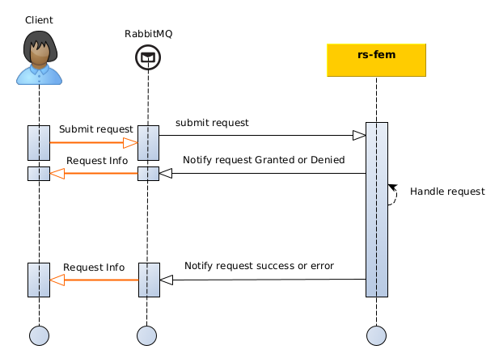

This section describes how to **notify a product** to recipients with the `Feature manager` or `rs-fem` service of
REGARDS with **AMQP interfaces**.

## Introduction

To notify products to one or many recipients `Feature manager` or `rs-fem` microservice relies on `rs-notifier`
microservice.

There is two ways to notify products to `rs-notifier` service:

- **Normal** notification : Send the notifications in the [format](../../conception.md#products-dissemination) specific
  to
  the rs-notifier service and let the service decide, based on its configuration, who to distribute the product to.
- **Direct** notification : Send notifications using the [format](../../conception.md#products-dissemination) specific
  to the rs-notifier service and specify the recipients required.

The diagram below explains the global processing of a new Feature notification request by REGARDS system.  
For a REGARDS client using message queuing, responses are sent for each change of your request status:

- `DENIED` : Your request has been denied (possibly malformed request).
- `GRANTED` : Your request has been granted and will be processed soon
- `ERROR` : Processing of your granted request finished in error status.
- `SUCCESS` : Processing of your granted request finished with success. Your SIP as been successfully ingest,
  AIP generated and associated files stored.



Requests and responses are linked with a correlation identifier : **requestId** provided into notification requests and
added in service responses.

:::info
When you submit a Feature notification request you have to ensure that the provided **requestId is unique**.
Service will respond to your request with this identifier.
:::

## AMQP API

### How to

The [Regards AMQP API concept](../../../../../development/concepts/06-amqp-api.md) describe how AMQP interfaces must be
handled to
submit events or to subscribe to events.

### Exchange

Notification requests have to be published to this REGARDS RabbitMQ exchange:

| Exchange                                                                                         | Virtual host                   |
|--------------------------------------------------------------------------------------------------|--------------------------------|
| `regards.broadcast.fr.cnes.regards.modules.feature.dto.event.in.FeatureNotificationRequestEvent` | `regards.multitenant.manager`	 |

### Request content

#### Properties

| Parameter        | Type    | Description                                                          |
|------------------|---------|----------------------------------------------------------------------|
| priority         | Integer | Standard RabbitMQ property to sort messages by priority order.       |
| content_encoding | String  | Standard RabbitMQ property for the encoding type of the message      |
| content_type     | String  | Standard RabbitMQ property for the MIME Type of the message sent     |
| delivery_mode    | Integer | Standard RabbitMQ property for the delivery mode (persistent or not) |

#### Headers

| Header                | Value                                                                                                                                                                                | Mandatory |
|-----------------------|--------------------------------------------------------------------------------------------------------------------------------------------------------------------------------------|-----------|
| regards.tenant        | The [tenant or project](../../../../concepts/03-multitenant.md) to request. It **must** be an existing Regards tenant.                                                               | True      |
| regards.request.id    | String of max 36 characters long. **You must ensure that this id is unique**.                                                                                                        | True      |
| regards.request.date  | ISO 8601 date (**can be in the future to delay request processing**). <br/>See [How it works section](../../conception.md#delaying-the-processing-of-requests) for more information. | False     |
| regards.request.owner | String of max 128 characters long                                                                                                                                                    | True      |

:::info
Use the request date parameter to delay the request processing if you need to by giving a date in the future.
The given date, will the execution date of our request.
If a past date is provided, request will be processed as soon as possible.
:::

#### Body

| Parameter  | Type          | Description                                                                                                          | Mandatory |
|------------|---------------|----------------------------------------------------------------------------------------------------------------------|-----------|
| urn        | `String`      | Product URN to notify.                                                                                               | True      |
| priority   | `String`      | `HIGH`, `NORMAL`, `LOW`.<br/> See [How it works section](../../conception.md#request-priority) for more information. | True      |
| recipients | `set<String>` | List of recipients. To be provided only for **direct notification mode**.                                            | False     |

:::caution
If notification recipients are supplied, they must correspond to existing recipients configured on the rs-notifier
service.
:::

### Example for standard notification mode

```properties
# Headers
regards.tenant=project1
regards.request.id=12345463-0f6b-4488-b58c-52af3f7e9563
regards.request.owner=owner
```

```json title='paylod for notification request'
{
  "urn": "URN:FEATURE:DATA:project1:87fdda0e-27d1-494f-a1c0-c57f2f0810f7:V1",
  "priority": "NORMAL"
}
```

### Example for direct notification mode

```properties
# Headers
regards.tenant=project1
regards.request.id=12345463-0f6b-4488-b58c-52af3f7e9563
regards.request.owner=owner
```

```json title='paylod for notification request'
{
  "urn": "URN:FEATURE:DATA:project1:87fdda0e-27d1-494f-a1c0-c57f2f0810f7:V1",
  "priority": "NORMAL",
  "recipients": [
    "MISSION-1",
    "MISSION-2"
  ]
}
```

### Responses format

To learn how to subscribe to your request responses as described in the introduction
diagram see [Subscribe to responses](./amqp-subscribe-request-response.md).
