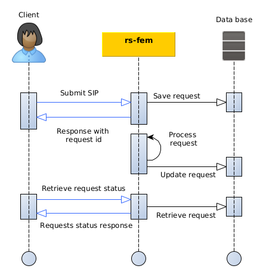

## Introduction

This section describes how to delete products with the `rs-fem` service using the REST interfaces.

The diagram below explains the global processing of a product deletion request by REGARDS system.
For a REGARDS client using REST interface, the main steps are:

1. Authenticate to REGARDS in order to retrieve a valid token. See
   the [authenticate guide](../../../../services/authentication/api-guides/rest/authent-oauth2.mdx).
2. Send your product archive request containing product information to RS-FEM microservice
3. Retrieve information about your request status from RS-FEM microservice.



## REST API

### How to

The [Regards REST API concept](../../../../concepts/05-rest-api.md) describe how REST interfaces must be handled to
submit requests.

### Endpoint

| Endpoint  | Verb   |
|-----------|--------|
| /features | DELETE |

### Request content

| Property     | Type           | description                                                                                                          |
|--------------|----------------|----------------------------------------------------------------------------------------------------------------------|
| priority     | `String`       | `HIGH`, `NORMAL`, `LOW`.<br/> See [How it works section](../../conception.md#request-priority) for more information. |
| featuresUrns | `List<String>` | Unique identifier of the features to delete                                                                          |

### Example

```bash
curl -X DELETE https://regards.com/api/v1/rs-fem/features --data "@request.json" \
 -H "Authorization: Bearer <token>" \
 -H "Content-Type: application/json"
```

```json title='Example of deletion request'
{
  "featuresUrns": [
    "URN:FEATURE:DATA:tenant:ca4015e5-9c59-49ff-b35e-f30c6929f402:V1"
  ],
  "priority": "NORMAL"
}
```

### Response

* **Code:** 201 Created

:::info
The success return codes only means that your request has been granted an will be processed soon.
:::

**Response Body:**

| Name    | Type                  | Description                                      |
|---------|-----------------------|--------------------------------------------------|
| granted | `Map<String, String>` | Couples FeatureId/requestId for granted requests |
| denied  | `Map<String, String>` | Couples FeatureId/cause for denied requests      |
| message | `List<String>`        | Error messages information                       |

```json title='Example of creation response'

{
  "granted": {
    "ProductId001": "request-id-001"
  },
  "denied": {
    "ProductId002": "Missing parameter cloud_coverage"
  },
  "messages": []
}
```
