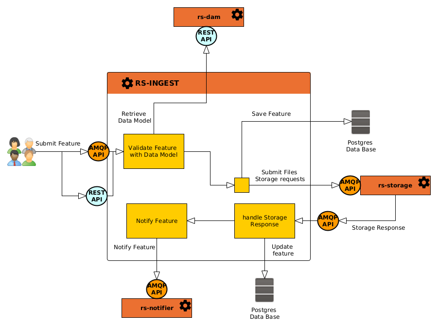
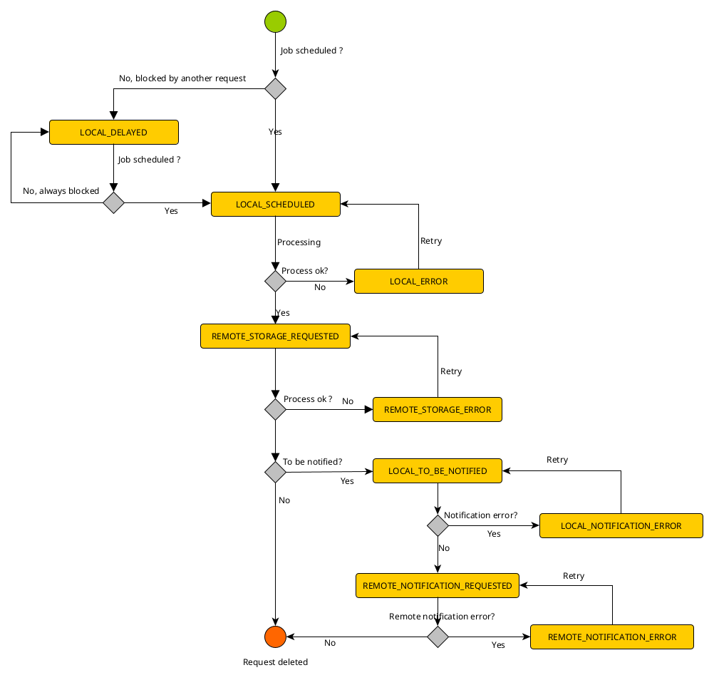

## Introduction

Products creation requests can be submitted as **Features** with **GeoJSON** formatted requests
through [AMQP API](./guides/amqp/publish-a-creation-request-event) or
[REST API](./guides/rest/create-product) to `rs-fem` microservice.

:::info
AMQP API is strongly recommended to increase service performances when a big amount of requests is sent.
:::

When a **Feature request** is received (AMQP or REST API), the request is saved in the microservice database and will be
processed by **schedulers** and **Jobs** as described
in the [global architecture overview](../../../concepts/scalability).

The diagram below explains how a product creation request is processed.



Throughout the processing of a request in the service, the status of the request changes. 
The diagram below shows the possible states and the transitions between them.



## Request priority

When submitting a request to create, modify, delete or notify products, you can specify the priority of your request.
There are three priorities: **HIGH**, **NORMAL** and **LOW**.

Giving your request a high priority ensures that it will be processed by the service before requests with lower 
priorities.

## Products metadata validation

Submitted Feature requests **must** provide an associated **Data Model** in their metadata section.
To validate this model, `rs-fem` microservice keeps a cache of Data Models retrieved from the `rs-dam`
microservice.

Model validation checks for attributes in **properties.descriptiveInformation** section of the SIP. They have to be 
compliant with attributes defined in the given **Data Model**. Validation checks for:

- **Mandatory** attributes,
- Attributes **values types**
- Attributes **values restrictions**

Attributes of the data model are validated with **case sensitive** on attributes labels.

## Products versioning

To understand versioning, you must be familiar with the two different identifiers of a feature in the `rs-fem` service.

- Provider identifier (or `providerId`) : Is an arbitrary identifier provided by the feature creator owner.
  It is not a unique identifier for the service, but is used to handle product versioning.
- **U**niform **R**esource **N**ame (or `urn`) : Is the **unique identifier** of a feature.

The `rs-fem` representation of URN is
URN:**FEATURE**:`<type\>`:`<tenant\>`:`<uuid\>`:V`<version\>` with :

- **type** : `DATA`, `DATASET` or `COLLECTION`
- **tenant**: [tenant or project](../../concepts/03-multitenant.md) in which the product is created.
- **uid**: Universally unique identifier. Generated from the feature given **providerId**
- **version** : entity version

```json title='Feature URN example'
"urn":"URN:FEATURE:DATA:project1:c6487db8-9955-3917-a7e2-0374ccde903c:V1"
```

When updating a Feature with a request, the `rs-fem` microservice may deal with Feature versioning.

There are several possibilities to update a request, leading to different versioning policies:

* If a **Patch request** is used with an existing feature **urn**, the product is simply updated, its version
  is not incremented. To learn more on how to patch a product see
  [AMQP Guide](./api-guides/amqp/amqp-publish-patch-product-request.md) or
  [REST Guide](./api-guides/rest/rest-patch-product.md).
* If a **Creation request** is used with the same **providerId** as an existing one, then a new feature is created with
  an incremented version number. If the **override** parameter in the request metadata is set to `true`, then
  the old versioned feature is deleted after the new one creation success. To learn more on how to create a product see
  [AMQP Guide](./api-guides/amqp/amqp-publish-create-product-request.md) or
  [REST Guide](./api-guides/rest/rest-create-product.md).
* If a **Creation request** is used with the same **providerId** and **urn** as an existing one , it means that a
  feature with the same version already exists. Then, we need to check the **updateIfExists** parameter in the request
  metadata :
    * If it is set to `true`, then the **feature is updated**, like a patch request.
    * Otherwise, an **error is raised**.

Mainly, there is two ways to handle versioning in **rs-fem** service :

* Let the service manage the versioning and only provide the **provider identifier** (providerId)
* Manually handle product versioning by providing unique **urn** in the request metadata.

## Product Associated files

### Creation

When you ask the `rs-fem` microservice to create a new [product](../../../overview/concepts/01-products.md),
you can choose between two methods to handle associated files:

- **Storage** : You want Regards system to move associated files to one or many configured storage locations.
- **Reference** : You want Regards system to reference associated files with there current location and without moving
  them.

In both case, the product associated files wil be added in the `rs-storage` microservice file referential.
If your product contains associated files, it will not be fully created until the storage service has correctly
processed the files and added them to its repository.

To know how to select file management in a creation request see
[AMQP Guide](./api-guides/amqp/amqp-publish-create-product-request.md) or
[REST Guide](./api-guides/rest/rest-create-product.md).

Like product metadata, the files associated with a product can be modified. To know how to modify product files see
[AMQP Guide](./api-guides/amqp/amqp-publish-patch-product-request.md) or
[REST Guide](./api-guides/rest/rest-patch-product.md).

### Update

When you request a product update and specify associated files, by default the service will add these files to the
existing ones. However, if you use the [AMQP API](./api-guides/amqp/amqp-publish-patch-product-request.md),
you can specify the file update mode. The available modes are :

- **REPLACE**: Deletes existing files and adds new ones.
- **APPEND**: Adds the supplied files to the existing files.

## Products dissemination

### How to ?

If the `rs-fem` microservice is configured to notify external components, each created/modified/deleted
feature is sent to the `rs-notifier` microservice for notification to external components.

To notify external systems you need to:

- Activate automatic notifications of products in the
  [Feature manager configuration](../../../user-documentation/4_3-fem/manage-features-settings.md)
- Configure the wanted recipient(s) of the notifications in the
  [Notification service configuration](../notifier/overview.md)

Nevertheless, if automatic notifications is not activated, you can manually notify selected features through
[admin UI](../../../user-documentation/4_3-fem/manage-features.md#les-actions).

When a notification is sent to a recipient by the `rs-notifier` service, the dissemination information of the feature is
updated by the `rs-fem` microservice with the following parameters:

- **recipient label**: Name of the notification's recipient (as configured in `rs-notifier` service)
- **dissemination date**: Date of the notification
- **acknowledge date**: Date of received acknowledgement. If the recipient is not configured to send acknowledgements, 
  this date is the same as the dissemination date. If the recipient is configured to send acknowledgements, this 
  date is the date on which the acknowledgement is received. This acknowledgement parameter is configured in the
  `rs-notifier` service for each recipient.

With this information, Regards administrators can see through administrator UI all recipients of features
notifications.

### Products notification format

To understand how `rs-notifier` can handle product notifications received from the `rs-fem` microservice, here is the 
format of each product notification between `rs-fem` and `rs-notifier` :

```json
{
  "metadata": {
    "action": "",
    "sessionOwner": "",
    "session": ""
  },
  "payload": {
    "type": "Feature",
    "urn": "",
    "entityType": "",
    "model": "",
    "last": false,
    "history": {
      "createdBy": "",
      "updatedBy": "",
      "deletedBy": ""
    },
    "geometry": {},
    "bbox": [],
    "crs": "",
    "files": [],
    "properties": {}
  }
}
```

The **payload section** contains the product that has been notified and the **metadata section** contains the following 
information:

| Parameter    | Type     | description                                                                                                                                                  |
|--------------|----------|--------------------------------------------------------------------------------------------------------------------------------------------------------------|
| action       | `String` | Indicates the action on the product that triggered the notification.<br/> Possible values are`CREATED`, `UPDATED`, `DELETED`, `ALREADY_DELETED`, `NOTIFIED`. |
| sessionOwner | `String` | Session Owner that created the product                                                                                                                       |
| session      | `String` | Session in which the product was created                                                                                                                     |

You can then use this information (metadata and payload sections) to configure the
[rs-notifier service](../notifier/overview.md) to send the feature to the required recipients.

## Products dissemination acknowledgement

External systems who subscribe to Feature notifications from the `rs-fem` service can send back an acknowledgement to
inform that the notification has been successfully handled. To do so, refer
to [Feature notification acknowledgement guide](./api-guides/amqp/amqp-publish-ack-request.md).

With this system, Regards administrators can validate through administrator UI that notifications has been successfully
handled by recipients.

## Delaying the processing of requests

When you submit a product request to the `rs-fem` microservice, you can ask for them to be processed at
a later date. To do this, you need to specify the date on which you want the treatment to be carried out.

Please refer to the various API guides to find out how to specify this date in your requests.

