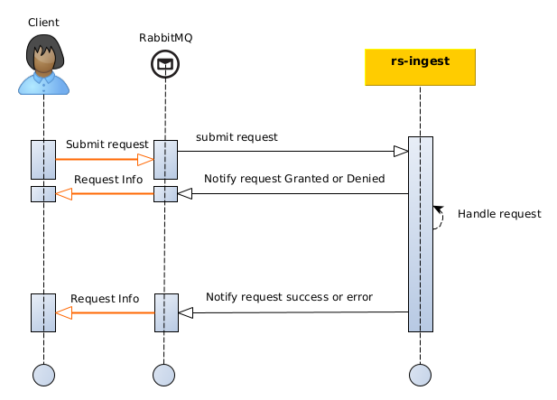

import RegardsApiSchema from '/src/redoc/RegardsApiSchema';
import Spec from '../rest/rs-ingest.json';

This section describes how to **submit a new product** to the OAIS service of REGARDS thanks to **AMQP interfaces**.

## Introduction

The diagram below explains the global processing of a new SIP submission request by REGARDS system.  
For a REGARDS client using message queuing, responses are sent for each change of your request status :

- `DENIED` : Your request has been denied (possibly malformed request).
- `GRANTED` : Your request has been granted an will be processed soon
- `ERROR` : Processing of your granted request finished in error status.
- `SUCCESS` : Processing of your granted request finished with success. Your SIP as been successfully ingest, AIP
  generated and associated files stored.



Requests and responses are linked with a correlation identifier : **requestId** provided into submission requests and
added in service responses.

:::info
When you submit a SIP submission request you have to ensure that the provided requestId is unique. Service will respond
to your request with this identifier.
:::

## AMQP API

### How to

The [Regards AMQP API concept](../../../../concepts/06-amqp-api.md) describe how AMQP interfaces must be handled to
submit events or to subscribe to events.

### Exchange

Submission requests have to be published to REGARDS Rabbitmq exchange:

| Exchange                                                                              | Virtual host                   |
|---------------------------------------------------------------------------------------|--------------------------------|
| `regards.broadcast.fr.cnes.regards.modules.ingest.dto.sip.flow.IngestRequestFlowItem` | `regards.multitenant.manager`	 |

### Request content

#### Properties

| Parameter        | Type    | Description                                                          |
|------------------|---------|----------------------------------------------------------------------|
| priority         | Integer | Standard RabbitMQ property to sort messages by priority order.       |
| content_encoding | String  | Standard RabbitMQ property for the encoding type of the message      |
| content_type     | String  | Standard RabbitMQ property for the MIME Type of the message sent     |
| delivery_mode    | Integer | Standard RabbitMQ property for the delivery mode (persistent or not) |

#### Headers

| Parameter      | Type   | Description                                                    |
|----------------|--------|----------------------------------------------------------------|
| regards.tenant | String | Tenant name depends on REGARDS instance project configuration. |
| regards.type   | String | Type of content of the message                                 |

```json title="Example of the properties and headers of an Ingest request event message"
{
  "priority": 1,
  "delivery_mode": 2,
  "content_encoding": "UTF-8",
  "content_type": "application/json",
  "headers": [
    {
      "regards.tenant": "REGARDS",
      "regards.type": "fr.cnes.regards.modules.ingest.dto.sip.flow.IngestRequestFlowItem"
    }
  ]
}
```

#### Body

```json
{
  "sip": {
    ...
  },
  "metadata": {
    ...
  },
  "requestId": "xxx"
}
```

- `sip` content schema properties (To see more detailed information for OAIS SIP format
  see [Regards OAIS](../../../../appendices/01-oais.md))

<RegardsApiSchema spec={Spec} pointer="#/components/schemas/SIPDto" showExample={false}/>

- `metadata` content schema properties

<RegardsApiSchema spec={Spec} pointer="#/components/schemas/IngestMetadataDto" showExample={false}/>

### Responses format

To learn how to subscribe to your request responses as described in the introduction diagram
see [Subscribe to SIP submission response](./ingest-amqp-subscribe-sip-responses.md)
