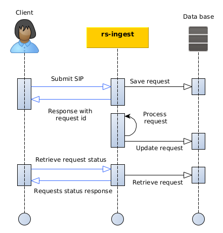

import RegardsApiSchema from '/src/redoc/RegardsApiSchema';
import Spec from './rs-ingest.json';

## Introduction

This section describes how to submit a new product to the `rs-ingest` service using the REST interfaces.

The diagram below explains the global processing of a new product submission request by REGARDS system.  
For a REGARDS client using REST interface, the main steps are:

1. Authenticate to REGARDS in order to retrieve a valid token. See
   the [authenticate guide](../../../../services/authentication/api-guides/rest/authent-oauth2.mdx).
2. Send your product archive request containing product information to RS-INGEST microservice
3. Retrieve information about your request status from RS-INGEST microservice.



## REST API

### How to

The [Regards REST API concept](../../../../concepts/05-rest-api.md) describe how REST interfaces must be handled to
submit requests.

### Endpoint

| Endpoint | Verb |
|----------|------|
| /sips    | POST |

### Request format

To submit a SIP Collection request, refers to [openAPI description](./api-swagger#tag/sip-controller/operation/ingest)
without filling the **ref** section.
The **ref** section is used to submit a SIP by referencing a file instead of providing SIP information in the request
body.

Request body parameter is a json formated object.

```json
{
  "type": "FeatureCollection",
  "metadata": {},
  "features": []
}
```

| Parameter | Description                                                                                                                                   |
|-----------|-----------------------------------------------------------------------------------------------------------------------------------------------|
| type      | Entity type, only possible value at this level is **FeatureCollection**                                                                       |
| metadata  | Contains metadata used by the service to process the SIP                                                                                      |
| features  | List of SIP to submit. You can find more information about **SIP** format in the [REGARDS OAIS appendice](../../../../appendices/01-oais.md). |

`metadata` section contains :

<RegardsApiSchema spec={Spec} pointer="#/components/schemas/IngestMetadataDto" />

#### Exemple with files storage

In the following example, only one SIP **RawProduct_001** is submitted.

This product contains only one file located on file system at **/products/2024/data_file.raw** that will be stored one
**Local** Regards data storage. That means that the Regards system and more
precisely [rs-storage microservice](../../../storage/overview.md) **must be able to access this file**
to copy it to the
destination storage. Storage locations are configured in **storage microservice**.

```json
{
  "type": "FeatureCollection",
  "metadata": {
    "categories": [
      "January-2024"
    ],
    "ingestChain": "DefaultIngestChain",
    "model": "DataModel01",
    "session": "Submissions of 2024-08-01",
    "sessionOwner": "Jean",
    "storages": [
      {
        "pluginBusinessId": "Local",
        "targetTypes": []
      }
    ],
    "submissionDate": "2024-08-01T00:15:22Z",
    "versioningMode": "INC_VERSION"
  },
  "features": [
    {
      "type": "Feature",
      "id": "RawProduct_001",
      "bbox": [
        -122.7,
        45.51,
        -122.64,
        45.53
      ],
      "crs": "WGS84",
      "geometry": {
        "coordinates": [
          125.6,
          10.1
        ],
        "type": "Point"
      },
      "ipType": "DATA",
      "properties": {
        "contentInformations": [
          {
            "dataObject": {
              "algorithm": "MD5",
              "checksum": "145ff4e2fb057359fe66bd398aef3f9b",
              "filename": "data_file.raw",
              "locations": [
                {
                  "url": "file:/products/2024/data_file.raw"
                }
              ],
              "regardsDataType": "RAWDATA"
            },
            "representationInformation": {
              "syntax": {
                "description": "Scientific raw data",
                "mimeType": "application/octet-stream",
                "name": "data_file.raw"
              }
            }
          }
        ],
        "descriptiveInformation": {
          "mesure": "value"
        },
        "pdi": {}
      }
    }
  ]
}
```

#### Example with files reference

In the following example, only one SIP **RawProduct_001** is submitted.

This product contains only one file located on a S3 server at **https:/my.s3.server/bucket_01/data_file.raw**.
As the storage location of the file is provided (`properties.contentInformations.dataObject.locations.storage =
S3Server`), Regards system will not try to store the file but only
reference its given location. Nevertheless, **with this system you must provide** :

- **Storage** location name : Should be an existing storage location defined
  on [rs-storage microservice](../../../storage/overview.md). If not, the file will be considered as
  **Offline** and will not be accessible for download.
- **File size in bytes** : Regards will not access the file by itself so the information must be provided.

```json
{
  "type": "FeatureCollection",
  "metadata": {
    "categories": [
      "January-2024"
    ],
    "ingestChain": "DefaultIngestChain",
    "model": "DataModel01",
    "session": "Submissions of 2024-08-01",
    "sessionOwner": "Jean",
    "storages": [],
    "submissionDate": "2024-08-01T00:15:22Z",
    "versioningMode": "INC_VERSION"
  },
  "features": [
    {
      "type": "Feature",
      "id": "RawProduct_001",
      "bbox": [
        -122.7,
        45.51,
        -122.64,
        45.53
      ],
      "crs": "WGS84",
      "geometry": {
        "coordinates": [
          125.6,
          10.1
        ],
        "type": "Point"
      },
      "ipType": "DATA",
      "properties": {
        "contentInformations": [
          {
            "dataObject": {
              "algorithm": "MD5",
              "checksum": "145ff4e2fb057359fe66bd398aef3f9b",
              "filename": "data_file.raw",
              "fileSize": 1235689,
              "locations": [
                {
                  "storage": "S3Server",
                  "url": "https:/my.s3.server/bucket_01/data_file.raw"
                }
              ],
              "regardsDataType": "RAWDATA"
            },
            "representationInformation": {
              "syntax": {
                "description": "Scientific raw data",
                "mimeType": "application/octet-stream",
                "name": "data_file.raw"
              }
            }
          }
        ],
        "descriptiveInformation": {
          "mesure": "value"
        },
        "pdi": {}
      }
    }
  ]
}
```

### Response

Response body is a json formated object with :

<RegardsApiSchema spec={Spec} pointer="#/components/schemas/RequestInfoDto" />