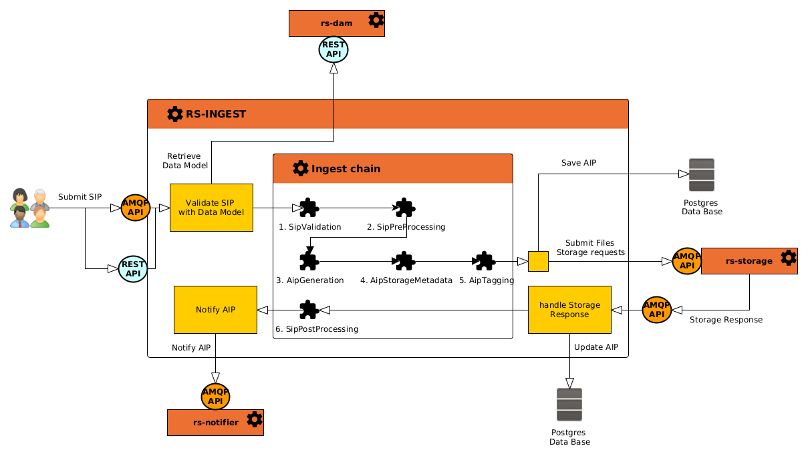
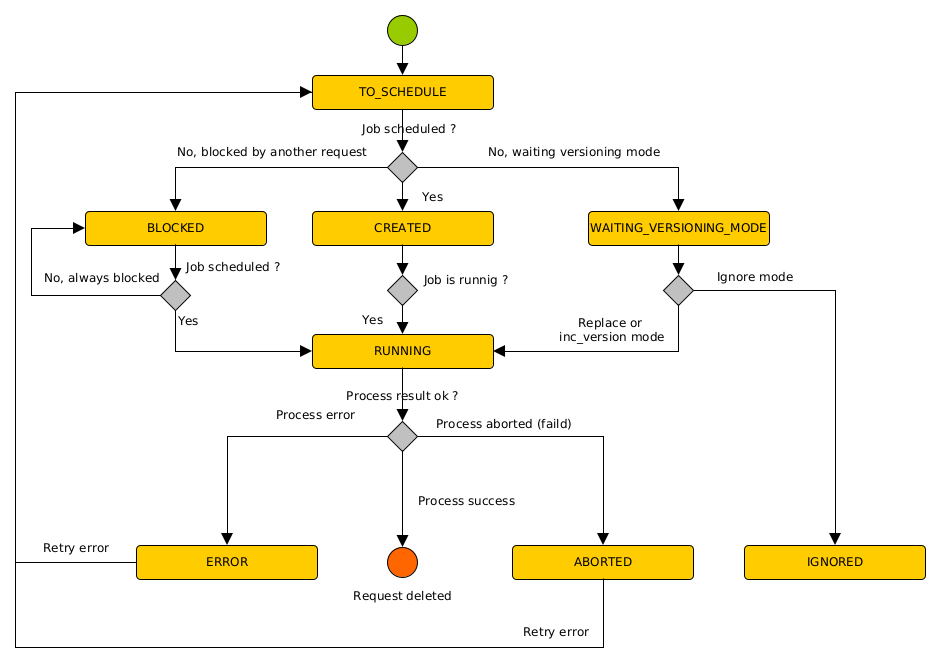

## Introduction

[Products](../../concepts/04-products.md) creation requests can be submitted with **SIP** formated requests
through [AMQP API](api-guides/amqp/ingest-amqp-publish-product.mdx) or [REST API](api-guides/rest/submit-sip.mdx)
to `rs-ingest` microservice.

:::info
AMQP API is strongly recommended to increase service performances when a big amount of requests is sent.
:::

When a **SIP request** is received (AMQP or REST API), request is saved in the microservice database and will be
processed by **schedulers** and **Jobs** as described
in [Requests and Jobs processing concept overview](../../concepts/10-requests-jobs.md).

When a **SIP** or **S**ubmition **I**nformation **P**ackage is handled by **rs-ingest service**, it is transformed
to an **AIP** or **A**rchival **I**nformation **P**ackage by adding :

- Metadata
- Tags
- History
- Files storage information

The main concept to understand how `rs-ingest` microservice handles **SIP** is **Ingestion chains**.
Ingestion chains are configurable
workflows to define the way **SIP requests** will be handled. It is a succession of [plugins](./plugins/overview.md).

The here under diagram explains :

- Concept of **Ingest chain** with **Plugins**
- Workflow to handle a **SIP request**.



SIP creation requests can be in different states. The following diagram explain these states.



## Ingest chain

The **Ingest chain** is the main configurable item in the `rs-ingest` microservice to define how SIPs will be handled.
Administrators can configure one or many **Ingest chains** as
described [here](../../../user-documentation/4_1-ingest/ingestion-chain-configuration.md).

The **Ingest chain** used to process a SIP is defined in the **metadata** section of the request as described
in [AMQP guide](./api-guides/amqp/ingest-amqp-publish-product.mdx) or [REST Guide](./api-guides/rest/submit-sip.mdx).

All steps of an **Ingest chain** are implemented by a plugin in order to be able to customize behavior for each
project and mission. Steps of an **Ingest chain** are :

- **SIP validation** : to valid input SIP metadata and/or associated files.
- **SIP Pre processing** : apply a process before the SIP is transformed to an AIP.
- **AIP Metadata Generation** : transform the SIP metadata to insert them into the AIP.
- **AIP Storage Metadata Generation** : transform files storage location information.
- **AIP Tagging** : add some tags to the output AIP.
- **SIP Post processing** : apply a process once the AIP is fully stored.

During all the process, the **SIP entity** status can be :

- `INGESTED` : The SIP as been validated and AIP is generated.
- `STORED` : The files of the AIP associated to the SIP have been successfully stored with the `rs-storage` service. If
  the SIP and
  the AIP are not associated to any file, then the `STORED` status is immediately set without waiting for `rs-storage`
  response.
- `DELETED` : The SIP has been deleted without the **irrevocably** option. With the **irrevocably** option set, the
  entity is fully deleted from database (and not just marked as deleted).

When a SIP is in `INGESTED` state, the **AIP entity** is created. The AIP status can be :

- `GENERATED` : The AIP has been successfully generated by the **AIP Metadata Generation Plugin**
- `STORED`    : The files of the AIP are successfully stored or the AIP does not contain any files.
- `DELETED`   : The AIP as been deleted without the **irrevocably** option. With the **irrevocably** option
  set, the entity is fully deleted from database (and not just marked as deleted).

## Model validation

A submitted SIP requests can provide an associated **Data Model** in its metadata section as described
in [AMQP guide](./api-guides/amqp/ingest-amqp-publish-product.mdx) or [REST Guide](./api-guides/rest/submit-sip.mdx). If
no model is defined in the submitted SIP, no validation is done. To do this model validation, `rs-ingest` microservice
keep a cache of Data Models retrieved from the `rs-dam` microservice.

Model validation checks for attributes in the **properties.descriptiveInformation** section of the SIP to be compliant
with
attributes defined in the given **Data Model**. Validation checks for :

- **Mandatory** attributes,
- Attributes **values types**
- Attributes **values restrictions**

Attributes of the data model are validated with **case sensitiveness** on attributes labels.

## Versioning

SIP (and associated AIP) versioning is handled by the `rs-ingest` microservice. To do so, the SIP (and AIP)
**providerId**
is used. When a SIP is submitted with a providerId that already exists the service will try to handle versioning with
three possible methods **REPLACE**, **INC_VERSION** or **MANUAL**. The versioning method is provided in request
**metadata.versioningMode** section.

These three methods of versioning are :

- **INC_VERSION** : The new SIP and AIP are created with an incremented version.
- **REPLACE** : The new SIP and AIP are created with an incremented version. And when new AIP is fully created and
  stored,
  the original SIP and AIP versions are **deleted**.
- **MANUAL** : With this versioning method, the SIP is not created. The request remains in
  **WAITING_VERSIONING_MODE* status*
  waiting for an administrator to manually select the versioning mode between the two first ones **REPLACE** or
  **INC_VERSION** by using the administration UI.

The **unique identifier** of a SIP or an AIP is generated by the `rs-ingest` microservice, it's its **URN**
(**U**niform **R**esource **N**ame). This identifier contains the entity version.

The Ingest representation of an URN is URN:**<entity\>**:**<type\>**:**<tenant\>**:**<uuid\>**:V**<version\>** with :

- **entity** : AIP or SIP
- **type** : DATA, DATASET or COLLECTION
- **version** : entity version

```json title="Example of product URN"
"urn":"URN:AIP:DATA:project1:c6487db8-9955-3917-a7e2-0374ccde903c:V1"
```

## Errors management

SIP creation requests can specify the way errors are handled with the parameter `metadata.replaceErrors`. This
parameter is a boolean.

If `replaceErrors` is set to `true` and there is already an existing SIP creation request in error state,
as both requests have the same `providerId`, the previous error request is deleted and replaced with the
new one. Otherwise, the last request is retried.

The **default value** of this parameter is `false` if not specified in the submitted SIP.

The default behavior is to keep SIP requests in error state to allow the administrator to retry them. If you prefer to
send a new request instead of retrying the existing one, use the `replaceErrors` parameter in your request.

## Products dissemination

If the `rs-ingest` microservice is configured to notify external components, each created/modified/deleted AIPs are sent
to the `rs-notifier` microservice to notify external components.

To notify external systems, you need to :

- Activate notification of products in `rs-ingest` microservice configuration. To do so,
  see [Ingest Configuration](../../../user-documentation/4_1-ingest/settings-ingest.md)
- Configure `rs-notifier` to set the wanted destination of the notifications. To learn how to use `rs-notifier`
  microservice see [Notification service](../../backend/regards/notifier/notifier.md)

Nevertheless, if automatic notification is not activated, or if you want to **re-notify** some AIP, you can manually
notify the selected AIPs using the admin UI. To do so, see [AIP Dissemination](../../..
/user-documentation/4_1-ingest/oais-dissemination.md).

When a notification is sent to a recipient by notifier service, the dissemination information of the notified AIP is
updated by the `rs-ingest` microservice with :

- **recipient label**  : Name of the recipient of the notification (as configured in `rs-notifier` service)
- **dissemination date** : Date of the notification
- **acknowledge date**  : Date of the received acknowledgement. If the recipient is not configured to send
  acknowledgements, this date is the same as the dissemination date. If the recipient is configured to send
  acknowledgements, this date is the date when the acknowledgement is received. This acknowledgement parameter is
  configured in the `rs-notifier` service for each recipient.

With those information, Regards administrators can view all recipients of AIPs notifications using the administrator UI.

## Products dissemination acknowledge

External systems who subscribe to AIP notifications from the `rs-ingest` service can send back an acknowledgment to
inform that the notification has been successfully handled. To do so, refer
to [AIP notification acknowledge guide](api-guides/amqp/ingest-amqp-publish-ack.md).

With this system Regards administrators can validate using the administrator UI that notifications has been successfully
handled by recipients.

## AIP dump

The **rs-ingest** microservice provides a dump functionality of all the AIPs referenced in its catalog.
Incremental dumps are done every time the dump **cron** is activated. The first time, all AIP are added into the dump
file.
The dump file is a **zip** archive containing AIP in json format.

You can [configure dump options](../../../user-documentation/4_1-ingest/settings-ingest.md#-les-paramètres)

