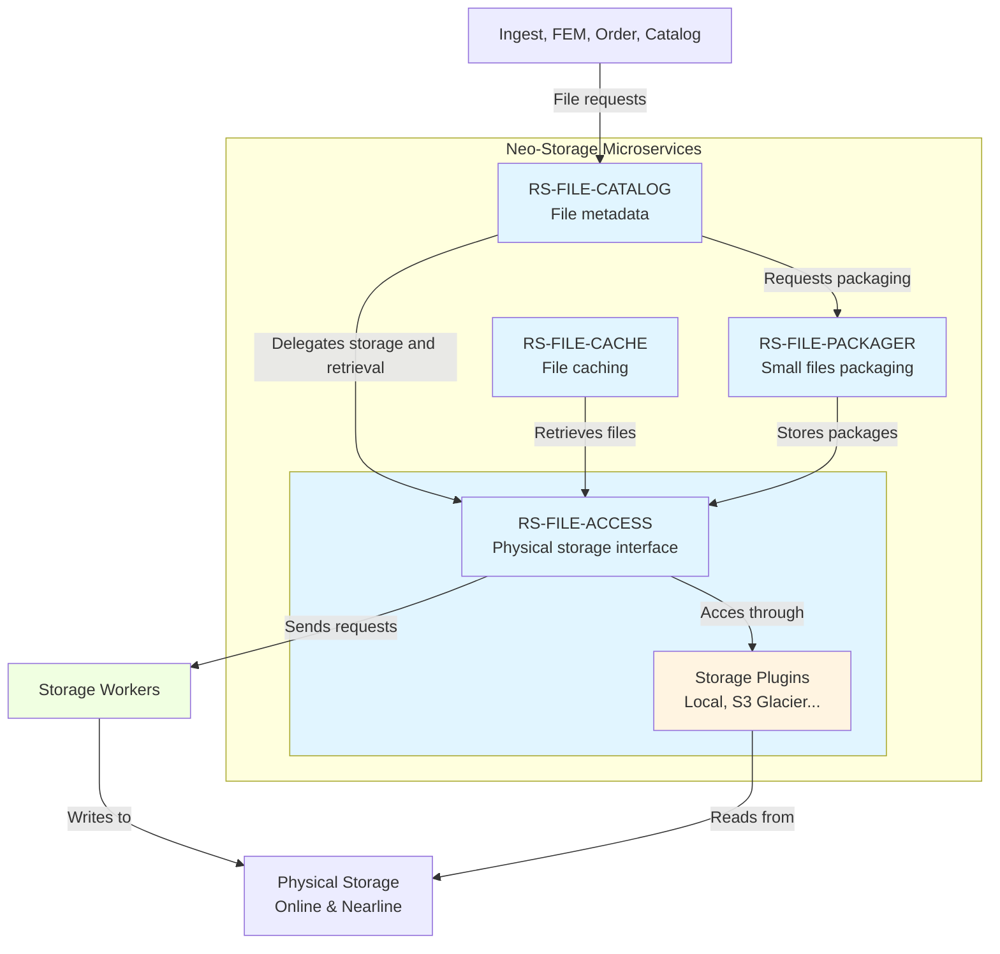
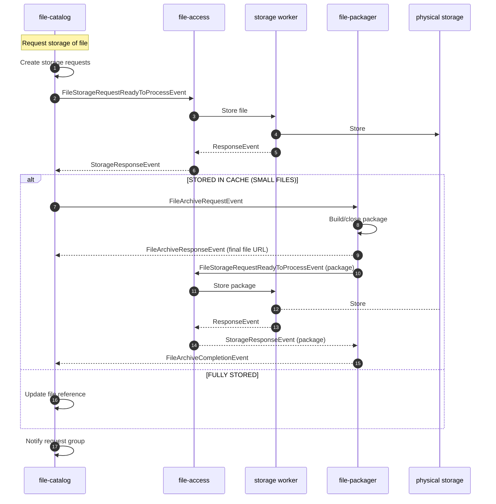

## Introduction

### File Reference vs Physical File

[Products](../../../overview/concepts/01-products.md) typically consist of one or more files when they are added to
REGARDS through the [Ingest](../ingest/overview.md) or [Feature Manager](../fem/overview.md) microservices. A file can
either be a **reference** or a **physical file** that needs to be stored.

This distinction corresponds to the three [storage types](./neo-storage-overview.md#storage-types) supported by REGARDS:

* A reference corresponds to [**offline storage**](./neo-storage-overview.md#offline-storage): it is an URL to a file located in a different storage system, usually accessed via HTTP. No physical storage is performed by REGARDS. This means that if the actual referenced file is altered or deleted, REGARDS will not be able to retrieve the original file.
* A physical file that needs to be stored will be downloaded (or copied) and will be entirely managed by the neo storage microservices. The file at the original location can then be safely deleted or altered.

### File Uniqueness

The storage microservice represents saved files by their checksum rather than by their name to ensure that files are
never duplicated, thereby preserving storage space. When a file request concerning an already existing file is received,
no physical storage is performed; instead, an **owner** is added to the existing file. This approach preserves an URL to
the stored file and all the products referencing it, and it is primarily used in the storage deletion process described
in the following sections.

### Group Identifier

All file requests submitted for a single product (whether storage, retrieval, or any other type of request) will share a
group identifier (**groupId**). This allows the microservice to track the progress for that product. When there are no
more requests with this group identifier waiting to be processed, a response is sent back to the service that submitted
the request, indicating that all requests were successful or that an error occurred.

**File-catalog** is responsible for cataloging files in regards database.

### Small Files

It's more efficient to manage large files than many small files on S3 servers. For this reason, Neo storage allows you
to store small files locally until they reach a certain size or age. Once this threshold is met, the small files are
grouped into an archive (package) and then stored in the physical storage location. This process can be activated for any
storage location through a worker configuration.

The process is monitored, so it's possible to see in the UI if a file was only stored locally and is waiting to be
packaged and stored in the physical storage location.

## Architecture Overview
Neo-storage is composed of several microservices and workers, each with its own responsibilities.

### File-catalog

**File-catalog** is responsible for cataloging files in regards database. It is the entry point for all
requests related to files. It's the microservice containing the File Reference database, but it is not able to
access the files on its own. It delegates the access to **file-access**.

### File-access

**File-access** is responsible for accessing files in the storage system. It is the interface between
**file-catalog** and the storage system (Local, S3..). It is responsible for retrieving, and deleting files.
File-access delegate the storage of files to dedicated workers to ensure scalability and performance.

### File-packager

**File-packager** is responsible for regrouping small files in archives (packages) before storing them.
It receives packaging requests from **file-catalog** and uses **file-access** to store the packages.

### File-cache

**File-cache** is responsible for caching files retrieved by file-access in order to
diminish the latency of file retrieval. It is the interface between **file-catalog** and **file-access**
for retrieval purposes.

### Plugins & Workers

**File-access** delegates the storage of files to dedicated workers and uses plugins to access the physical storage.
That mean that for each Storage Location used in REGARDS, there need to be a plugin and a worker to access
it and store on it.

## Neo-storage workflow

### Write flow (storage)

The following diagram describes the current store workflow as implemented by **file-catalog**, **file-access**, **file-packager** and **the storage workers**.

