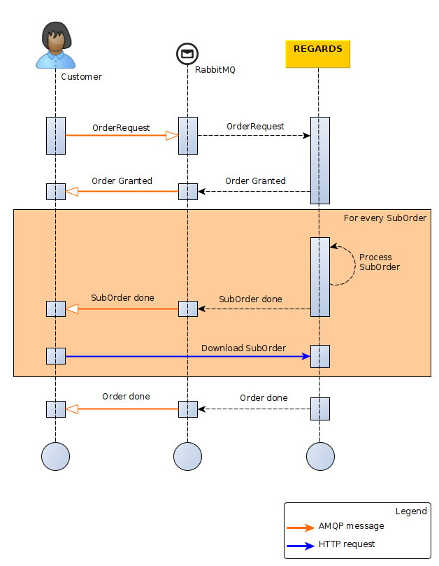

This guide describes how to order one or many products from the order service through AMQP interface.

## Introduction

The diagram below explains the overall processing of an order request by the REGARDS system.
For a REGARDS client using message queuing, the main steps are :

1. Publish your order request to REGARDS Rabbitmq server.
2. Wait for the first notification from REGARDS on its Rabbitmq server. The message status can be :
    - `DENIED` -> There is a problem with the order request, check the logs. No more message will be received.
    - `GRANTED` -> The order is now pending for product retrieval.
3. Wait for other notification from Rabbitmq. Message status is
    - `SUBORDER_DONE` (occurs 1 to many times) -> A suborder is done and is ready for download. The`SUBORDER_DONE`
      message contains the URL to the [Download ordered files](./download-ordered-files) REST API which allows
      downloading all available files related to an order.
    - If no `SUBORDER_DONE` is received after 2 hours, that means that your order failed. The order status is now
      `FAILED`.
4. Wait for a last notification from Rabbitmq. The message status can be
    - `DONE` -> All suborders successes.
    - `DONE_WITH_WARNING` -> Some files have not been retrieved.
    - `FAILED` -> No file retrieved.

:::info suborder download
You can configure number of parallel suborder per user [here](../../configuration/configurations.md) (see
*regards.order.max.storage.files.jobs.per.user*).

With n = parallel suborder max per user, REGARDS behave as follows : you can wait for n `notification_done`
message before downloading. When downloading, all available suborders will be automatically downloaded.
:::

:::note done vs suborder_done
The last notification with **DONE** status only indicates that all suborders are done. This does not mean that more data
are available to download.

:::



## Submit Order request

### Exchange

Exchange to submit Order requests:  
`regards.broadcast.fr.cnes.regards.modules.order.amqp.input.OrderRequestDtoEvent`

### Order request format

`Message headers`

```json
"regards.tenant": "tenant"
```

| Parameter        | Type   | Optional | Description                                                   |
|------------------|--------|:--------:|---------------------------------------------------------------|
| `regards.tenant` | String |    No    | Tenant name depends on REGARDS instance project configuration |

`Message body content`

```json
{
  "correlationId": "xxx",
  "queries": [],
  "user": "",
  "sizeLimitInBytes": "xx",
  "filters": {
    "dataTypes": [],
    "filenameRegExp": ""
  }
}
```

| Parameter              | Type           | Optional | Description                                                                                               |
|------------------------|----------------|:--------:|-----------------------------------------------------------------------------------------------------------|
| correlationId          | String         |    No    | The request correlation id.                                                                               |
| queries                | Lucene strings |    No    | List of lucene formatted queries to find products to order.                                               |
| user                   | String         |    No    | Email of your REGARDS user.                                                                               |
| sizeLimitInBytes       | Long           |   Yes    | Number to limit the size of the files ordered at once, in bytes.                                          |
| filters.datatypes      | String         |   Yes    | List of REGARDS datatypes to filter files from orderd products. Datatypes can be `RAWDATA` or `QUICKLOOK` |
| filters.filenameRegExp | String         |   Yes    | Regular expression to filter files by their names from orderd products.                                   |

`NOTE`: Here is the link to the [REGARDS Lucene format](../../../../appendices/02-create-lucene-query.md)

`NOTE`: A REGARDS user is mandatory to order products. Your user must be activated and remaining download quota must
allow you to order.

### Order request examples

If you want to retrieve a product by its identifier, the order request is :

```json
{
  "queries": [
    "productId:my_product_identifier"
  ],
  "user": "myself@cnes.fr"
}
```

If you want to retrieve many products using their identifiers, the order request is :

```json
{
  "queries": [
    "productId:(my_product_id_1 OR my_product_id_2 OR my_product_id_3 OR my_product_id_4)"
  ],
  "user": "myself@cnes.fr"
}
```

If you want to retrieve all products from a specific metadata like datatype (depends on configured REGARDS data models),
the restoration request is:

```json
{
  "queries": [
    "datatype:type1"
  ],
  "user": "myself@cnes.fr"
}
```

If you want to retrieve all products from a specific metadata like datatype (depends on configured REGARDS data models)
and retrieve only image files, the restoration request is:

```json
{
  "queries": [
    "datatype:type1"
  ],
  "user": "myself@cnes.fr",
  "filters": {
    "dataTypes": [
      "QUICKLOOK"
    ]
  }
}
```

**Click on the link Get Order progress AMQP** just below, you will discover responses RS-ORDER will send you for your
order.
