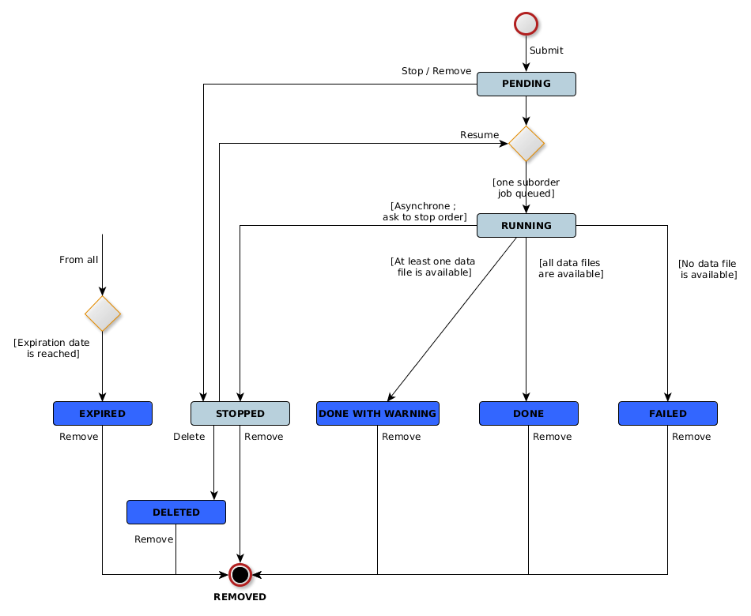
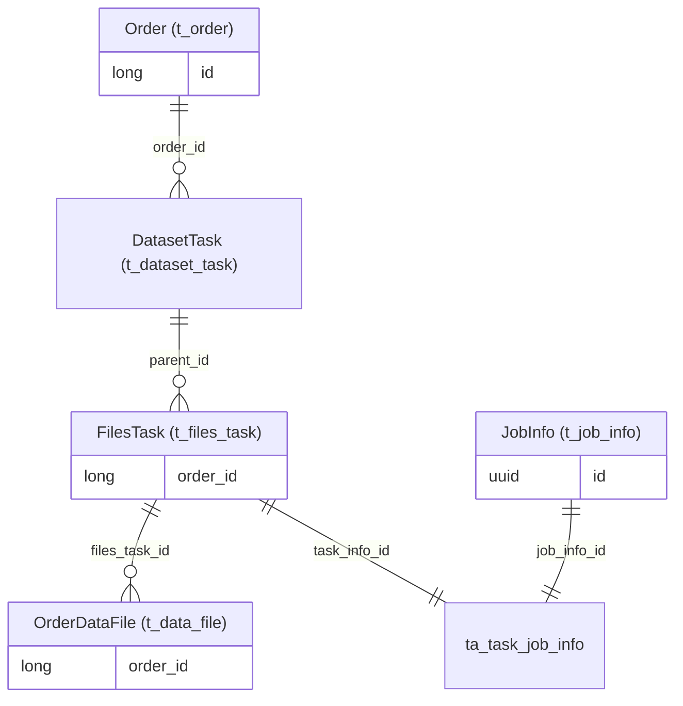

## Introduction

This page describes how the rs-order microservice works.

You can find a [user guide here](../../../user-documentation/8-order-data/introduction-order.md) to understand how to
use and manage orders through UI.

## Basket

In the REGARDS UI, an authenticated user can explore the [products](../../../overview/concepts/01-products.md) list.
These products are provided by [rs-catalog](../catalog/overview.md). Searching products is possible using
the [API](../catalog/overview#how-to-use).

The REGARDS Basket is simply a selection of downloadable products. REGARDS will try to download these products
once the user start an order. The products selection can be done with
this [API](api-guides/rest/order-api-swagger.mdx#tag/basket-controller/operation/addSelection), another way is to
provide a file containing all the products identifiers (
see [API](api-guides/rest/order-api-swagger.mdx#tag/basket-controller/operation/addSelectionFromFile)). [Learn more](api-guides/rest/fill-basket-from-file.md).

:::info public data
Note that some data can be accessed without authentication, but cannot be added to a basket. You have to be logged to
have
a basket.
A user can only have one basket.
:::

### Additional dataset data

Files are associated with a product, and they are not accessible independently.
Products must be linked to a dataset to be accessible to users. (See rs-dam microservice)
However, sometimes there are files associated to a dataset, typically containing metadata or descriptions of the
dataset.

Data type files (RAWDATA) associated with datasets are automatically downloaded when the basket contains a product from that dataset.

## Order creation

Once the user has added at least one product to his basket (or cart), an order can be initiated. This order is created
with **PENDING** state. REGARDS will then attempt to retrieve all the files related to the selected
products. ([See API Guide](api-guides/rest/rest-create-order.md))

## Suborders creation

To retrieve files, rs-order will create several jobs. These jobs are called **suborders**. A suborder has :

* a limited size in bytes (see [configuration](configuration/configurations.md)),
* a limited number of files (5000, not configurable)

That's why several suborders can be required for one order. These jobs will

* query the [rs-storage service](../storage/overview.md) for files stored by REGARDS. They are the **Storage Jobs**,
  that try to restore or make files available, by querying the storage service.
* get all externally stored files. These are the **External Jobs**

:::note external or internal file ?

* External file : A file not managed by REGARDS. REGARDS got only a reference (an url) to this file.
* Internal file : stored by REGARDS in one of the configured storage.
:::

:::important user quotas
  Quotas are used only for files stored by REGARDS. Externally stored files don't require a quota, but do require access
  rights.

REGARDS will retrieve files until all files have been retrieved or the user's download quota has been reached.
:::

Once all jobs are created, the order state transitions to **RUNNING**. While the jobs are still running, the order
remains in the **RUNNING** state.

## Suborder workflow

There is a maximum number of running storage jobs for a given user (external jobs are not concerned by this limit).
This number is defined in the service configuration (*regards.order.max.storage.files.jobs.per.user*).

A sub-order is considered as finished once data has been retrieved from rs-storage, and downloaded by the user. That's why an order can be blocked, until the user does a download of the order. The download of an order downloads all data retrieve from rs-storage, and launch remaining sub-orders. In case of big order, multiple download can be required.

This download can be done on UI or API. See the dedicated [API guide](api-guides/rest/rest-download-ordered-files.md)

## Storage job details

In fact, storage jobs ask the storage service to make files available for download. There is no download by REGARDS in
this operation. To learn more, read the nearline [storage documentation](../storage/overview.md). The download operation
is done by the user.

The maximum number of parallel job (pool size) is defined in the service configuration (*regards.jobs.pool.size*). This
pool is shared by all users of the rs-order microservice.

When a sub-order is finished (all files retrieved by storage service during the job and all files are downloaded by
user), rs-order try to launch another sub-order and the associated **Storage job**.

:::note
In case of error inside the Storage job, only the sub-order fail. Other storage jobs may continue.
:::

:::info prioritization
The storage jobs are prioritized among all users based on suborder size: smaller suborders are given priority
:::

:::warning sub-order number limit

* Globally : REGARDS cannot launch more than X sub-order in parallel. (X is the jobs pool size,
  *regards.jobs.pool.size*)
* Per user : A user cannot have more than Y waiting sub-order. That means sub-orders that are finished but not
  downloaded. (Y is *regards.order.max.storage.files.jobs.per.user*)
  :::

## Order final state

Once all sub-orders are finished, order can be in multiple states :

* FAILED : No data file is available (nothing to download)
* DONE_WITH_WARNING : One or more data files have failed but at least one is available
* DONE : All data files are available

## Other Order states

* PENDING : Order is in creation, no associated jobs exist or are planned to be executed
* RUNNING : At least one associated job is planned to be executed
* PAUSED : Associated jobs are asked to be stopped (or already stopped). Order can be resumed later
* EXPIRED : Order has been detected as expired and will be paused soon (Duration is configurable through
  UI, [see here](configuration/configurations.md))

## Processing selection

Some processing treatments can be selected at the basket level, either through the API or in the user interface.
Processing treatments are applied to all files ordered within the same dataset. If a processing treatment is selected, a
processing job is created after the [storage job](#storage-job-details).

You can learn more in the [processing microservice section](../processing/overview.md)

## Order states workflow

Here under is the state diagram of the order process :

## Order main tables

The following entity relationship diagram shows the main entities (and table name in parentheses) that represent an 
order.

*This entity-relationship diagram uses the
[Crow's foot notation](https://en.wikipedia.org/wiki/Entity%E2%80%93relationship_model#Crow's_foot_notation).*  
*The box labels show the entity class, and the corresponding table name in parenthesis.*

* **Order**: an entire order.
* **DatasetTask**: the task for one dataset of the order, may be composed of one or several sub-orders.
* **FilesTask**: a sub-order, either internal (files are stored by REGARDS) or external (files are only referenced by REGARDS). An
  internal sub-order is  associated to one `StorageFilesJob` job and optionally one `ProcessExecutionJob` job.
* **OrderDataFile**: one file in a sub-order.