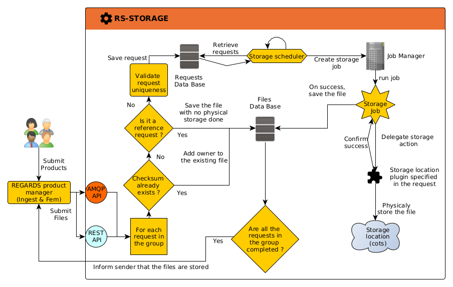
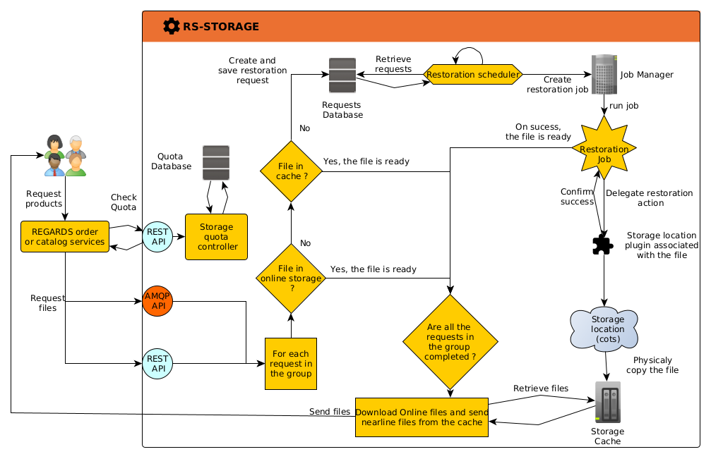

## Introduction

### File Reference vs Physical File

[Products](../../../overview/concepts/01-products.md) typically consist of one or more files when they are added to
REGARDS through the [Ingest](../ingest/overview.md) or [Feature Manager](../fem/overview.md) microservices. A file can
either be a **reference** or a **physical file** that needs to be stored.

* A reference is a link to a file located in a different storage system, usually accessed via HTTP. Note that no
  physical storage is performed by REGARDS when a reference file is saved by the storage microservice. This means that
  if the actual referenced file is altered or deleted, REGARDS will not be able to retrieve the original file.
* When a file needs to be stored, a link to the file will also be provided. Instead of simply referencing it, the file
  will be downloaded (or copied) and will now be entirely managed by the microservice. The file at the original location
  can then be safely deleted or altered.

### File Uniqueness

The storage microservice represents saved files by their checksum rather than by their name to ensure that files are
never duplicated, thereby preserving storage space. When a file request concerning an already existing file is received,
no physical storage is performed; instead, an **owner** is added to the existing file. This approach preserves a link to
the stored file and all the products referencing it, and it is primarily used in the storage deletion process described
in the following sections.

#### Group Identifier

All file requests submitted for a single product (whether storage, retrieval, or any other type of request) will share a
group identifier (**groupId**). This allows the microservice to track the progress for that product. When there are no
more requests with this group identifier waiting to be processed, a response is sent back to the service that submitted
the request, indicating that all requests were successful or that an error occurred.

### Workflow

Most functionalities provided by the storage microservice are executed asynchronously. The typical workflow is as
follows:

1. A request is received through an **AMQP** handler or the storage **REST** client. The request is then saved in the
   storage database.
2. A scheduler periodically checks if there are any requests that can be processed, and a **job** is submitted to the *
   *Job Manager**.
3. The **Job Manager** (JobService) schedules the **job**.
4. The job is processed by calling the **Storage Location Plugin** associated with the request.
5. The [Storage Location Plugin](./plugins/overview.md) executes the physical action on the file concerned by the
   request (e.g., creation, retrieval, etc.).
6. When the job succeeds, the database entities are updated accordingly, and responses are sent if the group is
   completed.

### Storage Locations plugins

A storage location plugin serves as the interface between the microservice and the actual storage space (COTS).
A storage location can be either **Online** (
implementing [IOnlineStorageLocation interface](https://github.com/RegardsOss/regards-backend/blob/master/rs-file-access/file-access-plugin/file-access-plugin-domain/src/main/java/fr/cnes/regards/modules/fileaccess/plugin/domain/IOnlineStorageLocation.java))
or **Nearline** (
implementing [INearlineStorageLocation](https://github.com/RegardsOss/regards-backend/blob/master/rs-file-access/file-access-plugin/file-access-plugin-domain/src/main/java/fr/cnes/regards/modules/fileaccess/plugin/domain/INearlineStorageLocation.java)).
Online locations are traditional, immediately accessible file storages, while nearline locations may require some time
to make a file accessible. As a result, nearline storage retrieval actions are asynchronous.

For more information about the available storage locations plugins, see the [Plugins Section](./plugins/overview.md)

## Online Storage responsibilities

### Storage of a file

When a product is submitted to regards with one or multiple files, a request will be submitted to the storage
microservice.
A storage request will therefore result in saving the file's information in the database and physically storing the file
in the target storage space.

The storage workflow is as follows :

:::note
This diagram does not describe the handling of errors that may occur at different points in the workflow.
:::

### Retrieval of a file

### Quota

The quota represents the total amount of data (in bytes) a user can download before needing to wait to download more
files.

When downloading a file using the [Catalog](../catalog/overview.md) microservice, the storage microservice checks
whether the user has exceeded their **maximum quota**. If the quota is exceeded, the download is blocked, and an error
is returned.

Before processing a download request through an order using the [Order](../order/overview.md) microservice, the storage
microservice verifies that the user has enough remaining quota to complete the download. If the user lacks sufficient
quota, the order will not be fulfilled.

### File availability

When a download request is processed, the storage microservice first ensure the request file is **available**. This
process is instantaneous if the file is stored on an **online** storage (because
it's always true) or is in the REGARDS cache, quick if the file is currently on the **tier 2** of a nearline storage,
and can be long if the file need to be **restored** by the **nearline** storage.

#### Cache

When a file is downloaded from a **nearline storage location**, it is first moved to a cache on the REGARDS instance
file system. This copy is used to send a stream containing the requested file during the download. The storage
microservice tracks which files are currently in the cache so they can be copied directly from there if the same file is
requested multiple times in a short interval.

#### External Cache

Nearline storage location plugins may offer functionality to act as an external cache. When this feature is enabled,
files will be downloaded directly from the Tier 2 storage at this location, bypassing the REGARDS cache.

The retrieval workflow is as follows :

:::note
This diagram does not describe the handling of errors that may occur at different points in the workflow.
:::

### Deletion of a file

Storage locations all have a parameter called **Allow physical deletion of files**. When set to false, a file will never
be physically deleted from the storage. Instead, it will only be removed from the REGARDS database, meaning it will no
longer be accessible through the REGARDS catalog but will still exist in the storage.

As for the storage process, a file is never deleted directly. When a product is deleted, a deletion request is submitted
to the storage microservice. The owner (product) is then removed from the list of owners of the file in the database. If
no owners remain associated with the file, the physical file will be deleted, provided that **Allow physical deletion of
files** is set to true.

## Nearline storage responsibilities

Nearline storage follows the same storage and deletion process as online storage. The difference is only at the physical
storage level (REGARDS does not intervene in the movement of files between **tier 2** and **tier 3** of a nearline
storage).

### Retrieval of a file

On nearline storage, a file might not be immediately available. If it needs to be **restored** first, the retrieval job
will send a **restoration request** to the physical storage and wait for the restoration to complete. If the restoration
times out and fails, the retrieval must be retried.

### Check the availability of a file

A **check availability request** may be sent to determine whether a file can be downloaded immediately or needs to be
restored first. During this process, the storage location plugin will simply query the storage to check availability. If
the file is not available, no restoration request is sent.

### Download a file

A file download request is similar to a retrieval request, but it will only succeed if the file is **available**. If the
file is not available, no restoration will be initiated, and the request will fail. This process is intended to be used
in coordination with the **Check Availability** functionality.
Like the retrieval functionality, a user cannot directly download a file through the storage microservice and must
instead use the order or catalog microservices.

