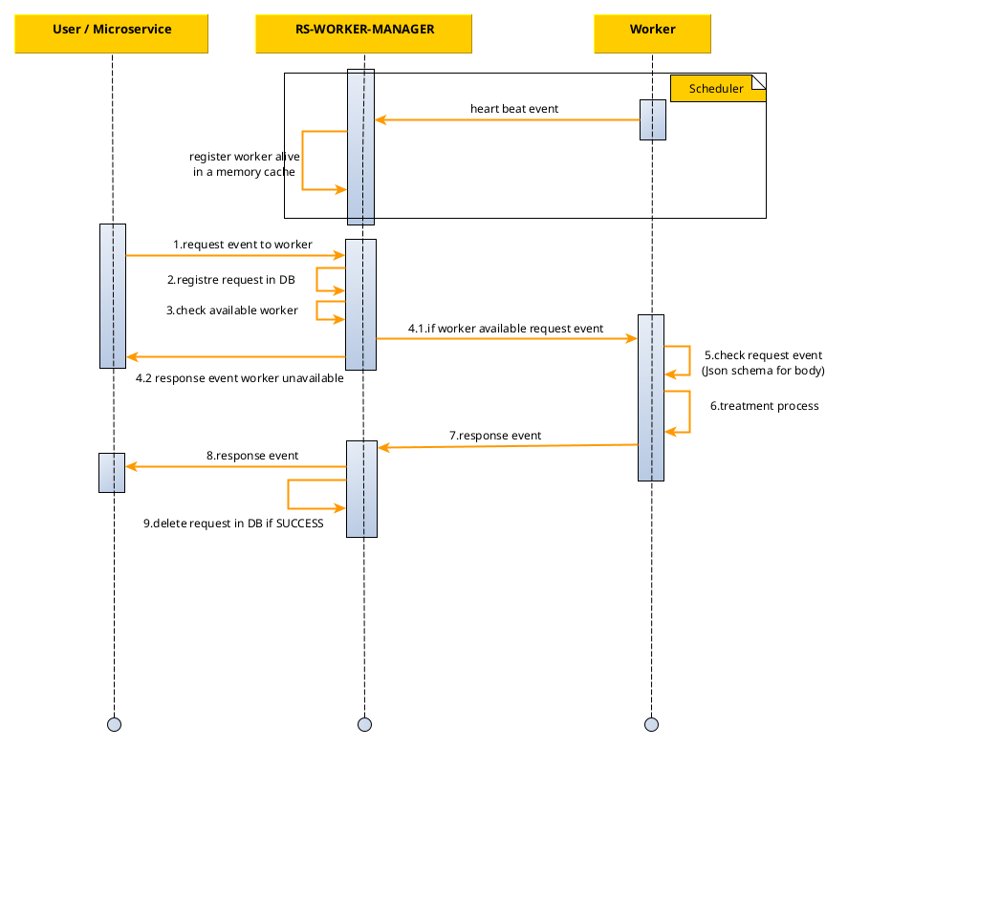
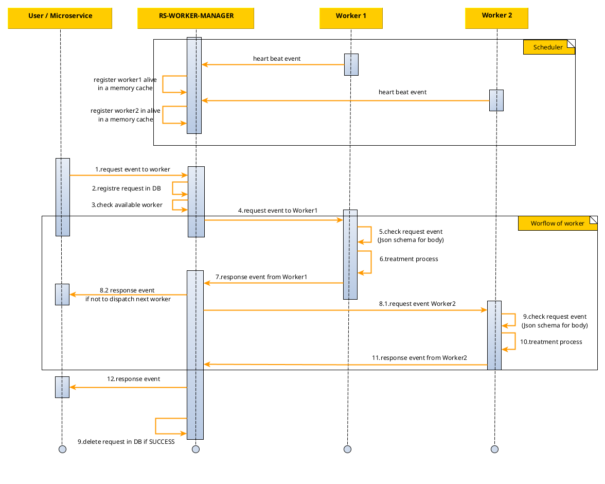
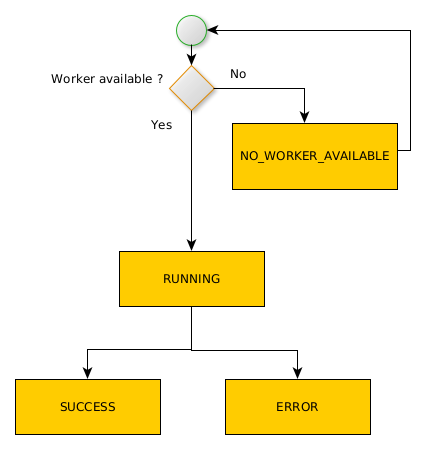

## Introduction

The `rs-worker-manager` microservice is designed to act as an entry point for all processing requests dedicated to all
workers on the system. This microservice registers the available workers and dispatches the requests received to the
various workers.

## Workers communication

When this microservice receives a processing request, it records the request in its database so that it can be
tracked and then forwards it to the worker dedicated to the request thanks to a mapping between a **content type** and
**worker type**. The worker dedicated to the request is determined by the `rs-worker-manager` using a mandatory
parameter contained in each input request, the **content type**.

The association between a worker (**worker type** parameter) and its **content type** is made by configuration file.
This configuration is described in the [configuration section](./configuration/import-export.md).

To redirect a request to the right worker, the `rs-worker-manager` waits until the worker is available. To be available
to the `rs-worker-manager`, a worker must indicate that it is active by regularly sending a **heart beat** to the
`rs-worker-manager`. Each **heart beat** message naturally contains the worker type information.
If a worker is not considered available by the `rs-worker-manager`, then any requests associated with that worker will
be kept in a waiting state (`NO_WORKER_AVAILABLE`) and will be processed as soon as the worker is available.

A worker is considered to be unavailable as soon as the `rs-worker-manager` has not received a **heart beat** from it
for a period of time that can be [configured in the service](./configuration/static-configuration.md).

:::info
All communication between the `rs-worker-manager` and the workers takes place via the REGARDS RabbitMQ message bus.
:::

The workers core uses [Spring Cloud Stream](https://spring.io/projects/spring-cloud-stream) to dispatch events
to `rs-worker-manager`. Spring Cloud Stream is a framework built on top of Spring Boot and Spring Integration that
helps in creating event-driven or message-driven microservices.

Microservices architecture follows the **smart endpoints and dumb pipes** principle. Communication between endpoints is
driven by messaging-middleware parties like RabbitMQ. Services communicate by publishing domain events via these
endpoints or channels.

The following sequence diagram presents the main interactions between the microservice and workers:

## Workflow of workers

The `rs-worker-manager` service can also be used to associate request types or content types with a sequence of workers.
To do this, the `content-type` is associated with a workflow configuration as described in the configuration section.

In this mode of operation, the `rs-worker-manager` is used to follow the progress of the request through the workflow
step by
step, where each step corresponds to a worker.
In the event of an error, it is possible to restart processing from the stage at which the error occurred.
For each step in the workflow, as in the standard function, the request is submitted to the next worker in the workflow
only if the worker is considered available by the `rs-worker-manager`.

The following sequence diagram presents the main interactions between the microservice and workers in a workflow:

## Requests states

The following state diagram presents states of request in `rs-worker-manager`:

`NO_WORKER_AVAILABLE` : the request does not correspond to any type of worker available. This status may indicate :

* The configuration file of `rs-worker-manager` does not contain the worker type indicated in the request in input
* The worker used by the request stopped sending heart beat events

`DISPATCHED` : the request is dispatched to a worker or to a workflow of workers.

## Workers responses states

States of response from a worker to the `rs-worker-manager` :

* `SUCCESS` : The treatment was correctly carried out.
* `INVALID_CONTENT` : The request content is invalid.
* `ERROR` : An error occurred during treatment.

## Worker Manager responses states

Some of the `rs-worker-manager` response statements will be produced directly by the workers themselves.

* `SKIPPED` : The request has been skipped and will never be handled.
* `GRANTED` : The request has been granted by the `rs-worker-manager` and will be processed as soon as possible.
* `SUCCESS` : The request has been successfully carried out. The request will be deleted from database.
* `ERROR` : A problem occurred during the treatment of the request.
* `INVALID_CONTENT` : The request content is invalid.
* `DELAYED` : No worker is currently available for the request. The request will be processed as soon as a
  worker becomes available.

