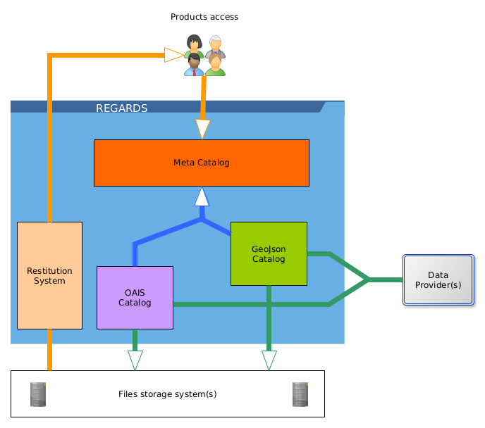

Welcome to REGARDS official documentation.
REGARDS is a highly configurable and customisable application. It is therefore essential to know which REGARDS features
you are interested in.

The **non-optional core** of REGARDS corresponds to the [meta catalog functional group](./02-meta-catalog-services.md),
which allows you to build and consult a homogeneous catalog of products from various product suppliers.

The diagram below shows these optional functional groups grouped around the meta catalog.

:::info Use only what you need
REGARDS software has been designed to meet several use-cases, allowing you to use group of functionalities that
you need and ignoring others components.
:::

**Core REGARDS system** is the [Meta catalog services group](02-meta-catalog-services.md). You can then add the
functional groups below as required :

- [OAIS catalog services](03-oais-catalog-services.md) introduces you the internal catalog that stores **OAIS products
  **.
- [GeoJson catalog services](04-geojson-catalog-services.md) introduces you the internal catalog that stores **GeoJSON
  products**.
- [Product restitution services](05-product-restitution-services.md) introduces you how to retrieve stored products
  through the meta catalog.
