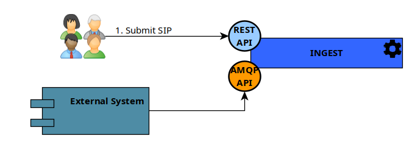
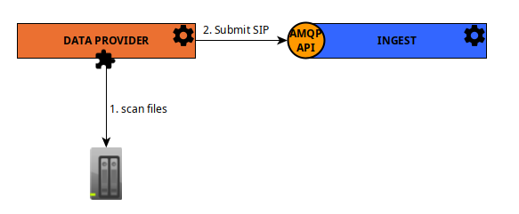
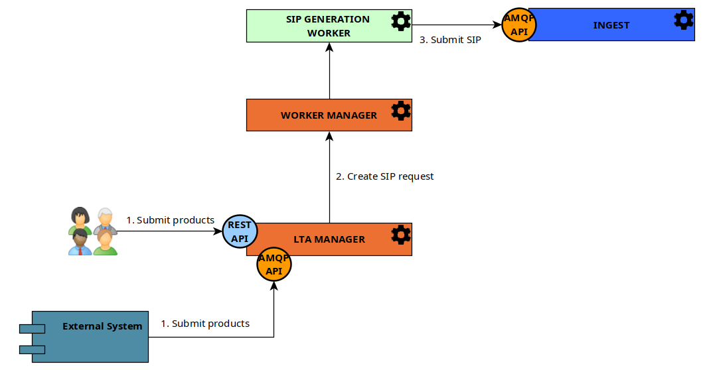
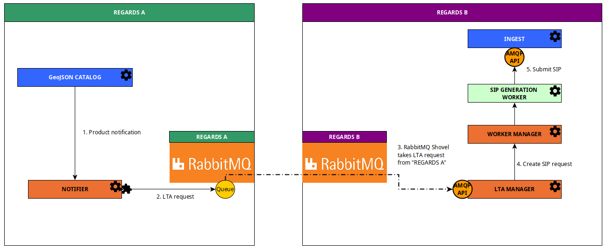

OAIS Catalog Services are a set of **facultative REGARDS services** that allows to create a data source of products with
metadata recommended by the [CCSDS](https://public.ccsds.org).

:::info
This data source is recommended for long-term archive catalog
:::

To allow administrators to manage OAIS products, you need to use these microservices :

- [rs-ingest](../../development/services/ingest/overview.md) : Manage OAIS formated products data source
- [rs-storage](../../development/services/storage/overview.md) : Manage files references and stored files
- **Optional** [rs-notifier](../../development/services/notifier/overview.md) : Highly configurable notification
  system. Can be used to inform external and internal components when an OAIS product is created or deleted.

Thanks to rs-ingest microservice, administrator can manage a new data source with OAIS formated products. To learn more
about **rs-ingest** microservice see [Ingest architecture](../../development/services/ingest/overview.md).

This data
source [can be used as one of the data sources crawled by the data management service](./02-meta-catalog-services.md)
thanks to DataManagement [OAIS Data Source Plugin](../../development/services/dam/plugins/overview.md).

To create products on the OAIS catalog, you can use these microservices :

- **Optional** [rs-data-provider](/docs/development/services/dataprovider/dataprovider-overview.md) : Scan files on file
  system and send OAIS Submission Information Package requests to OAIS catalog (rs-ingest).
- **Optional** [rs-lta-manager](../../development/services/lta-manager/lta-manager.md) : Long term Archive system.
  Simplified
  interface to add products into the OAIS catalog (rs-ingest). Requires rs-worker-manager microservice.
- **Optional** [rs-worker-manager](../../development/services/worker-manager/overview.md) : Manager to handle
  regards [workers](../../development/concepts/08-workers.md).
  To use **rs-lta-manager**, worker manager is mandatory with a worker that receives simplified products format and send
  Submission Information Package requests to OAIS catalog (rs-ingest).

## Populate using Ingest API

The diagram below explains how to fulfill the OAIS products data source directly using **rs-ingest** :

This design uses:

- [rs-ingest](../../development/services/ingest/overview.md)
- [rs-storage](../../development/services/storage/overview.md)
- **Optional** [rs-notifier](../../development/services/notifier/overview.md)

:::info
This design is easy to start, but you should consider the usage of
the [LTA Manager and Worker](#populate-through-lta-manager-and-worker) as these services simplifies the
interface to add products into the OAIS catalog.
:::

## Populate through DataProvider

The diagram below explains how the [rs-data-provider](/docs/development/services/dataprovider/dataprovider-overview.md)
scan files on file system and send OAIS Submission Information Package requests to OAIS catalog

This design uses:

- [rs-ingest](../../development/services/ingest/overview.md)
- [rs-storage](../../development/services/storage/overview.md)
- [rs-data-provider](/docs/development/services/dataprovider/dataprovider-overview.md)
- **Optional** [rs-notifier](../../development/services/notifier/overview.md)

:::info
DataProvider is a no-code solution that scans the file system to add products to the OAIS catalog.
:::

## Populate through LTA Manager and Worker

The diagram below explains the microservices interaction to fulfill the OAIS products data source with **LTA Manager**
microservice and a **Worker** to create the SIP request.

This design uses:

- [rs-ingest](../../development/services/ingest/overview.md)
- [rs-storage](../../development/services/storage/overview.md)
- [rs-lta-manager](../../development/services/lta-manager/lta-manager.md)
- [rs-worker-manager](../../development/services/worker-manager/overview.md)
- Some worker that receives simplified products format and send
  Submission Information Package requests to OAIS catalog (rs-ingest)
- **Optional** [rs-notifier](../../development/services/notifier/overview.md)

## Populate using another REGARDS GeoJSON catalog

The diagram below explains how to populate the OAIS catalog using another GeoJSON REGARDS catalog.

This design uses:

- on the **REGARDS B** side, same services than the ones describes in
  the [LTA Manager and Worker section](#populate-through-lta-manager-and-worker)
- on the **REGARDS A** side, you need
  the [LTA Request Sender Notifier plugin](../../development/services/notifier/plugins/recipient-sender-plugins.md#lta-request-sender)
  installed
- a shovel on **REGARDS B** that retrieves `LTA requests` stored on a **REGARDS A** queue