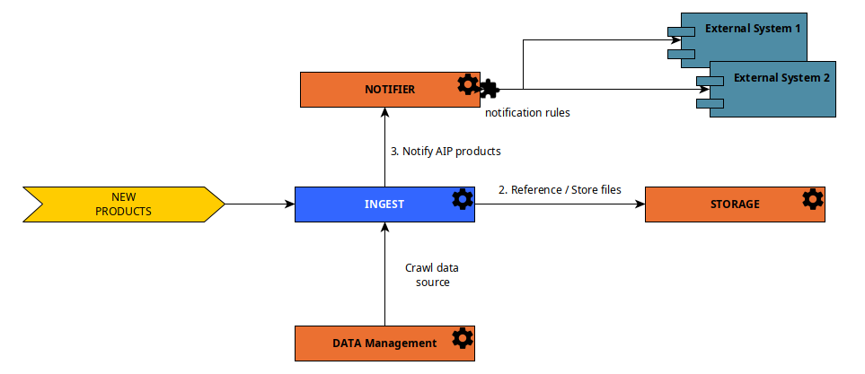

OAIS Catalog Services are a set of **facultative REGARDS services** that allows to create a data source of products with
metadata recommended by the [CCSDS](https://public.ccsds.org).

:::info
This data source is recommended for long-term archive catalog with a lot of metadata.
:::

To allow administrators to manage OAIS products, you need to add these microservices :

- [rs-ingest](../../development/services/ingest/overview.md) : Manage OAIS formated products data source
- [rs-storage](../../development/backend/regards/storage/storage.md) : Manage files references and stored files
- **Optional** [rs-data-provider](/docs/development/services/dataprovider/dataprovider-overview.md) : Scan files on file system and send
  OAIS
  Submission Information Package requests to OAIS catalog (rs-ingest).
- **Optional** [rs-notifier](../../development/services/notifier/overview.md) : Highly configurable notification system. Can be
  used to inform external and internal components when an OAIS product is created or deleted.
- **Optional** [rs-lta-manager](../../development/services/lta-manager/lta-manager.md) : Long term Archive system. Simplified
  interface to add products into the OAIS catalog (rs-ingest). Requires rs-worker-manager microservice.
- **Optional** [rs-worker-manager](../../development/backend/regards/worker-manager/storage.md) : Manager to handle
  regards [workers](../../development/concepts/08-workers.md).
  To use **rs-lta-manager**, worker manager is mandatory with a worker that receives simplified products format and send
  Submission Information Package requests to OAIS catalog (rs-ingest).

Thanks to rs-ingest microservice, administrator can manage a new data source with OAIS formated products. To learn more
about **rs-ingest** microservice see [Ingest architecture](../../development/services/ingest/overview.md).

This data
source [can be used as one of the data sources crawled by the data management service](./02-meta-catalog-services.md)
thanks to official
DataManagement Regards plugin [OAIS Data Source Plugin](../../development/services/ingest/plugins/overview.md).

The diagram below explains the microservices interaction to fulfill the OAIS products data source with **rs-ingest**
microservice.

