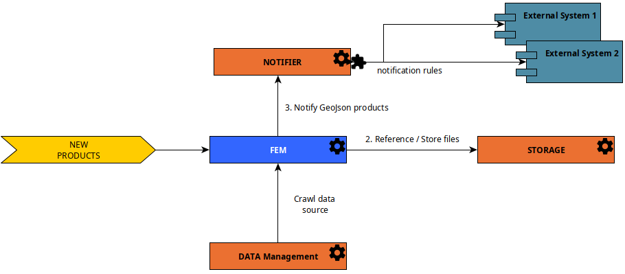

GeoJson Catalog Services are a set of **facultative REGARDS services** that allows to create a data source of products
with standard GeoJson format.

:::info
This data source is recommended for catalog with large volume of products and high performances required.
:::

To allow administrators to manage standard GeoJson products, you need to add microservices :

- [rs-fem](../../development/services/fem/overview.md) : Feature Manager. Manage standard GeoJson formated products data source
- [rs-storage](../../development/services/storage/overview.md) : Manage files references and stored files
- **Optional** [rs-notifier](../../development/services/notifier/overview.md) : Highly configurable notification system. Can be
  used to inform external and internal components when a GeoJSON product is created, updated or deleted.

Thanks to rs-fem microservice, administrator can manage a new **data source** with standard GeoJson formated products.
To lean more about **rs-fem** microservice, see [Feature Manager service documentation](../../development/services/fem/overview.md).

This data
source [can be used as one of the data sources crawled by the data management service](02-meta-catalog-services.md)
thanks to official
DataManagement Regards plugin [FEM Data Source Plugin](../../development/services/dam/plugins/overview.md#data-source-plugins).

The schema here under explain the microservices interaction to fulfill the GeoJson products data source with **rs-fem**
microservice.

In some cases, you may want to process products before their submission to **rs-fem** microservice. The recommended way
to do this is to add **rs-worker-manager** microservice and a **worker of your own** to process products before sending
them to **rs-fem** microservice.

The diagram below explains the microservices interaction to fulfill the GeoJson products data source with **rs-fem**
and **rs-worker-manager** microservices.

To learn more about **rs-worker-manager** microservice and how develop your own worker
see [Worker manager](../../development/backend/regards/worker-manager/storage.md)

To learn how to send product submission MQ message to **rs-fem** from your worker,
see [AMQP Submit product API Guide](../../development/services/fem/api-guides/amqp/amqp-publish-create-product-request.md).