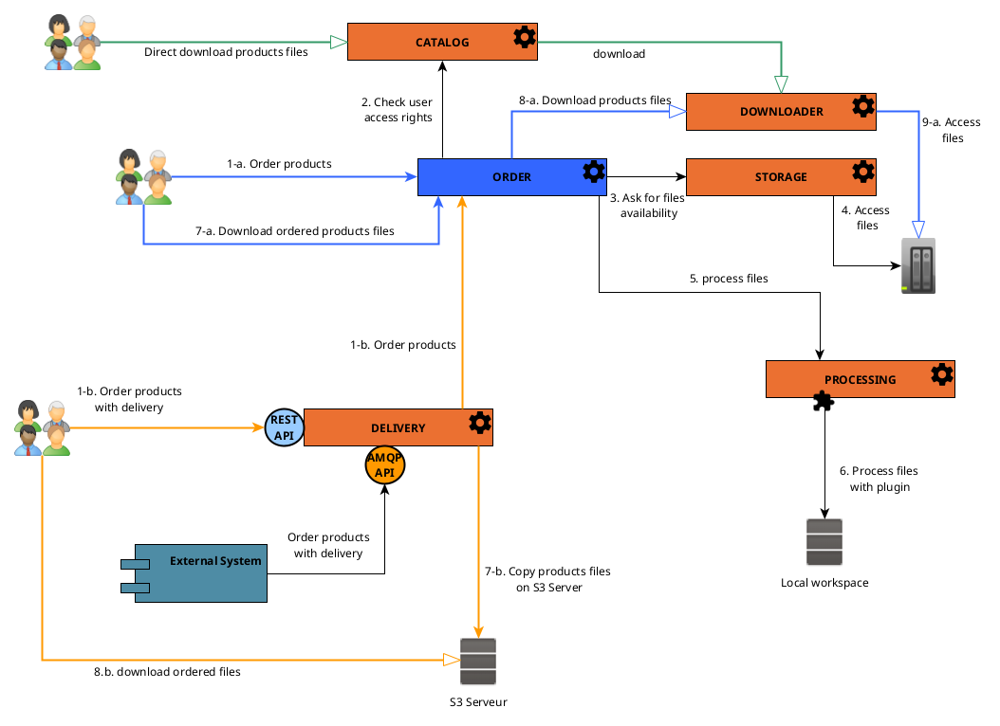

Products restitution Services are a set of **facultative REGARDS services** that allows user to ask for products files
availability to be able to download them.

:::info Cold storages files
Restitution services are mandatory for products with files stored on **Cold storages**. This kind of storage implies
that
all the data are not available for download at any time. Users need to request files for availability first.
:::info

To allow users to order products from your catalog, you need to add microservices :

- [rs-order](../../development/backend/regards/order/order.md) : Manage users orders.
- **Optional** [rs-delivery](../../development/services/delivery/delivery-overview.md) : Deliver ordered products files.
- **Optional** [rs-processing](../../development/services/processing/overview.md) : Manage pre-processing of ordered products
  files.

The following schema explains the interactions between microservices to handle an order with optional delivery and/or
processing.

To learn more about **rs-order** service architectures and API,
see [Order service documentation](../../development/backend/regards/order/order.md)

