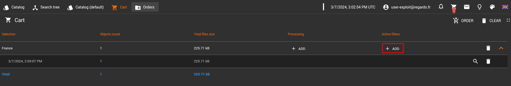
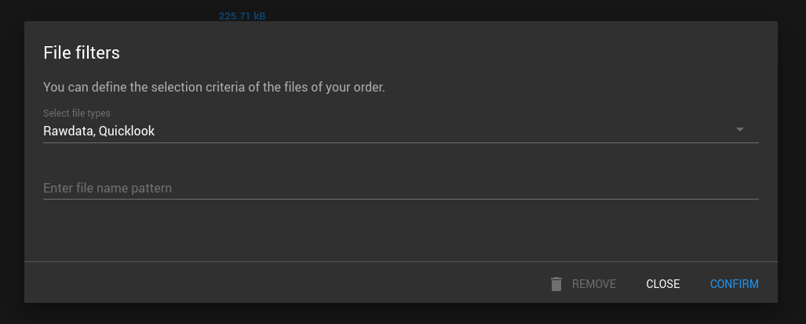
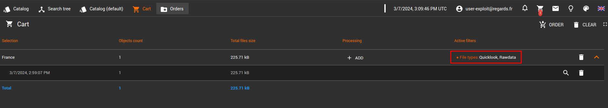

*Ajoutez des filtres sur les fichiers votre commande.*

---

## Les filtres sur les fichiers d'une commande

Avant de passer commande vous avez la possibilité d'ajouter des critères de sélection sur les fichiers de votre
commande. Pour ce faire cliquez sur le bouton ***Add*** de la colonne ***Active filters***

Dans la fenêtre affichées, deux critères sont disponibles :

- ***Select file types*** : permet de récupérer les fichiers ***Rawdata*** ou/et ***Quicklook***
- ***Enter file name pattern***, permet de récupérer les fichiers correspondant au pattern défini.

Une fois le filtre mis en place, celui-ci sera affiché dans votre panier

:::info
Vous avez la possibilité de supprimer un filtre depuis la fenêtre d'ajout de filtres
:::
