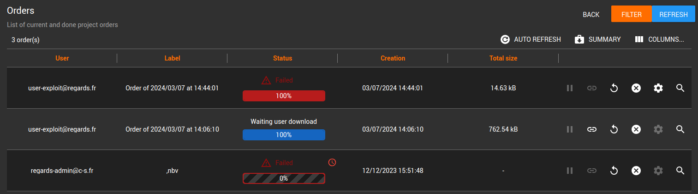

*Suivez les commandes effectuées dans votre projet*

 

---

Depuis l'interface d'administration, le menu ***Commands*** et la carte ***Orders***, appuyez sur le bouton ***List***.
Sur l'écran ***Orders***, vous pouvez visualiser toutes les commandes effectuées dans votre projet.

Les informations suivantes sont indiquées :

- ***User***, l'adresse mail de l'utilisateur ayant effectué la commande
- ***Label***, l'intitulé qu'il a renseigné lors de sa commande
- ***Status***, l'état de livraison de la commande parmi :
  - ***Waiting user download***, une intervention de l'utilisateur est attendue pour terminer le processus de commande
  - ***Done***, la commande a été livrée et téléchargée avec succès
  - ***Pending***, la commande est en attente
  - ***Running***, la commande est en cours de traitement
  - ***Paused***, la commande a été mise en pause lors de son exécution
  - ***Expired***, les fichiers associés à la commande ne sont plus téléchargeables car la commande a expiré
  - ***Failed***, la commande des fichiers a échoué
  - ***Done with warning***, la commande s'est correctement terminée mais avec des warnings
  - ***Deleted***, la commande a été supprimée
  - ***Unknown***, le statut est inconnu
- ***Progress***, le pourcentage de livraison
- ***Creation***, la date à laquelle la commande a été créée
- ***Total size***, la taille totale des fichiers
- ***Errors count***, le nombre d'erreurs éventuellement survenues

Par défaut les colonnes suivantes ne sont pas affichées, vous pouvez décidez de l'affichage des colonnes en appuyant sur le bouton ***Columns***.

- ***Identifier***, l'identifiant unique de la commande
- ***Expiration***, la date jusqu'à laquelle les fichiers de la commande sont téléchargeables
- ***Objects count***, le nombre d'objets téléchargés
- ***Errors count***, le nombre d'erreurs

:::info
Vous pourrez télécharger ce rapport sous format .csv en appuyant sur le bouton ***Summary***.
:::

:::info
A tout moment en tant qu'administrateur, vous avez la possibilité de mettre une commande en pause ou l'annuler en appuyant sur les boutons correspondants présents sur chaque ligne.
:::

:::info
Vous pouvez activer/désactiver le rafraîchissement automatique de la liste en appuyant sur le bouton ***Auto Refresh***
:::

:::info
N'hésitez pas à utiliser l'ensemble des filtres à votre disposition depuis le panneau ***Filter*** pour vous aider dans vos recherches.
:::
