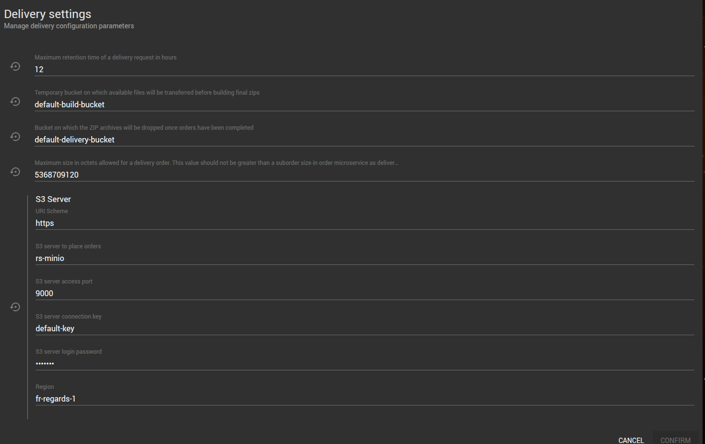

_Vous avez la possibilité de configurer les paramètres de livraison. Ces paramètres sont accessibles depuis le menu 
**Commands**, puis la carte **Delivery** et le bouton  ***Settings***._

---

## Les paramètres

Les paramètres disponibles sont les suivants :

- **Durée avant expiration de la demande de livraison**, en heures
- **Bucket** sur lequel seront déposés les fichiers **pendant la construction de la commande**
- **Bucket** sur lequel seront déposés les **archives ZIP de livraison** une fois la commande terminée
- **Taille maximale en octets pour une commande**. Attention, cette valeur ne doit pas être supérieure à la taille 
  maximale d'une sous-commande.
- **Paramètres du Serveur S3** sur lequel sont livrées les fichiers :
  - Schéma d'URI
  - Adresse du serveur S3
  - Port d'accès au serveur S3
  - Clé de connexion au serveur S3
  - Mot de passe de connexion au serveur S3
  - Région

:::info
L'icone  permet de remettre la valeur par défaut à un champ donné. La barre bleue présente à côté d'un paramètre signifie que sa valeur actuelle diffère de la valeur par défaut.
:::
