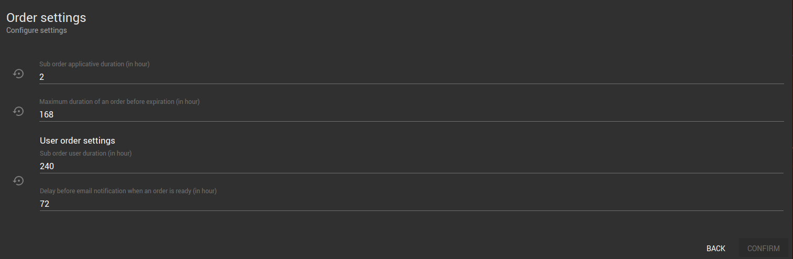

_Vous avez la possibilité de configurer les paramètres de vos commandes. Ces paramètres sont accessibles depuis le menu **Commands**, puis la carte **Orders** et le bouton  ***Settings***._

---

## Les paramètres

Les paramètres disponibles sont les suivants :

- **Durée d'une sous commande applicative en heure**
- **Durée maximale d'une commande avant expiration en heure**
- **Durée d'une sous commande utilisateur en heure**
- **Délai avant la notification par email lorsqu'une sous commande est prête en heure**

:::info
L'icone  permet de remettre la valeur par défaut à un champ donné. La barre bleue présente à côté d'un paramètre signifie que sa valeur actuelle diffère de la valeur par défaut.
:::
