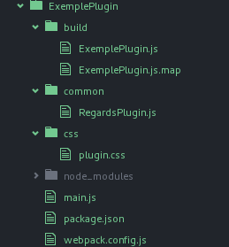
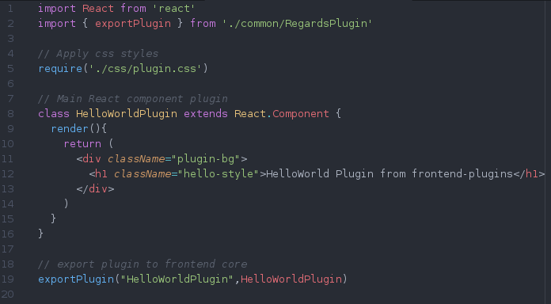

REGARDS Developpment manual
===========================

Overview
--------

1.	Developpment contexts
2.	Create a new microservice
3.	Create a new microservice plugin
4.	Create a new frontend plugin
5.	Contribute to REGARDS

1\. Developpment contexts
-------------------------

1\.1. Backend
-------------

REGARDS allow developpers to extends the REGARDS backend functionnalities by creating their own :  
- **Microservice** : In order to add new functionalities to REGARDS system throught new REST endpoints  
- **Microservice plugin** : In order to extend microservices functionalities throught defined extension points for each REGARDS Microservice

**Requirements :**  
You need a developpment environment with :  
- Java 1.8  
- Maven 3+  
- Git client

1\.2.Frontend
-------------

REGARDS allow developpers to extends REGARDS Frontend functionnalities by creating their own :  
- **IHM service plugin** : In order to add new functionalities availables from the consultables data id the project user IHM.  
- **IHM search criterion widget** : In order to add new criterion types in REGARDS search forms.  
- **IHM Module plugin** : In order to add a totaly new bundle of functionalities

**Requirements :**  
You need a developpment environment with :  
- npm 4+  
- Git client

2\. Create a new microservice
-----------------------------

To create a new microservice you have to create a new maven project with the microservice-archetype. To do so : 

1.	Clone the git rs-microservice repository <code>git clone https://user@thor.si.c-s.fr/git/rs-microservice</code>
2.	Compile and install the maven project <code> cd rs-microservice  mvn clean install</code>
3.	Generate the new microservice maven project <code> mvn archetype:generate   -DarchetypeGroupId=fr.cnes.regards.microservices  -DarchetypeArtifactId=rs-microservices-archetype  -DarchetypeVersion=0.0.1  -DgroupId=my.microservice  -DartifactId=myMicroService  -DarchetypeRepository=/path/to/git/repo/rs-microservice/archetype/target</code>

By default the microservice archetype expose an exemple Rest Controller on http://localhost:7777  To change the microservice configuration modify the src/main/resources/application.yml file.

**To run the new microservice :** <code>cd myMicroService mvn spring-boot:run</code>

**To authenticate :** <code> curl -X "POST" acme:acmesecret@localhost:7777/oauth/token -d grant_type=password -d username=public -d password=public</code>

**API exemple access :** <code>curl http://localhost:7777/api/greeting/ -H "Authorization: Bearer token" curl http://localhost:7777/api/me/ -H "Authorization: Bearer token" </code>

**Swagger UI access :** http://localhost:7777/swagger-ui.html

**NOTE** : To add new Rest resource follow exemple on file src/main/java/GreetingController.java

3\. Create a new Microservice plugin
------------------------------------

3\.1 Available plugin types
---------------------------

| Microservice    | Plugin Types                                                                                                                                                                                                                                                                                                                                                                                   |
|-----------------|------------------------------------------------------------------------------------------------------------------------------------------------------------------------------------------------------------------------------------------------------------------------------------------------------------------------------------------------------------------------------------------------|
| Access          | None                                                                                                                                                                                                                                                                                                                                                                                           |
| Administration  | None                                                                                                                                                                                                                                                                                                                                                                                           |
| ArchivalStorage | - **Representation** : Manage AIP from request MIME type  - **SecurityDelegation** : Manage AIP access authorization  - **AllocationStrategy** : Manage stockage strategy for an AIP  - **DataStorage** : Manage data storage system  - **CheckFileAccess** : Manage access rights by storage directory  - **FilePattern** :                                               |
| Catalog         | - **Representation** : Manage response format from request MIME type  - **Filter** : Add filter to requested datas  - **Service** : Add treatements to datas associated to a given dataset                                                                                                                                                                                             |
| DataManagement  | - **CalculationModel** : Add a calculation rule for an AIP attribute  - **DBConnection** : DataBase connector  - **DataSourceConnection** : Manage search requests in a datasource  - **DataExtraction** : Extract metadata from AIP  - **CheckDataAccess** : Manage AIP referenced data files access rights  - **Converter** : Add a converter to search requests results |
| DataProvider    | - **ScanDirectory** : Manage how to find SIP original files  - **DataReader** : Read input files to generate SIP  - **ValidateData** : Validate input files  - **GenerateSIP** : Create SIP metadata from input file(s)  - **PostProcessSIP** : Add specific treatment to a generated SIP  - **SIPWriter** : Write generated SIP into a specific file format               |
| Ingestion       | - **RequestReader** : Manage SIP formats - **SipReader** : Read SIP content - **Validation** : Validate SIP  - **Generate**: Generate AIP parameters from SIP - **Tag** : Add TAG(s) to generated AIP                                                                                                                                                                      |
| Order           | - **PriorityOrderScoring** : Plugin to manage priority order of sub-commands                                                                                                                                                                                                                                                                                                                   |
| Processing      | - **Processing** : Plugin to define datas treatements  - **Representation** : Manage response format from request MIME type                                                                                                                                                                                                                                                                |

3\.2 Create a new plugin
------------------------

To create a new plugin you have to create a new maven project with the microservice-plugin-archetype. To do so : 

1.	Clone the git rs-microservice repository <code>git clone https://user@thor.si.c-s.fr/git/rs-microservice</code>
2.	Compile and install the maven project <code> cd rs-microservice  mvn clean install</code>
3.	Generate the new plugin maven project <code> mvn archetype:generate   -DarchetypeGroupId=fr.cnes.regards.microservices.plugins  -DarchetypeArtifactId=rs-microservices-plugins-archetype  -DarchetypeVersion=0.0.1  -DgroupId=my.microservice.plugin  -DartifactId=myMicroServicePlugin  -DarchetypeRepository=/path/to/git/repo/rs-microservice/pluginArchetype/target  -DpluginType=existingPluginType</code>

**NOTE :** ExistingPluginType is a plugin type from the previous given list.

Next you have to implement every needed interface methods from the main plugin class to add your plugin implementation.

4\. Create a new frontend plugin
--------------------------------

To create a new frontend plugin you have to generate a new npm project using the Yeoman tool.  
1. Install yo and the regards-frontend-plugin generator  
<code> npm install yo git+https://github.com/RegardsOss/frontend/generator-regards-plugin.git</code>  
2. Generate a new plugin instance  
<code> yo regards-plugin </code>

Here under is the plugin project files tree generated by the Yeoman generator :

Since your new plugin is created, you have to implement your plugin functionalities into the main React.Component from the main.js file.  
It is this component that is displayed by the frontend core.

This React component is connected to the application 'Store', so the plugin can access any loaded datas from the frontend core application.

The 'build' directory conains the generated plugin in javascript ES5. this is this files that need to be placed in the 'Plugins' directory of the frontend webapp.

5\. Contribute to REGARDS
-------------------------

You can share your REGARDS developpments to the REGARDS community by sending a pull request on our github with your package.  
Your request will be checked as soon as possible by our maintenance team.
