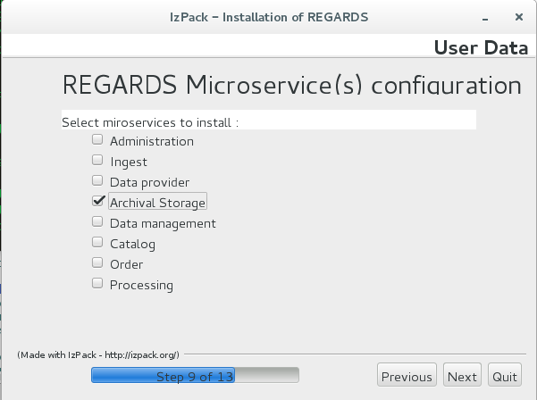

REGARDS Installation manual
===========================

1\. Download REGARDS Product
----------------------------

You can download the **REGARDS installer package** from our github page https://github.com/RegardsOss/RegardsOss.github.io  
The installer is a **IzPack** package.

To run the REGARDS installer, run the command :  
 <code> java -jar REGARDS-OSS-Installer-1.0.0.jar </code>

2\. Requirements
----------------

1.	Java JRE 1.8
2.	RabbitMQ Server
3.	Database PostgresSQL
4.	ElasticSearch

3\. Monolitic Installation
--------------------------

The monolitic installation of the REGARDS product consist in installing all parts of the system on the **same physical or virtual host**.  
To do so, run the installer package and select the installation of all the componennts :

Then fill the configuration properties needed by the installer.

4\. Cloud installation
----------------------

The cloud installation allow you to install the REGARDS product components in **multiples physical or virtual host**. The only requirement is that all the host could communicate throught **HTTPS protocol**.

To do so, run the IzPack installation package on each host and select the compoent(s) you want to install on each one.

With this installation system you can install **multiple instances of each microservice**. In the first place you can install one instance of each needed microservice and if the performances of the system are to low, you can install more instances later.

**NOTE :** You always need to install and configure the Configuration serveur first. For a cloud installation, the table bellow explain the mandatory components and the installation order.

| Component                | Mandatory | Installation Order | Max instances | Description                                                                          |
|--------------------------|-----------|--------------------|---------------|--------------------------------------------------------------------------------------|
| **Configuration server** | true      | 1                  | 1             | The configuration Server provide configuration parameters for all REGARDS components |
| **Eureka server**        | true      | 2                  | 1             | Provide the adress registry for all the REGARDS comonents                            |
| **Gateway**              | true      |                    | 1             | Provide a unique and secure entry point for all the REGARDS services                 |
| **Frontend**             | false     |                    | 1             | Provide WEB interfaces to access REGARDS services                                    |
| **Microservices**        | false     |                    | unlimited     | Provide the REGARDS fonctionalities                                                  |

5\. REGARDS Components configuration
------------------------------------

On each host you want to install on or more REGARDS component you will be asked to provide the installation directory :

After that, you'll need to configure all the components you selected for the installation on the current host.

### 5\.1 Configuration server

The configuration server is the first component to install, it provides the global configuration parameters to all REGARDS component. It only needs a starter port.

### 5\.2 Eureka server

The eureka server is the second component to install, it provides the globale components registry. This server is access by all REGARDS components to know the adress of other ones.  
It needs a starter port and the adress of the configuration server

### 5\.3 Gateway

The Gateway is the secured entry point to the REGARDS system. It assure the authentication system by providing an authentication Service Provider (SP) and redirect the REGARDS services request to the installed micro-services.  
This component assure the load-balancing of the request to redirect requests to the less-worked microservice.

### 5\.4 Frontend

The Frontend component provide the WEB interfaces to administrate and use the REGARDS fonctionnalities. This component is not mandatory, you can either access all the REGARDS functionnalities by REST requests to the Gateway server with a tool like **Curl**

### 5\.5 Microservices

When select the installation of microservices, the next configuration screen ask yu for which microserice and how many instances you want.

Next you have to configure for each selected microservice :  
- Starter port(s)  
- Number of istance  
- Specifics configuration parameters

Exemple for the archival storage microservice configuration :

6\. Run REGARDS System
----------------------

To run the REGARDS system, you have to run each component independly with the only condition to run Configuration server first and Eureka server next.

<code> cd {regards_intall_pall}  
./runConfigServer.sh  
./runEurekaServer.sh  
./runGateway.sh  
./runFrontend.sh  
./runMicroservice.sh [microservice-name]</code>
