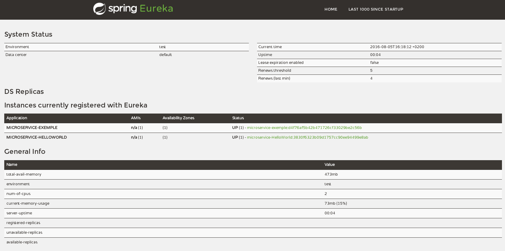

REGARDS Operations manual
=========================

Overview
--------

1.	Monitor Zull routing and load balancing (console)
2.	Monitor Eureka server (console)  
3.	Monitor RabitMQ Message server
4.	Consult logs

1\. Monitor Zull routing and load balancing (console)
-----------------------------------------------------

TODO.

2\. Monitor Eureka server (console)
-----------------------------------

The Eureka Registry can be monitored throught an IHM only available from the host server at the address : http://{host}:{eureka-port}/.

This interface display all microservices currently in activity and shows many stats about them. The bellow exemple display the interface in a test environnement with two actives mircroserices.

4\. Monitore RabbitMQ Message server (console)
----------------------------------------------

TOD.

3\. Consult logs
----------------

Every log from the REGARDS microservices are thrown throught SYSLOG protocol.
