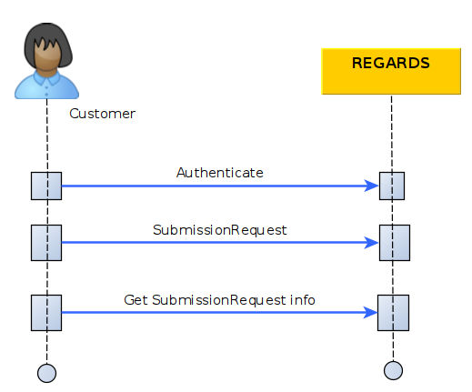

*This page assumes you know how to [authenticate](/docs/development/backend/services/authentication/api-guides/retrieve-token-rest/) your REST API requests *

This section describes how to submit a new product to the Long Term Archive service using the REST interfaces.

## Introduction

The diagram below explains the global processing of a new product submission request by REGARDS system.  
For a REGARDS client using REST interface, the main steps are:
1. Authenticate to REGARDS in order to retrieve a valid token. See the [authenticate guide](/docs/development/backend/services/authentication/api-guides/retrieve-token-rest/).
1. Send your product archive request containing product information to RS-LTA-MANAGER microservice
1. Ask information about your request status from RS-LTA-MANAGER microservice.



## Submit Product creation request

### Request 

These two following endpoints shares the same `Request headers` and `Request Body`.

| description | url | verb |
| ----------- | --- | ---- |
| Product creation request with **replace desactived** | `<HOST>`/api/v1/rs-lta-manager/products | POST |
| Product creation request with **replace actived** | `<HOST>`/api/v1/rs-lta-manager/products/replace | POST |

:::info
If your product creation request contains an error and you have a new payload to send, you can replace the previous request using the product replace endpoint
:::

`Request headers`
```json
{
  "Content-Type": "application/json",
  "Authorization": "Bearer <token>"
}
```

`Request Body`

```json
{
  "id": "string",
  "datatype": "string",
  "geometry": {},
  "files": [
    {
        "type": "THUMBNAIL",
        "url": "file:/input/LTA/2519/thumbnail-4.png",
        "filename": "thumbnail-4.png",
        "checksumMd5": "fb8613574312c47f215343ebebaf8ebf",
        "mimeType": "image/png"
    },
    {
        "type": "RAWDATA",
        "url": "file:/input/LTA/2519/product-4.zip",
        "filename": "product-4.zip",
        "checksumMd5": "ff3d0a4640b403a02007b0039640607b",
        "mimeType": "application/zip"
    },
    {
        "type": "RAWDATA",
        "url": "file:/input/LTA/2519/product-4-meta.xml",
        "filename": "product-4-meta.xml.",
        "checksumMd5": "fcd0e49a6f85e67ae6d2149a1f67d567",
        "mimeType": "application/xml"
    }
  ],
  "storePath": "string",
  "session": "string",
  "tags": [ "tag1", "tag2" ],
  "properties": {}
}
```
| Parameter | Type | Optional | Description |
| --------- | ---- | :--------: | ----------- |
| id | String | No | Product identifier. If two products are submitted with the same id, a new version is created or the previous one is replaced. |
| datatype | String | Yes | Product type. Have to be a REGARDS known datatype. |
| geometry | GeoJSON RFC 7946 | Yes | Product geometry |
| files.type | String | No | File type can be RAWDATA, THUMBNAIL, QUICKLOOK_SD, QUICKLOOK_MD or QUICKLOOK_HD |
| files.url | String | No | File location |
| files.name | String | No | File name|
| files.checksumMd5 | String | No | File MD5 checksum |
| files.mimeType | String | No | File mime type |
| storePath | Path | Yes | Used to manually define the destination location for files on archival system. |
| session | String | Yes | Used to define a session name. Many requests can be associated to a same session name for monitoring purpose. |
| tags | Strings | Yes | Optional labels to add in product metadata tags |
| properties | json object | No | Product metadata, Map of key/value properties. Mandatory properties depends on product datatype. |

:::info Difference with AMQP interface
On AMQP interface, there is an additional `owner` parameter. When you use the REST API, the product owner is automatically set to the logged in user who sent the submission request.
:::

:::info Integrity
REGARDS system will ensure integrity verification of each file of your product by checking provided md5 checksum after each file copy.
:::

### Response

| Http status | description |
| ----------- | ------------ |
| 200         | Your request is successfully created |
| 403         | Access denied |
| 422         | Invalid request body |

```json
{
  "content": {
    "correlationId": "string",
    "productId": "string",
    "responseStatus": "GRANTED",
    "expires": "2022-12-22T10:25:52.243Z",
    "session": "string",
    "message": "string"
  },
  "links": [
  ]
}
```
 - `correlationId`: Request identifier
 - `productId`: Id of the product to create
 - `responseStatus` : GRANTED or DENIED
 - `expires`: Expiration date of your request
 - `session`: Session of your request
 - `message`: Information message about your request

**Click on the link Get request status REST** just below, you will discover how to retrieve Product creation updates and status.
