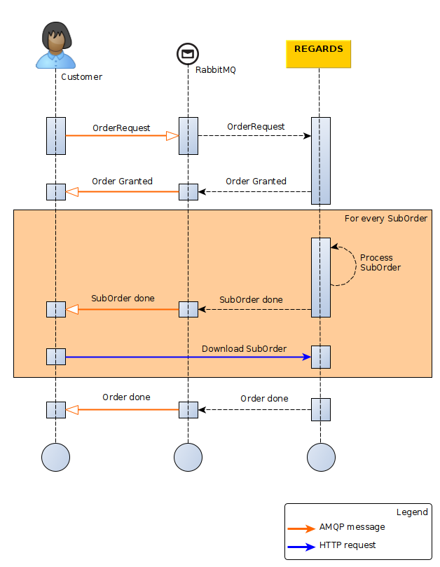

This guide describes how to order one or many products from the order service through AMQP interface.

## Introduction

The diagram below explains the global processing of an order request by REGARDS system.
For a REGARDS client using message queuing, the main steps are :
1. Publish your product order request to REGARDS Rabbitmq server.
1. Wait for notifications from REGARDS on its Rabbitmq server. Request status lifecycles can be :
   - `DENIED`
   - `GRANTED` -> `SUBORDER_DONE` (occurs 0 to many times) -> `FAILED`
   - `GRANTED` -> `SUBORDER_DONE` (occurs 1 to many times) -> `DONE`
1. Download order archive everytime you receive a `SUBORDER_DONE` or `DONE` message. `SUBORDER_DONE` and `DONE` contains the URL to the [Download ordered files](./download-ordered-files) REST API to download all available files related to an order.



## Submit Order request

### Exchange

Exchange to submit Order requests:  
`regards.broadcast.fr.cnes.regards.modules.order.amqp.input.OrderRequestDtoEvent`

### Order request format

`Message headers`

```json
"regards.tenant": "tenant"
```
| Parameter | Type | Optional | Description |
| --------- | ---- | :--------: | ----------- |
| `regards.tenant` | String | No | Tenant name depends on REGARDS instance project configuration |

`Message body content`

```json
{
    "correlationId": "xxx",
    "queries": [],
    "user" : "",
    "filters": {
        "dataTypes": [],
        "filenameRegExp" : "",
    }
}
```
| Parameter | Type | Optional | Description |
| --------- | ---- | :------: | ----------- |
| correlationId | String | No | The request correlation id. |
| queries | Lucene strings | No | List of lucene formatted queries to find products to order. |
| user | String | No | Email of your REGARDS user. |
| filters.datatypes | String | Yes | List of REGARDS datatypes to filter files from orderd products. Datatypes can be `RAWDATA` or `QUICKLOOK` |
| filters.filenameRegExp | String | Yes | Regular expression to filter files by their names from orderd products. |

`NOTE`: Here is the link to the [REGARDS Lucene format](https://regardsoss.github.io/docs/development/appendices/lucene-query/)

`NOTE`: A REGARDS user is mandatory to order products. Your user must be activated and remaining download quota must allow you to order.

### Order request examples

If you want to retrieve a product by its identifier, the order request is :
```json
{
    "queries": [
        "productId:my_product_identifier"
    ],
    "user" : "myself@cnes.fr"
}
```

If you want to retrieve many products using their identifiers, the order request is :
```json
{
    "queries": [
        "productId:(my_product_id_1 OR my_product_id_2 OR my_product_id_3 OR my_product_id_4)"
    ],
    "user" : "myself@cnes.fr"
}
```

If you want to retrieve all products from a specific metadata like datatype (depends on configured REGARDS data models), the restoration request is:
```json
{
    "queries": [
        "datatype:type1"
    ],
    "user" : "myself@cnes.fr"
}
```

If you want to retrieve all products from a specific metadata like datatype (depends on configured REGARDS data models) and retrieve only image files, the restoration request is:
```json
{
    "queries": [
        "datatype:type1"
    ],
    "user" : "myself@cnes.fr",
    "filters": {
        "dataTypes": [
            "QUICKLOOK"
        ],
    }
}
```

**Click on the link Get Order progress AMQP** just below, you will discover responses RS-ORDER will send you for your order.
