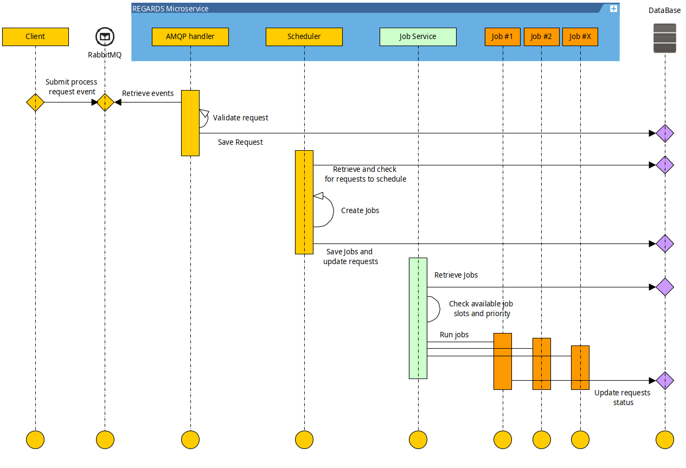

## Vertical scalability

Vertical scalability consist of **scaling up resources and capacity of a single server**.  
Regards Microservices can use Vertical scalability by :

- scaling up the number of requests processed in a bulk in a **Job**
- scaling up the number of **Jobs** executed in parallel (one Job = one Thread).
- scaling up the number of database pool connection authorised

## Horizontal scalability

Horizontal scalability consist of deploying multiple instances of the same [microservice](./02-microservices.md)
or [worker](./08-workers.md) in many servers. This stability type
allows to scale up the processable requests of a service type by adding replicas without scaling up server resources.

To handle horizontal scalability, each Regards microservice is designed to be aware of the possibility that there is
another replica doing the same work as it is doing.

To be compatible with the **Jobs system**, **Shared locks** are used. Shared locks are stored in microservice database.
They are mainly used to ensure :

- **Schedulers execution** are only done in a single instance of a microservice at a time.
- **Resources** are handled by a single instance of microservice at a time.

As every instance of a given microservice provides an independent **Jobs pool** with several **Job slots** available,
the first instance with a **Job slots** available process takes waiting jobs and execute them.

## Conclusion

Regards **Jobs system** allows to :

- Executes more parallel processes in a single instance of microservice with vertical scalability.
- Run many instances of the same microservice, with horizontal scalability, to duplicates **Jobs pools**.