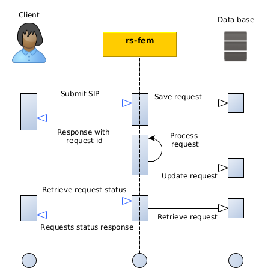

## Introduction

This section describes how to submit a new product to the `rs-fem` service using the REST interfaces.

To create a product through AMQP API, you have to submit a product in GeoJson format with some additional information.
These additional information allows you to:

- Choose product **versioning method**.
- Choose method to handle **product associated files**.
- Add **meta information** about the creation process.

The diagram below explains the global processing of a new product submission request by REGARDS system.
For a REGARDS client using REST interface, the main steps are:

1. Authenticate to REGARDS in order to retrieve a valid token. See
   the [authenticate guide](../../../../services/authentication/api-guides/rest/authent-oauth2.mdx).
2. Send your product archive request containing product information to RS-FEM microservice
3. Retrieve information about your request status from RS-FEM microservice.



## REST API

### How to

The [Regards REST API concept](../../../../concepts/05-rest-api.md) describe how REST interfaces must be handled to
submit requests.

### Endpoint

| Endpoint  | Verb |
|-----------|------|
| /features | POST |

### Request content

For creation and update requests, REST API is expecting a GeoJSON collection extended with specific metadata.

The structure is as follows :

* Required `metadata` that apply to **all features**,
* A required `type` with value `FeatureCollection`,
* Required `features` containing a set of [GeoJson features](#payloadppt).

#### Body

| Property | Type                                                               |
|----------|--------------------------------------------------------------------|
| metadata | See below                                                          |
| feature  | (look at [description here](../geojson-feature-format.md#feature)) |

With metadata being described as this:

|            Path             |   Type    |                                                                                                              Description                                                                                                              | Optional |
|:---------------------------:|:---------:|:-------------------------------------------------------------------------------------------------------------------------------------------------------------------------------------------------------------------------------------:|:--------:|
|          priority           | `String`  |                                                         `HIGH`, `NORMAL`, `LOW`.<br/> See [How it works section](../../conception.md#request-priority) for more information.                                                          |          |
|          override           | `Boolean` |                 Indicates whether the previous version should be overridden or not (**only for request without urn provided**).<br/> See [How it works section](../../conception.md#versioning) for more information.                 |   true   |
|       updateIfExists        | `Boolean` | If **URN is provided** and an associated feature already exists, indicates whether the feature should be updated with the new parameters or not.<br/>See [How it works section](../../conception.md#versioning) for more information. |   true   |
|           session           | `String`  |                                                                                     Arbitrary session name to classify data for human operators.                                                                                      |          |
|        sessionOwner         | `String`  |                                                                                     Arbitrary session owner to classify data for human operators.                                                                                     |          |
|          storages           |  `Array`  |                              Target storages if there are files to store (**may be an empty list!**).<br/>See [How it works section](../../conception.md#product-associated-files) for more information.                              |  false   |
| storages[].pluginBusinessId | `String`  |                                                                               Storage plugin identifier (previously configured in `Storage Management`.                                                                               |  false   |
|   storages[].targetTypes    |  `Array`  |                                                                                     List of data object types accepted by this storage location.                                                                                      |   true   |
|    storages[].storePath     | `String`  |                                                                                                 Directory in which to store the file.                                                                                                 |   true   |

### Example with file storage

A request with **file storage** means that you want REGARDS to **move the products** files to one or many configured
storage locations. See [How it works section](../../conception.md) for more information.

This feature creation request contains **one product** with only **one file** that will be stored on a **Local**
Regards data storage. That means that the Regards system and more
precisely the [rs-storage microservice](../../../storage/overview)
**must be able to access this file** in order to copy it to the destination storage. Storage locations are configured in
**storage microservice**.

:::info
This exemple is the way to ask **rs-fem** microservice to move files to the selected storage location(s) of your choice.
:::

```bash
curl https://regards.com/api/v1/rs-fem/features --data "@request.json" \
 -H "Authorization: Bearer <token>" \
 -H "Content-Type: application/json"
```

```json title='content of file request.json'
{
  "metadata": {
    "session": "session",
    "sessionOwner": "owner",
    "storages": [
      {
        "pluginBusinessId": "disk"
      }
    ],
    "priority": "NORMAL"
  },
  "requestOwner": "owner",
  "features": [
    {
      "entityType": "DATA",
      "model": "FEATURE01",
      "files": [
        {
          "locations": [
            {
              "storage": null,
              "url": "http://www.test.com/filename.xml"
            }
          ],
          "attributes": {
            "dataType": "RAWDATA",
            "mimeType": "application/xml",
            "filename": "filename",
            "filesize": 100,
            "algorithm": "MD5",
            "checksum": "checksum"
          }
        }
      ],
      "id": "MyId",
      "geometry": {
        "coordinates": [
          10.0,
          20.0
        ],
        "type": "Point",
        "bbox": null,
        "crs": null
      },
      "normalizedGeometry": null,
      "properties": {
        "data_type": "TYPE01",
        "file_characterization": {
          "valid": true
        }
      },
      "type": "Feature"
    }
    }
  ],
  "type": "FeatureCollection"
}
```

### Exemple with files reference

A request with **file reference** means that you want REGARDS to reference files **without moving** them from the given
location. See [How it works section](../../conception.md) for more information.

This product contains only one file located on an S3 server.
As the storage location of the file is provided, **S3Server** Regards system will not try to store the file but only
references its given location. Nevertheless, **with this system you must provide**:

- **Storage** location name : Should be an existing storage location defined
  on [rs-storage microservice](../../../storage/overview). If not, the file will be considered as
  **Offline** and will not be accessible for download.
- **File size in bytes**: Regards will not access the file by itself so the information must be provided.

:::info
This exemple is the way to ask **rs-fem** microservice to only reference the files in your product without moving any
file.
:::

```bash
curl https://regards.com/api/v1/rs-fem/features --data "@request.json" \
 -H "Authorization: Bearer <token>" \
 -H "Content-Type: application/json"
```

```json title='content of file request.json'
{
  "metadata": {
    "session": "session",
    "sessionOwner": "owner",
    "storages": [],
    "priority": "NORMAL"
  },
  "requestOwner": "owner",
  "features": [
    {
      "entityType": "DATA",
      "model": "FEATURE01",
      "files": [
        {
          "locations": [
            {
              "storage": "S3Server",
              "url": "http://www.test.com/filename.xml"
            }
          ],
          "attributes": {
            "dataType": "RAWDATA",
            "mimeType": "application/xml",
            "filename": "filename",
            "filesize": 100,
            "algorithm": "MD5",
            "checksum": "checksum"
          }
        }
      ],
      "id": "MyId",
      "geometry": {
        "coordinates": [
          10.0,
          20.0
        ],
        "type": "Point",
        "bbox": null,
        "crs": null
      },
      "normalizedGeometry": null,
      "properties": {
        "data_type": "TYPE01",
        "file_characterization": {
          "valid": true
        }
      },
      "type": "Feature"
    }
    }
  ],
  "type": "FeatureCollection"
}
```

### Response

* **Code:** 201 Created

:::info
The success return codes only means that your request has been granted an will be processed soon.
:::

**Response Body:**

| Name    | Type                  | Description                                      |
|---------|-----------------------|--------------------------------------------------|
| granted | `Map<String, String>` | Couples FeatureId/requestId for granted requests |
| denied  | `Map<String, String>` | Couples FeatureId/cause for denied requests      |
| message | `List<String>`        | Error messages information                       |

```json title='Example of creation response'

{
  "granted": {
    "ProductId001": "request-id-001"
  },
  "denied": {
    "ProductId002": "Missing parameter cloud_coverage"
  },
  "messages": []
}
```
