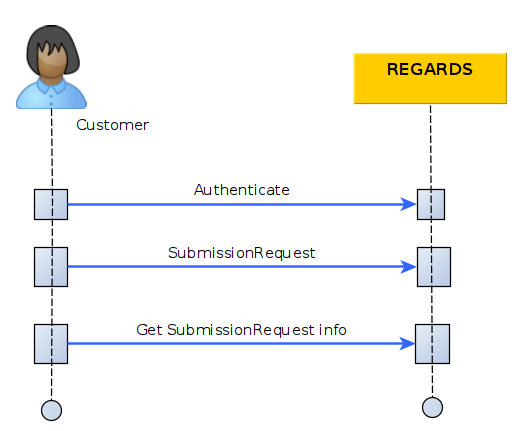

import RegardsApiSchema from '/src/redoc/RegardsApiSchema';
import Spec from './rs-lta-manager.json';

*This page assumes you know how
to [authenticate](../../../../services/authentication/api-guides/rest/authent-oauth2.mdx) your REST API
requests *

This section describes how to submit a new product to the Long Term Archive service using the REST interfaces.

## Introduction

The diagram below explains the global processing of a new product submission request by REGARDS system.  
For a REGARDS client using REST interface, the main steps are:

1. Authenticate to REGARDS in order to retrieve a valid token. See
   the [authenticate guide](../../../../services/authentication/api-guides/rest/authent-oauth2.mdx).
2. Send your product archive request containing product information to RS-LTA-MANAGER microservice
3. Retrieve information about your request status from RS-LTA-MANAGER microservice.



## Submit Product creation request

These two following endpoints shares the same `Request headers` and `Request Body`.

| description                                           | url                                             | verb | documentation                                                                                                               |
|-------------------------------------------------------|-------------------------------------------------|------|-----------------------------------------------------------------------------------------------------------------------------|
| Product creation request with **replace deactivated** | `<HOST>`/api/v1/rs-lta-manager/products         | POST | [see REST documentation](./lta-manager-api-swagger.mdx#tag/Create-controller/operation/createSubmissionRequest)            |
| Product creation request with **replace activated**   | `<HOST>`/api/v1/rs-lta-manager/products/replace | POST | [see REST documentation](./lta-manager-api-swagger.mdx#tag/Create-controller/operation/createSubmissionRequestWithReplace) |

If two products are submitted with the same provider id :
 * if you use the endpoint with **replace deactivated**, a new version is created (V2, V3...)
 * if you use the endpoint with **replace activated**, the previous version is replaced

:::note First creation
If that's the first time you submit a product (no product with same providerId is present on OAIS catalog), both endpoint create a first version of the product.
:::

### Regards Headers

```json
{
  "Content-Type": "application/json",
  "Authorization": "Bearer <token>"
}
```

### Request Body

<RegardsApiSchema spec={Spec} pointer="#/components/schemas/SubmissionRequestDto" />

:::info
If your product creation request contains an error and you have a new payload to send, you can replace the previous
request using [the product replace endpoint](./lta-manager-api-swagger.mdx#tag/Create-controller/operation/createSubmissionRequestWithReplace)
:::

:::info Difference with AMQP interface
On [AMQP interface](../amqp/amqp-submit-product.md), there is an additional `owner` parameter. When you use the REST API, the
product owner is
automatically set to the logged-in user who sent the submission request.
:::

:::info Integrity
REGARDS system will ensure integrity verification of each file of your product by checking provided md5 checksum after
each file copy.
:::

## Response

| Http status | description                          |
|-------------|--------------------------------------|
| 200         | Your request is successfully created |
| 403         | Access denied                        |
| 422         | Invalid request body                 |

```json
{
  "content": {
    "correlationId": "string",
    "productId": "string",
    "responseStatus": "GRANTED",
    "expires": "2022-12-22T10:25:52.243Z",
    "session": "string",
    "message": "string"
  },
  "links": [
  ]
}
```

<RegardsApiSchema spec={Spec} pointer="#/components/schemas/SubmissionResponseDto" />

:::info
When you create a product, the `responseStatus` will either be `GRANTED` or `DENIED`
:::

**Click on the link Get request status REST** just below, you will discover how to retrieve Product creation updates and
status.
