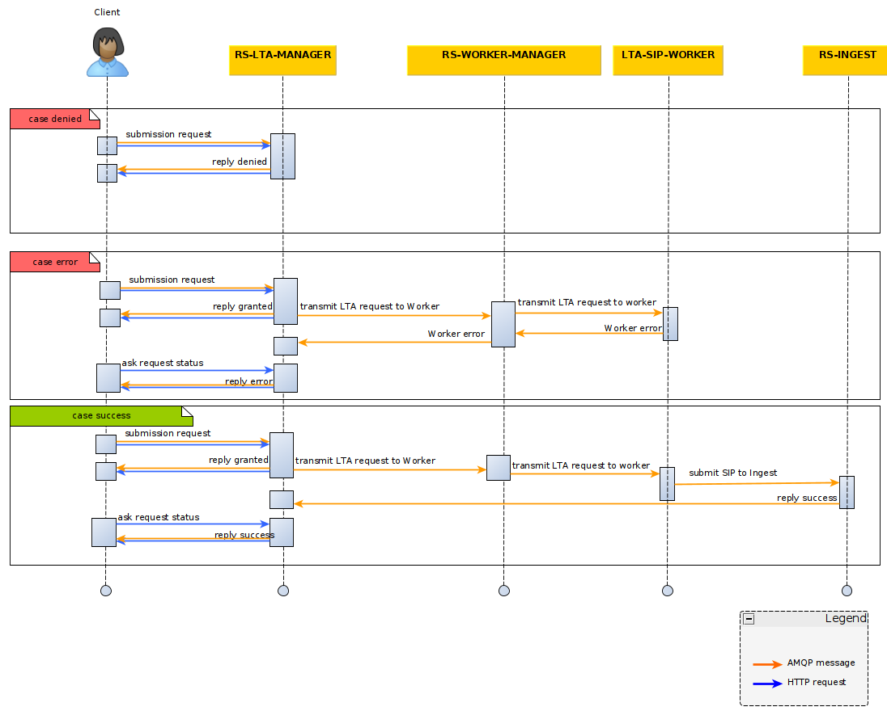

## Introduction

LTA Manager is used to simplify data ingestion. To do so,
LTA use a datatype configuration. It allows to associate a label (datatype name) to a configuration (
see [LTA Manager configuration](./configuration/lta-manager-import-export.md)).

The submission requests must indicate a datatype to let LTA Manager knows which configuration use.
Otherwise, the request will be denied.

The main purpose of the microservice is to transfer product creation requests to the `rs-worker-manager` service.
The product will then be transformed into a SIP and sent to the `rs-ingest` service using a
dedicated [worker](../../concepts/08-workers.md).

To learn how to submit product creation request to the `LTA Manager` microservice, please refer to
the [AMQP API Guide](./api-guides/amqp/amqp-submit-product.md)
and [REST API Guide](./api-guides/rest/rest-create-product.mdx).

LTA request are stored in database, and status requests can be followed from admin UI (Admin/LTA Manager).

:::note
We've illustrated an error on the Worker side, but you can also have an error on the Ingestion step and on the Storage
step.
:::

:::warning
The `lta-sip-generation-worker` will not be explained in this documentation section but is mandatory to generate SIPs.
:::

## Data types

Every [product](../../../overview/concepts/01-products.md) submitted to the `LTA Manager` microservice must define a *
*Data Type**.

The Data Type concept is the main concept enabling the microservice to know how to process the product creation request.

All Data Types must be configured on the service in order to define for each one :

- The [data model](../../../overview/concepts/02-meta-catalog.md) used to validate the product
- The sub-directory for storing the files associated with the product in the long-term archive.

## Versioning

Versioning of products is the same as describe in the [rs-ingest documentation](../ingest/conception.md#versioning).
Nevertheless, only two versioning methods are available with `LTA Manager`, **REPLACE** and **INC_VERSION**.

When you submit a creation request you can provide a parameter to choose the versioning mode. Please refer to
the [AMQP Guide](./api-guides/amqp/amqp-submit-product.md) and
the [Rest API Guide](./api-guides/rest/rest-create-product.mdx).