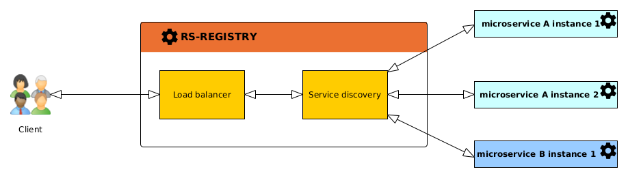

The config microservice is based on [Spring Cloud Netflix Eureka](https://cloud.spring.io/spring-cloud-netflix/reference/html/).

Spring Cloud Eureka is used for two purposes:

## Microservice registry

In a [microservice](../../concepts/02-microservices.md) architecture, it's crucial for each service to discover and  
communicate with others without needing to know their exact network locations or addresses.
A **microservice registry** enables microservices to dynamically discover and communicate with each other 
without needing to know the addresses of other services in advance. This simplifies scalability, deployment 
management, and system resilience by allowing reliable and flexible communication between microservices.

the Eureka server (the `rs-registry` microservice) fulfills this role by centralizing information about available 
services.

The main concepts used are:

* **Service Registration**: Each microservice, when it starts up, registers itself with the Eureka server by sending its
  IP address, port, and other necessary metadata. This allows the Eureka server to maintain an up-to-date list of 
  all available services.

* **Service Discovery**: When one microservice needs to communicate with another, it queries the Eureka server to obtain
  the location (URL) of the target service. This allows dynamic resolution of the service address, which is 
  particularly useful when service instances can scale up or down or move within the network.

## Load balancing

Spring Cloud Eureka also plays a key role in load balancing within a microservice architecture. When a service is deployed
with multiple instances (for scalability or redundancy), it's important to distribute incoming requests evenly across these
instances to ensure optimal performance and resource utilization.

When a client service queries the `rs-registry` microservice to find a target service, the Eureka server provides a 
list of all active instances, then uses this information to distribute requests across the available 
instances. This ensures that no single instance is overwhelmed with too many requests, improving overall system 
reliability and responsiveness.

