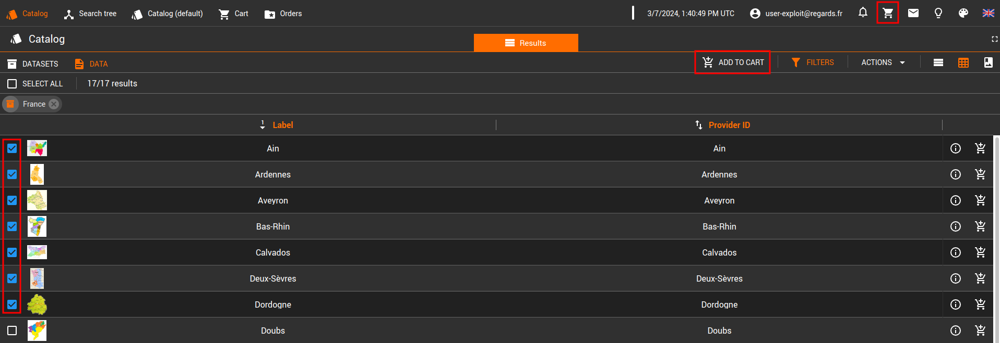
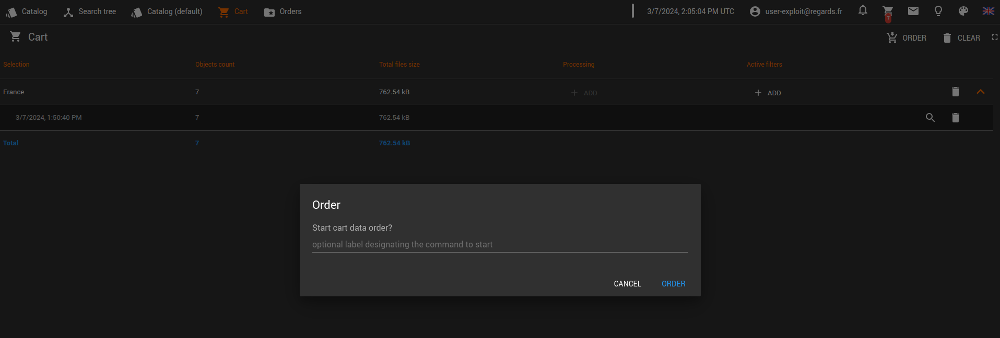

*Gérez les modules de commande et commandez des données*

 


---

Pour pouvoir commander des données, vous aurez besoin de configurer deux types de modules :

- ***order-cart***, un panier dans lequel vous pourrez ajouter les données que vous souhaitez commander et
  éventuellement décider de leur appliquer des traitements.
- ***order-history***, pour retrouver l'état d'avancement de la commande et l'historique de vos commandes

## Configurer les modules de type

***order***

Depuis l'IHM d'administration du projet, cliquez sur l'onglet ***User Interface*** du menu, puis sur le bouton ***Add***
de la carte ***UI modules***.

Créer le module ***order-history***

- ***Module type*** : ***order-history***
- ***Description*** : elle apparaîtra dans la liste des modules configurés. Dans l'exemple suivant, il s'appellera
  ***My orders***.
- ***Layout container*** : ***page-content-module (dynamic)***
- ***Activate modules*** : cochée
- ***Page settings*** : choisissez ou non de définir ce module comme page d'accueil de l'interface utilisateur et
  configurez l'icône du module
- Donnez un titre en anglais et en français au module dans l'interface user.
- ***Module settings***
    - ***Initially expanded***, le module sera initialement ouvert
    - ***Initially collapsed***, le module sera initialement fermé
    - ***Always expanded***, le module sera toujours ouvert

Créer le module ***order-cart***

- ***Module type*** : ***order-cart***
- ***Description*** : elle apparaîtra dans la liste des modules configurés. Dans l'exemple suivant, il s'appellera
  ***My cart***.
- ***Layout container*** : ***page-content-module (dynamic)***
- case ***Activate modules*** : cochée
- ***Page settings*** : configurez l'icône du module et choisissez si vous souhaitez définir ce module comme page d'
  accueil dans l'interface user
- Donnez un titre en anglais et en français au module dans l'interface user.
- ***Module settings***
    - ***Initially expanded***, le module sera initialement ouvert
    - ***Initially collapsed***, le module sera initialement fermé
    - ***Always expanded***, le module sera toujours ouvert
- ***Display settings***
    - case ***Display datasets*** pour afficher les données par jeu de données dans le panier
    - case ***Display processings*** pour afficher ou cacher le traitement associé à un jeu de données. Pour plus
      d'informations, rendez vous sur cette page [Add data processing](processing.md)
    - case ***Display filters*** pour afficher ou cacher les filtres associés à un jeu de données. Cliquez ici pour plus
      d'informations [File filters](file-filters.md)

Éditez le module ***Menu*** accessible depuis la liste des UI modules.

- Vérifiez que la case ***Display cart link*** est bien cochée. Si ce n'est pas le cas, cochez-la.
- Editez votre module de type ***order-cart*** et sélectionnez la visibilité cachée (***Display*** > ***Never***). Ainsi
  votre module s'affichera uniquement depuis l'icône
  cart 
- Cliquez sur le bouton ***Update module***

## Commander des données

Accédez à l'interface user depuis l'adresse `http://<regards host>/user/<project>`, les modules ***order-history*** et
***order-cart*** sont à présent disponibles. Commandez les données depuis un module de type
***[search-result](../6-catalog-consultation/catalog-configuration.md)***, appelé ***Catalog*** dans l'image ci-dessous.

Pour commander des données, ajoutez les une par une à l'aide de l'icône ***Add item to my cart*** affiché sur chaque
ligne ou sélectionnez un groupe de données et ajoutez-les en appuyant sur le bouton ***Add to Basket*** sur la barre
principale du ***Catalog***.



Il est également possible d'ajouter des données au panier en important un fichier contenant les identifiants
fournisseur (providerId) des produits. Si plusieurs versions du produit existent dans le catalogue, seule la dernière
version sera ajoutée au panier dans ce cas. Pour ce faire, cliquez sur le bouton **Importer** depuis le module **Panier
**
et sélectionnez le fichier à importer.


Le fichier doit contenir un identifiant de produit par ligne.

Exemple de fichier :

```json
ProviderId001
ProviderId002
ProviderId003
ProviderId004
```

:::caution
Vous ne pourrez pas ajouter de données au panier dans les cas suivants :

- Si vous n'êtes pas connecté. En suivant la configuration de base tout utilisateur ayant au moins un rôle
  ***REGISTERED USER*** peut se connecter
- Si vous avez un accès limité aux données
- S'il n'y pas d'accès permis à l'espace de stockage

:::

Une fois que vous aurez ajouté un élément, une icône s'affichera sur l'écran pour vous indiquer s'ils ont correctement
été ajoutés.
Cliquez ensuite sur l'icône 
***My cart*** , et préparez les données que vous souhaitez commander.


La sélection est triée par jeux de données (si vous avez coché la case ***Display datasets*** du module
***order-cart***), dans lesquels vous trouverez les données choisies, le nombre d'objets et la taille associée lorsque
celle-ci est disponible. Appuyez sur le bouton en forme de loupe ***Shows added object list*** pour avoir le détail des
données. Appliquez des [traitements](processing.md) si nécessaire en appuyant sur le bouton ***Add*** de la colonne
***Processing***. Vous pouvez également appliquer des [filtres sur les fichiers](file-filters.md) de votre commande en
appuyant sur le bouton ***Add*** de la colonne ***Active filters***. Vous pouvez retirer des éléments en appuyant sur le
bouton ***Clear*** qui videra tout le panier, ou en appuyant sur les boutons de suppression des jeux de données ou des
données.

Une fois que vous aurez terminé, appuyez sur le bouton ***Order***. Donnez éventuellement un nom de commande, que vous
retrouverez dans l'historique des commandes ***Orders***.



Cliquez ensuite dans l'onglet ***Orders*** et observez la progression du téléchargement de vos données au travers de la
colonne ***Status***. Vous pourrez le mettre en pause ou l'annuler en appuyant respectivement sur les boutons
***Pause order*** et ***Cancel order***. A la fin du téléchargement, cliquez sur le bouton
***Download available files order as zip*** pour sauvegarder vos données.


:::caution
Il se peut que la commande soit automatiquement séparée en sous-commandes. Cela peut par exemple arriver lorsqu'il y a
beaucoup de données à télécharger, ou si les données ne sont pas toutes accessibles immédiatement. Dans ce cas, la barre
de progression s'arrêtera temporairement durant le téléchargement pour récupérer les données. Dès qu'elles seront
disponibles, le statut prendra la valeur ***Waiting user download*** et vous pourrez cliquer sur le
bouton 
***Download available files order as zip***, qui vous précisera également le nombre d'objets dans le zip. La progression
reprendra ensuite et s'arrêtera autant de fois que nécessaire.
:::

:::info
Pour éviter une solicitation régulière de l'utilisateur lors de sous-commandes, il existe un moyen automatique de gérer
le téléchargement de données REGARDS en utilisant l'outil ***REGARDS Downloader***, que vous pouvez obtenir en
suivant [ce lien](https://github.com/RegardsOss/RegardsDownloader). Une fois installé, vous n'aurez qu'à fournir le
fichier Metalink que vous pouvez obtenir lors du lancement de la commande dans REGARDS en appuyant sur le bouton
***Download order metalink file*** depuis l'onglet ***Orders***.
:::

:::info
Il est recommandé d'utiliser l'outil ***REGARDS Downloader*** dans le cas de commandes volumineuses.
:::

:::info
Vous pourrez également retrouver toutes vos commandes depuis l'interface d'administration. Référez-vous à la
page [Monitor orders](monitor-orders.md) pour en savoir plus.
:::
