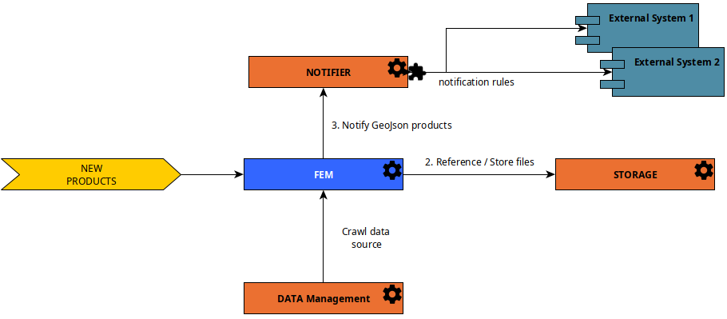

GeoJson Catalog Services are a set of **facultative REGARDS services** that allows to create a data source of products
with standard GeoJson format.

:::info
This data source is recommended for catalog with large volume of products and high performances required.
:::

To allow administrators to manage standard GeoJson products, you need to use these microservices :

- [rs-fem](../../development/services/fem/overview.md) : Feature Manager. Manage standard GeoJson formated products data
  source
- [rs-storage](../../development/services/storage/overview.md) : Manage files references and stored files
- **Optional** [rs-notifier](../../development/services/notifier/overview.md) : Highly configurable notification system.
  Can be
  used to inform external and internal components when a GeoJSON product is created, updated or deleted.

Thanks to rs-fem microservice, administrator can manage a new **data source** with standard GeoJson formated products.
To learn more about **rs-fem** microservice,
see [Feature Manager service documentation](../../development/services/fem/overview.md).

This data
source [can be used as one of the data sources crawled by the data management service](02-meta-catalog-services.md)
thanks to DataManagement [FEM Data Source Plugin](../../development/services/dam/plugins/overview.md).

## Populate using FEM API

The diagram below explains how to fulfill the GeoJSON products data source directly using rs-fem :

This design uses:

- [rs-fem](../../development/services/fem/overview.md)
- [rs-storage](../../development/services/storage/overview.md)
- **Optional** [rs-notifier](../../development/services/notifier/overview.md)

:::info
This design is easy to start, but you should consider the usage of a [Worker](#populate-using-worker) as it allows to
process products before their submission into the GeoJSON catalog.
:::

## Populate using Worker

The diagram below explains the microservices interaction to fulfill the GeoJson products data source with **rs-fem**
and **rs-worker-manager** microservices.

This design uses:

- [rs-fem](../../development/services/fem/overview.md)
- [rs-storage](../../development/services/storage/overview.md)
- A worker that retrieves an input payload (customizable) and send
  GeoJSON product creation request to the Feature-Manager (rs-fem)
    - Guide to create your own [Worker](../../development/services/worker-manager/overview.md)
    - Guide to send product submission MQ message to **rs-fem** from your worker,
      see [AMQP Submit product API Guide](../../development/services/fem/api-guides/amqp/amqp-publish-create-product-request.md).
- **Optional** [rs-notifier](../../development/services/notifier/overview.md)

## Populate using another REGARDS GeoJSON catalog

The diagram below explains how to populate the GeoJSON catalog using another GeoJSON catalog.

This design uses:

- on the **REGARDS B** side, same services than the ones describes in
  the [Populate using Worker section](#populate-using-worker)
- on the **REGARDS A** side, you need
  the [Worker Manager Sender Notifier plugin](../../development/services/notifier/plugins/recipient-sender-plugins.md#worker-manager-sender)
  installed
- a shovel on **REGARDS B** that retrieves `Worker Manager compatible requests` stored on a **REGARDS A** queue

You can also implement the acknowledge request like this:  

This design uses:

- on the **REGARDS B** side, you need
  the [Dissemination ACK Sender Notifier plugin](../../development/services/notifier/plugins/recipient-sender-plugins.md#dissemination-ack-sender)
  installed
- a shovel on **REGARDS A** that retrieves `Dissemination ACK requests` stored on a **REGARDS B** queue