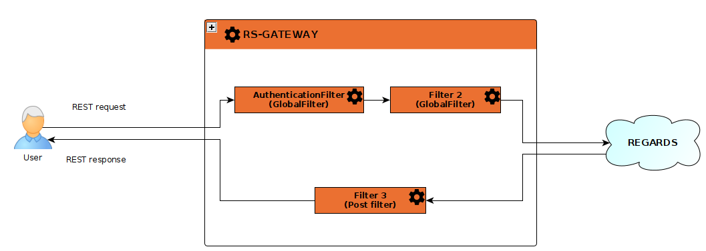

## Introduction

Gateway microservice uses [Spring Cloud Gateway concept](https://cloud.spring.io/spring-cloud-gateway/reference/html/#gateway-how-it-works).

Clients send requests to REGARDS. If the Gateway Handler Mapping identifies that a request matches a route, it is forwarded to the Gateway Web Handler. The handler processes the request by passing it through a filter chain specific to the request. All the 'pre' filter logic is executed first, and then the request is routed to service destination. Once this request is sent and a response is received, the 'post' filter logic is executed.



## Filters

REGARDS has implemented few filters for security, REGARDS [authentication](../authentication/authentication-overview.md) (internal or external authentication), and monitoring REST requests. As explained in the upper section, these filters are called one by one (with a specified order). These filters can add informations, like user informations, in the request headers.

:::note
Several other filters are implemented by spring. [Check them here](https://docs.spring.io/spring-cloud-gateway/reference/spring-cloud-gateway/global-filters.html)
:::note

## Route

The routing is configured in [rs-gateway.properties file](https://github.com/RegardsOss/regards-backend/blob/master/rs-cloud/rs-config/bootstrap-config/src/main/resources-filtered/regards/regards-oss-backend/rs-gateway.properties) inside [rs-config microservice](../config/overview.md). It explains how the gateway have to redirect requests after the filters has been exectued. This file also contains [CORS](https://en.wikipedia.org/wiki/Cross-origin_resource_sharing) informations, and REST response timeout.

A classic REGARDS endpoint url respects the pattern :
```
{PROTOCOL}://{HOST}/{PATH_PREFIX}/{MICROSERVICE_NAME}/{ENDPOINT_PATH}

example:
https://validation-regards.cloud-espace.si.c-s.fr/api/v1/rs-authentication/oauth/token?scope=validation_1_16' \
```

This url contains two prefixes
* PATH_PREFIX : api/v1 : permit to have multiple API version. For now, only a V1 exists.
* MICROSERVICE : rs-authentication : the microservice name

Gateway makes a call to [rs-registry microservice](../../../development/services/registry/overview.md) to know which instance of the microservice send the request (this concept is called load-balancing).